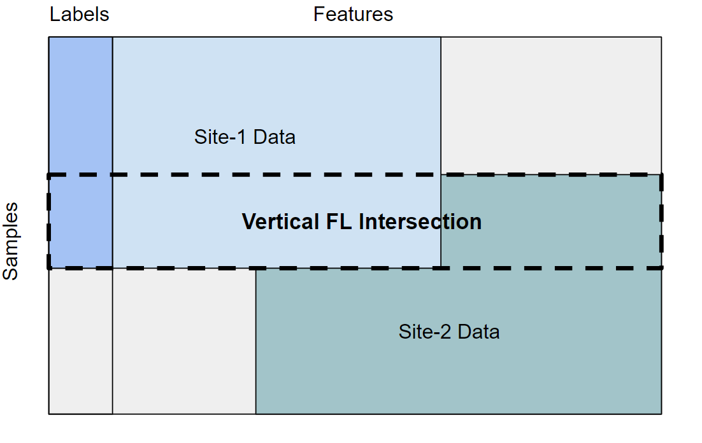
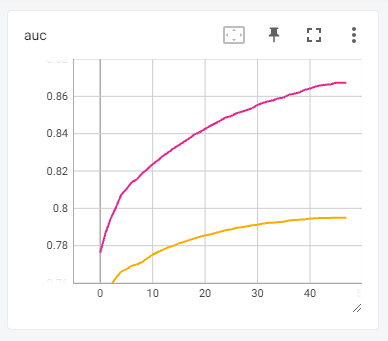

# Vertical Federated XGBoost
This example shows how to use vertical federated learning with [NVIDIA FLARE](https://nvflare.readthedocs.io/en/main/index.html) on tabular data.
Here we use the optimized gradient boosting library [XGBoost](https://github.com/dmlc/xgboost) and leverage its federated learning support.

Before starting please make sure you set up a [virtual environment](../../../README.md#set-up-a-virtual-environment) and install the additional requirements:
```
python3 -m pip install -r requirements.txt
```

> **_NOTE:_** If vertical federated learning support or GPU support is not available in the XGBoost PyPI release yet, either reinstall XGBoost from a [wheel](https://xgboost.readthedocs.io/en/stable/install.html#nightly-build) with a recent commit from the master branch, or build from [source](https://github.com/dmlc/xgboost/blob/master/plugin/federated/README.md). When building XGBoost from source, ensure that gRPC, CUDA, and NCCL are installed with sufficient versions and use the cmake options `-DPLUGIN_FEDERATED -DUSE_CUDA -DUSE_NCCL` (`-DNCCL_LIBRARY -DUSE_NCCL_LIB_PATH` might also be needed depending on the location of NCCL). Lastly, we recommend using a [cuda image](https://hub.docker.com/r/nvidia/cuda/tags) if you prefer working with docker.

## Preparing HIGGS Data
In this example we showcase a binary classification task based on the [HIGGS dataset](https://archive.ics.uci.edu/dataset/280/higgs), which contains 11 million instances, each with 28 features and 1 class label.

### Download and Store Dataset
First download the dataset from the HIGGS link above, which is a single zipped `.csv` file.
By default, we assume the dataset is downloaded, uncompressed, and stored in `~/dataset/HIGGS.csv`.

### Vertical Data Splits
In vertical federated learning, sites share overlapping data samples (rows), but contain different features (columns).
In order to achieve this, we split the HIGGS dataset both horizontally and vertically. As a result, each site has an overlapping subset of the rows and a  subset of the 29 columns. Since the first column of HIGGS is the class label, we give site-1 the label column for simplicity's sake.



Run the following command to prepare the data splits:
```
./prepare_data.sh
```

### Private Set Intersection (PSI)
Since not every site will have the same set of data samples (rows), we can use PSI to compare encrypted versions of the sites' datasets in order to jointly compute the intersection based on common IDs. In this example, the HIGGS dataset does not contain unique identifiers so we add a temporary `uid_{idx}` to each instance and give each site a portion of the HIGGS dataset that includes a common overlap. Afterwards the identifiers are dropped since they are only used for matching, and training is then done on the intersected data. To learn more about our PSI protocol implementation, see our [psi example](../psi/README.md).

> **_NOTE:_** The uid can be a composition of multiple variabes with a transformation, however in this example we use indices for simplicity. PSI can also be used for computing the intersection of overlapping features, but here we give each site unique features.

Create the psi job using the predefined psi_csv template:
```
nvflare job create -j ./jobs/vertical_xgb_psi -w psi_csv -sd ./code/psi -force
```

Run the psi job to calculate the dataset intersection of the clients at `psi/intersection.txt` inside the psi workspace:
```
nvflare simulator ./jobs/vertical_xgb_psi -w /tmp/nvflare/vertical_xgb_psi -n 2 -t 2
```

## Vertical XGBoost Federated Learning with FLARE

This Vertical XGBoost example leverages the recently added [vertical federated learning support](https://github.com/dmlc/xgboost/issues/8424) in the XGBoost open-source library. This allows for the distributed XGBoost algorithm to operate in a federated manner on vertically split data.

For integrating with FLARE, we can use the predefined `XGBFedController` to run the federated server and control the workflow.

Next, we can use `FedXGBHistogramExecutor` and set XGBoost training parameters in `config_fed_client.json`, or define new training logic by overwriting the `xgb_train()` method.

Lastly, we must subclass `XGBDataLoader` and implement the `load_data()` method. For vertical federated learning, it is important when creating the `xgb.Dmatrix` to set `data_split_mode=1` for column mode, and to specify the presence of a label column `?format=csv&label_column=0` for the csv file. To support PSI, the dataloader can also read in the dataset based on the calculated intersection, and split the data into training and validation.

> **_NOTE:_** For secure mode, make sure to provide the required certificates for the federated communicator.

### GPU Support
By default, CPU based training is used.

In order to enable GPU accelerated training, first ensure that your machine has CUDA installed and has at least one GPU.
In `config_fed_client.json` set `"use_gpus": true` and  `"tree_method": "hist"` in `xgb_params`. Then, in `FedXGBHistogramExecutor` we use the `device` parameter to map each rank to a GPU device ordinal in `xgb_params`. If using multiple GPUs, we can map each rank to a different GPU device, however you can also map each rank to the same GPU device if using a single GPU.

We can create a GPU enabled job using the job CLI:
```
nvflare job create -j ./jobs/vertical_xgb_gpu -w vertical_xgb \
-f config_fed_client.conf use_gpus=true tree_method=hist \
-f config_fed_server.conf \
-sd ./code/vertical_xgb \
-force
```

## Run the Example
Create the vertical xgboost job using the predefined vertical_xgb template:
```
nvflare job create -j ./jobs/vertical_xgb -w vertical_xgb -sd ./code/vertical_xgb -force
```

Run the vertical xgboost job:
```
nvflare simulator ./jobs/vertical_xgb -w /tmp/nvflare/vertical_xgb -n 2 -t 2
```

The model will be saved to `test.model.json`.

(Feel free to modify the scripts and jobs as desired to change arguments such as number of clients, dataset sizes, training params, etc.)

## Results
Model accuracy can be visualized in tensorboard:
```
tensorboard --logdir /tmp/nvflare/vertical_xgb
```

An example training (pink) and validation (orange) AUC graph from running vertical XGBoost on HIGGS.
Used an intersection of 50000 samples across 5 clients each with different features, and ran for ~50 rounds due to early stopping.


