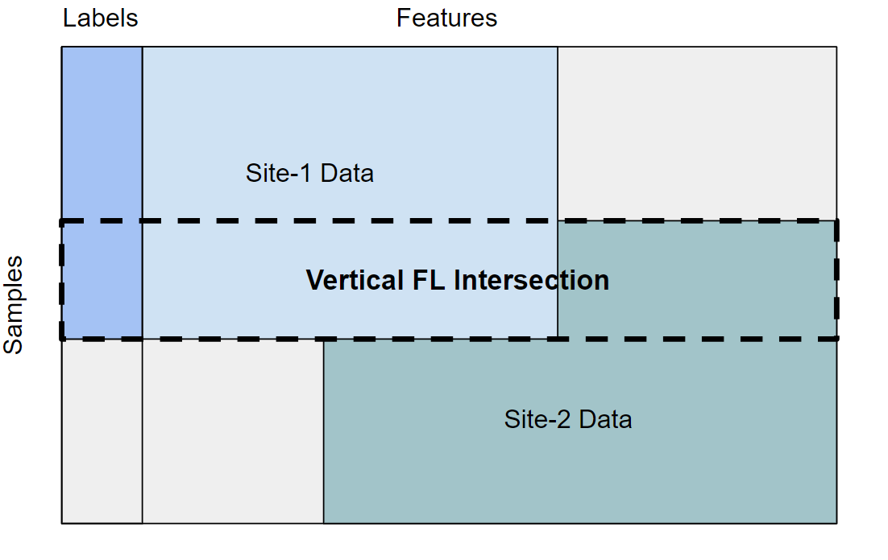
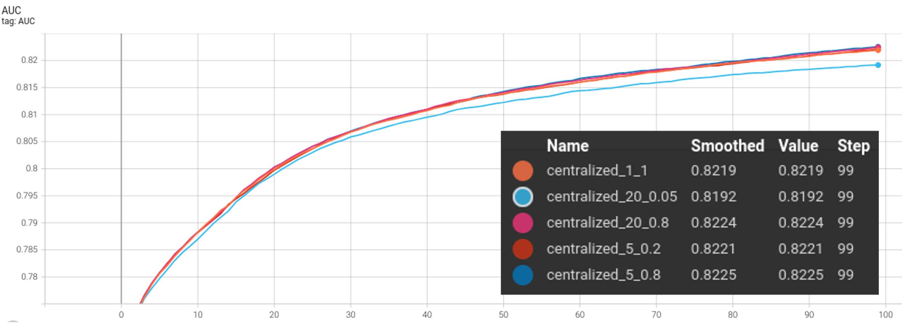
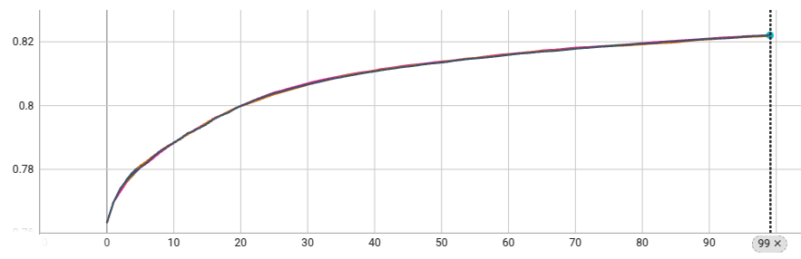
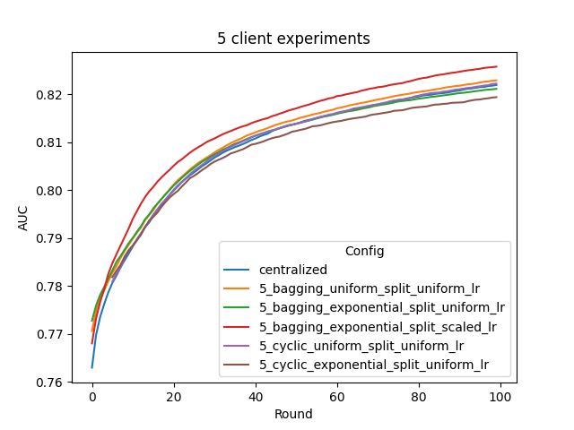
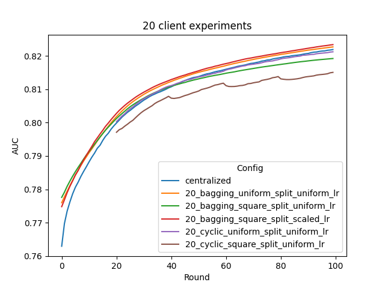
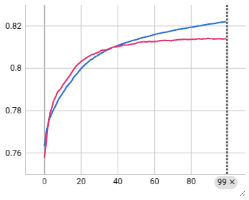

# Federated XGBoost
Several mechanisms have been proposed for training an XGBoost model in a federated learning setting.
In these examples, we illustrate the use of NVFlare to carry out *horizontal* federated learning using two approaches: histogram-based collaboration and tree-based collaboration.
And *vertical* federated learning using histogram-based collaboration.

## Horizontal Federated XGBoost
Under horizontal setting, each participant joining the federated learning will have part of 
the whole data samples / instances / records, while each sample has all the features.

### Histogram-based Collaboration
The histogram-based collaboration federated XGBoost approach leverages NVFlare integration of [federated learning support](https://github.com/dmlc/xgboost/issues/7778) in the XGBoost open-source library,
which allows the existing *distributed* XGBoost training algorithm to operate in a federated manner,
with the federated clients acting as the distinct workers in the distributed XGBoost algorithm.

In distributed XGBoost, the individual workers share and aggregate gradient information about their respective portions of the training data,
as required to optimize tree node splitting when building the successive boosted trees.

The shared information is in the form of quantile sketches of feature values as well as corresponding sample gradient and sample Hessian histograms.

Under federated histogram-based collaboration, precisely the same information is exchanged among the clients.
The main differences are that the data is partitioned across the workers according to client data ownership, rather than being arbitrarily partionable, and all communication is via an aggregating federated [gRPC](https://grpc.io) server instead of direct client-to-client communication.
Histograms from different clients, in particular, are aggregated in the server and then communicated back to the clients.

### Tree-based Collaboration
Under tree-based collaboration, individual trees are independently trained on each client's local data without aggregating the global sample gradient histogram information.
Trained trees are collected and passed to the server / other clients for aggregation and / or further boosting rounds.
Under this setting, we can further distinguish between two types of tree-based collaboration: cyclic and bagging.

#### Cyclic Training
"Cyclic XGBoost" is one way of performing tree-based federated boosting with 
multiple sites: at each round of tree boosting, instead of relying on the whole 
data statistics collected from all clients, the boosting relies on only 1 client's 
local data. The resulting tree sequence is then forwarded to the next client for 
next round's boosting. Such training scheme have been proposed in literatures [1] [2].

#### Bagging Aggregation

"Bagging XGBoost" is another way of performing tree-based federated boosting with multiple sites: at each round of tree boosting, all sites start from the same "global model", and boost a number of trees (in current example, 1 tree) based on their local data. The resulting trees are then send to server. A bagging aggregation scheme is applied to all the submitted trees to update the global model, which is further distributed to all clients for next round's boosting. 

This scheme bears certain similarity to the [Random Forest mode](https://xgboost.readthedocs.io/en/stable/tutorials/rf.html) of XGBoost, where a `num_parallel_tree` is boosted based on random row/col splits, rather than a single tree. Under federated learning setting, such split is fixed to clients rather than random and without column subsampling. 

In addition to basic uniform shrinkage setting where all clients have the same learning rate, based on our research, we enabled scaled shrinkage across clients for weighted aggregation according to each client's data size, which is shown to significantly improve the model's performance on non-uniform quantity splits over HIGGS data.


Specifically, the global model is updated by aggregating the trees from all clients as a forest, and the global model is then broadcasted back to all clients for local prediction and further training.

The XGBoost Booster api is leveraged to create in-memory Booster objects that persist across rounds to cache predictions from trees added in previous rounds and retain other data structures needed for training.

## Vertical Federated XGBoost
Under vertical setting, each participant joining the federated learning will 
have part of the whole features, while each site has all the overlapping instances.

### Private Set Intersection (PSI)
Since not every site will have the same set of data samples (rows), we will use PSI to first compare encrypted versions of the sites' datasets in order to jointly compute the intersection based on common IDs. In the following example, we add a `uid_{idx}` to each instance and give each site 
a portion of the dataset that includes a common overlap. After PSI, the identifiers are dropped since they are only used for matching, and training is then done on the intersected data. To learn more about our PSI protocol implementation, see our [psi example](../../psi/README.md).
> **_NOTE:_** The uid can be a composition of multiple variables with a transformation, however in this example we use indices for simplicity. PSI can also be used for computing the intersection of overlapping features, but here we give each site unique features.

### Histogram-based Collaboration
Similar to its horizontal counterpart, under vertical collaboration, histogram-based collaboration will 
aggregate the gradient information from each site and update the global model accordingly, resulting in
the same model as the centralized / histogram-based horizontal training. 
We leverage the [vertical federated learning support](https://github.com/dmlc/xgboost/issues/8424) in the XGBoost open-source library. This allows for the distributed XGBoost algorithm to operate in a federated manner on vertically split data.

## Data Preparation
Assuming the HIGGS data has been downloaded following [the instructions](../README.md), we further split the data 
horizontally and vertically for federated learning.

In horizontal settings, each party holds different data samples with the same set of features.
To simulate this, we split the HIGGS data by rows, and assigning each party a subset of the data samples.
In vertical settings, each party holds different features of the same data samples, and usually, the population 
on each site will not fully overlap. To simulate this, we split the HIGGS data by both columns and rows, each site
will have different features with overlapping data samples.
More details will be provided in the following sub-sections.
 

Data splits used in this example can be generated with
```
DATASET_ROOT=~/.cache/dataset/HIGGS
bash prepare_data.sh ${DATASET_ROOT}
```
Please modify the path according to your own dataset location. 
The generated horizontal train config files and vertical data files will be stored in the 
folder `/tmp/nvflare/dataset/`, this output path can be changed in the script `prepare_data.sh`.

### Horizontal Data Split
Since HIGGS dataset is already randomly recorded,
horizontal data split will be specified by the continuous index ranges for each client,
rather than a vector of random instance indices.
We provide four options to split the dataset to simulate the non-uniformity in data quantity: 

1. uniform: all clients has the same amount of data 
2. linear: the amount of data is linearly correlated with the client ID (1 to M)
3. square: the amount of data is correlated with the client ID in a squared fashion (1^2 to M^2)
4. exponential: the amount of data is correlated with the client ID in an exponential fashion (exp(1) to exp(M))

The choice of data split depends on dataset and the number of participants.

For a large dataset like HIGGS, if the number of clients is small (e.g. 5),
each client will still have sufficient data to train on with uniform split,
and hence exponential would be used to observe the performance drop caused by non-uniform data split.
If the number of clients is large (e.g. 20), exponential split will be too aggressive, and linear/square should be used.

In this example, we generate data splits with three client sizes: 2, 5 and 20, under three split conditions: uniform, square, and exponential.

### Vertical Data Split
For vertical, we simulate a realistic 2-client scenario where participants share overlapping data samples (rows) with different features (columns).
We split the HIGGS dataset both horizontally and vertically. As a result, each site has an overlapping subset of the rows and a  subset of the 29 columns. Since the first column of HIGGS is the class label, we give site-1 the label column for simplicity's sake.
 

PSI will be performed first to identify and match the overlapping samples, then the training will be done on the intersected data.


## Experiments
We first run the centralized trainings to get the baseline performance, then run the federated XGBoost training using NVFlare Simulator via [JobAPI](https://nvflare.readthedocs.io/en/main/programming_guide/fed_job_api.html).

### Centralized Baselines
For centralize training, we train the XGBoost model on the whole dataset, as well as subsets with different subsample rates
and parallel tree settings.
```
bash run_experiment_centralized.sh ${DATASET_ROOT}
```
The results by default will be stored in the folder `/tmp/nvflare/workspace/centralized/`.



As shown, including multiple trees in a single round may not yield significant performance gain,
and can even make the accuracy worse if subsample rate is too low (e.g. 0.05).

### Horizontal Experiments
The following cases will be covered:
- Histogram-based collaboration based on uniform data split for 2 / 5 clients
- Tree-based collaboration with cyclic training based on uniform / exponential / square data split for 5 / 20 clients
- Tree-based collaboration with bagging training based on uniform / exponential / square data split for 5 / 20 clients w/ and w/o scaled learning rate

Histogram-based experiments can be run with:
```
bash run_experiment_horizontal_histogram.sh
```

> **_NOTE:_** "histogram_v2" implements a fault-tolerant XGBoost training by using 
> NVFlare as the communicator rather than relying on XGBoost MPI, for more information, please refer to this [TechBlog](https://developer.nvidia.com/blog/federated-xgboost-made-practical-and-productive-with-nvidia-flare/).

Model accuracy curve during training can be visualized in tensorboard, 
recorded in the simulator folder under `/tmp/nvflare/workspace/works/`.
As expected, we can observe that all histogram-based experiments results in identical curves as centeralized training:


Tree-based experiments can be run with:
```
bash run_experiment_horizontal_tree.sh
```
The resulting validation AUC curves are shown below:




As illustrated, we can have the following observations:
- cyclic training performs ok under uniform split (the purple curve), however under non-uniform split, it will have significant performance drop (the brown curve)
- bagging training performs better than cyclic under both uniform and non-uniform data splits (orange v.s. purple, red/green v.s. brown)
- with uniform shrinkage, bagging will have significant performance drop under non-uniform split (green v.s. orange)
- data-size dependent shrinkage will be able to recover the performance drop above (red v.s. green), and achieve comparable/better performance as uniform data split (red v.s. orange) 
- bagging under uniform data split (orange), and bagging with data-size dependent shrinkage under non-uniform data split(red), can achieve comparable/better performance as compared with centralized training baseline (blue)

For model size, centralized training and cyclic training will have a model consisting of `num_round` trees,
while the bagging models consist of `num_round * num_client` trees, since each round,
bagging training boosts a forest consisting of individually trained trees from each client.

### Vertical Experiments

Create the psi job using the predefined psi_csv template:
```
bash run_experiment_vertical.sh
```

Model accuracy can be visualized in tensorboard:
```
tensorboard --logdir /tmp/nvflare/workspace/works/xgboost_vertical
```

An example validation AUC graph (red) from running vertical XGBoost on HIGGS as compared with baseline centralized (blue):
Since in this case we only used ~50k samples, the performance is worse than centralized training using full dataset.



## GPU Support
By default, CPU based training is used.

In order to enable GPU accelerated training, first ensure that your machine has CUDA installed and has at least one GPU.
In `XGBFedController` set `"use_gpus": true`.
Then, in `FedXGBHistogramExecutor` we can use the `device` parameter to map each rank to a GPU device ordinal in `xgb_params`.
If using multiple GPUs, we can map each rank to a different GPU device, however you can also map each rank to the same GPU device if using a single GPU.


## Reference
[1] Zhao, L. et al., "InPrivate Digging: Enabling Tree-based Distributed Data Mining with Differential Privacy," IEEE INFOCOM 2018 - IEEE Conference on Computer Communications, 2018, pp. 2087-2095

[2] Yamamoto, F. et al., "New Approaches to Federated XGBoost Learning for Privacy-Preserving Data Analysis," ICONIP 2020 - International Conference on Neural Information Processing, 2020, Lecture Notes in Computer Science, vol 12533 
