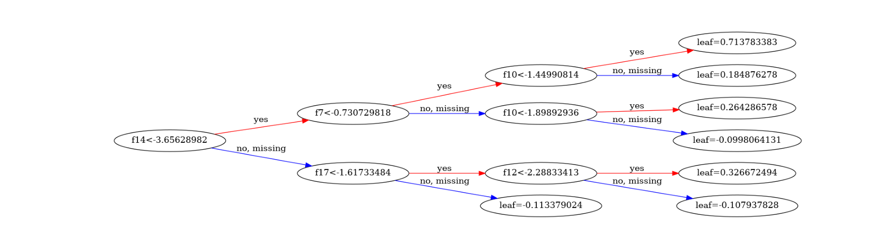
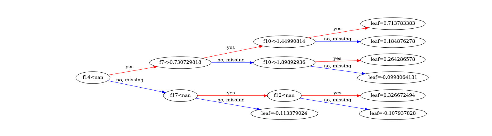
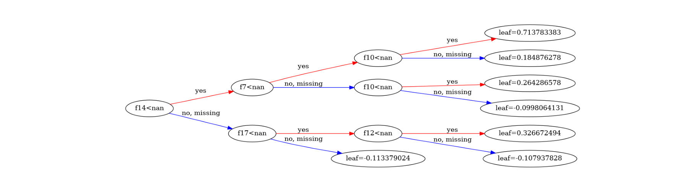

# Secure Federated XGBoost with Homomorphic Encryption
This example illustrates the use of [NVIDIA FLARE](https://nvflare.readthedocs.io/en/main/index.html) enabling secure federated [XGBoost](https://github.com/dmlc/xgboost) under both horizontal and vertical collaborations.
The examples are based on a [finance dataset](https://www.kaggle.com/datasets/mlg-ulb/creditcardfraud) to perform fraud detection.

## Secure Federated Training of XGBoost
Several mechanisms have been proposed for training an XGBoost model in a federated learning setting, e.g. [vertical](https://github.com/NVIDIA/NVFlare/blob/main/examples/advanced/vertical_xgboost/README.md), [histogram-based horizontal](https://github.com/NVIDIA/NVFlare/tree/main/examples/advanced/xgboost/histogram-based/README.md), and [tree-based horizontal](https://github.com/NVIDIA/NVFlare/tree/main/examples/advanced/xgboost/tree-based/README.md). 

In this example, we further extend the existing horizontal and vertical federated learning approaches to support secure federated learning using homomorphic encryption. Depending on the characteristics of the data to be encrypted, we can choose between [CKKS](https://github.com/OpenMined/TenSEAL) and [Paillier](https://github.com/intel/pailliercryptolib_python).

In the following, we illustrate both *horizontal* and *vertical* federated XGBoost, *without* and *with* homomorphic encryption. Please refer to our [documentation](https://nvflare.readthedocs.io/en/main/user_guide/federated_xgboost/secure_xgboost_user_guide.html) for more details on the pipeline design and the encryption logic.

## Installation
To be able to run all the examples, please install the requirements first.
```
pip install -r requirements.txt
```
## Encryption Plugins
The secure XGBoost requires encryption plugins to work. The plugins are distributed with NVFlare package. If you build NVFlare from source, you need
to build the plugins following the instructions in this [README](https://github.com/NVIDIA/NVFlare/blob/main/integration/xgboost/encryption_plugins/README.md)

The build process will generate 2 .so files: libcuda_paillier.so and libnvflare.so. Configure the path accordingly following the instructions in 
[XGBoost User Guide](https://nvflare.readthedocs.io/en/main/user_guide/federated_xgboost/secure_xgboost_user_guide.html)

## Data Preparation
### Download and Store Data
To run the examples, we first download the dataset from this [link](https://www.kaggle.com/datasets/mlg-ulb/creditcardfraud), which is a single `.csv` file.
By default, we assume the dataset is downloaded, uncompressed, and stored in `${PWD}/dataset/creditcard.csv`.

> **_NOTE:_** If the dataset is downloaded in another place,
> make sure to modify the corresponding `DATASET_PATH` inside `prepare_data.sh`.

### Data Split
To prepare data for further experiments, we perform the following steps:
1. Split the dataset into training/validation and testing sets. 
2. Split the training/validation set: 
    * Into "train" and "valid" for baseline centralized training.
    * Into "train" and "valid" for each client under horizontal setting. 
    * Into "train" and "valid" for each client under vertical setting.

Data splits used in this example can be generated with
```
bash prepare_data.sh
```

This will generate data splits for 3 clients under all experimental settings.

> **_NOTE:_** In this example, we have divided the dataset into separate columns for each site,
> assuming that the datasets from different sites have already been joined using Private Set
> Intersection (PSI). However, in practice, each site initially has its own separate dataset. To
> combine these datasets accurately, you need to use PSI to match records with the same ID across
> different sites. For more information on how to perform PSI, please refer to the
> [vertical xgboost example](https://github.com/NVIDIA/NVFlare/tree/main/examples/advanced/vertical_xgboost).


> **_NOTE:_** The generated data files will be stored in the folder `/tmp/nvflare/xgb_dataset/`,
> and will be used by jobs by specifying the path within `config_fed_client`

## Run Baseline and Standalone Experiments
First, we run the baseline centralized training and standalone federated XGBoost training for comparison.
In this case, we utilized the `mock` plugin to simulate the homomorphic encryption process. 
For more details regarding federated XGBoost and the interface-plugin design,
please refer to our [documentation](https://nvflare.readthedocs.io/en/main/user_guide/federated_xgboost/secure_xgboost_user_guide.html).

To run all experiments, we provide a script for all settings.
```
bash run_training_standalone.sh
```
This will cover baseline centralized training, federated xgboost run in the same machine
(server and clients are running in different processes) with and without secure feature.

## Generates the FLARE Job
We can use our job template and the `nvflare job` command to generate different jobs for different scenarios:

```
# config the job template directory
nvflare config -jt ../../../job_templates/

# create horizontal job
nvflare job create -force -w xgboost -j ./jobs/xgb_hori \
    -f config_fed_server.conf secure_training=false data_split_mode=0 \
    -f config_fed_client.conf folder="/tmp/nvflare/xgb_dataset/horizontal_xgb_data"

# create horizontal secure job
nvflare job create -force -w xgboost -j ./jobs/xgb_hori_secure \
    -f config_fed_server.conf secure_training=true data_split_mode=0 \
    -f config_fed_client.conf folder="/tmp/nvflare/xgb_dataset/horizontal_xgb_data"

# create vertical job
nvflare job create -force -w xgboost -j ./jobs/xgb_vert \
    -f config_fed_server.conf secure_training=false data_split_mode=1 \
    -f config_fed_client.conf folder="/tmp/nvflare/xgb_dataset/vertical_xgb_data"

# create vertical secure job
nvflare job create -force -w xgboost -j ./jobs/xgb_vert_secure \
    -f config_fed_server.conf secure_training=true data_split_mode=1 \
    -f config_fed_client.conf folder="/tmp/nvflare/xgb_dataset/vertical_xgb_data"

```

Or you can just run the script:
```
bash prepare_flare_job.sh
```

## Run Federated Experiments with NVFlare
Next, we run the federated XGBoost training without and with homomorphic encryption using NVFlare. 
We run the NVFlare jobs using simulator with: 
```
bash run_training_flare.sh
```
The running time of each job depends mainly on the encryption workload. 

## Results
Comparing the AUC results with centralized baseline, we have four observations:
1. The performance of the model trained with homomorphic encryption is identical to its counterpart without encryption.
2. Vertical federated learning (both secure and non-secure) have identical performance as the centralized baseline.
3. Horizontal federated learning (both secure and non-secure) have performance slightly different from the centralized baseline. This is because under horizontal FL, the local histogram quantiles are based on the local data distribution, which may not be the same as the global distribution.
4. GPU leads to different results compared to CPU, which is expected as the GPU involves some data conversions.

Below are sample results for CPU training:

The AUC of vertical learning (both secure and non-secure):
```
[0]	eval-auc:0.90515	train-auc:0.92747
[1]	eval-auc:0.90516	train-auc:0.92748
[2]	eval-auc:0.90518	train-auc:0.92749
```
The AUC of horizontal learning (both secure and non-secure):
```
[0]	eval-auc:0.89789	train-auc:0.92732
[1]	eval-auc:0.89791	train-auc:0.92733
[2]	eval-auc:0.89791	train-auc:0.92733
```

Comparing the tree models with centralized baseline, we have the following observations:
1. Vertical federated learning (non-secure) has exactly the same tree model as the centralized baseline.
2. Vertical federated learning (secure) has the same tree structures as the centralized baseline, however, it produces different tree records at different parties - because each party holds different feature subsets, as illustrated below.
3. Horizontal federated learning (both secure and non-secure) have different tree models from the centralized baseline.

|           |
|:-------------------------------------------------:|
|                 *Baseline Model*                  |
|  |
|        *Secure Vertical Model at Party 0*         |
|  |
|        *Secure Vertical Model at Party 1*         |
|  |
|        *Secure Vertical Model at Party 2*         |

In this case we can notice that Party 0 holds Feature 7 and 10, Party 1 holds Feature 14, 17, and 12, and Party 2 holds none of the effective features for this tree - parties who do not hold the feature will and should not know the split value if it.

By combining the feature splits at all parties, the tree structures will be identical to the centralized baseline model.

When comparing the training and validation accuracy as well as the model outputs,
experiments conducted with NVFlare produce results that are identical
to those obtained from standalone scripts.

For more information on the secure xgboost user guide please refer to
https://nvflare.readthedocs.io/en/main/user_guide/federated_xgboost/secure_xgboost_user_guide.html
