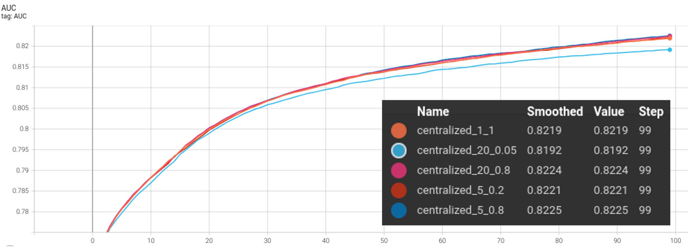
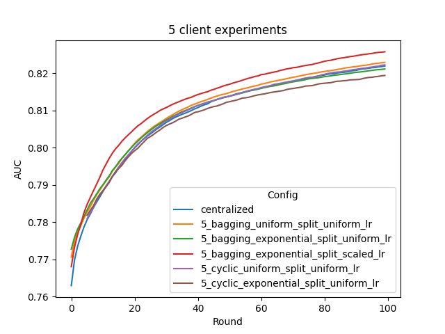
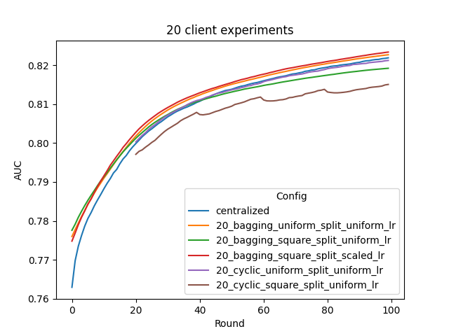

# Tree-based Federated Learning for XGBoost   

You can also follow along in this [notebook](./xgboost_tree_higgs.ipynb) for an interactive experience.

## Cyclic Training 

"Cyclic XGBoost" is one way of performing tree-based federated boosting with multiple sites: at each round of tree boosting, instead of relying on the whole data statistics collected from all clients, the boosting relies on only 1 client's local data. The resulting tree sequence is then forwarded to the next client for next round's boosting. Such training scheme have been proposed in literatures [1] [2].

## Bagging Aggregation

"Bagging XGBoost" is another way of performing tree-based federated boosting with multiple sites: at each round of tree boosting, all sites start from the same "global model", and boost a number of trees (in current example, 1 tree) based on their local data. The resulting trees are then send to server. A bagging aggregation scheme is applied to all the submitted trees to update the global model, which is further distributed to all clients for next round's boosting. 

This scheme bears certain similarity to the [Random Forest mode](https://xgboost.readthedocs.io/en/stable/tutorials/rf.html) of XGBoost, where a `num_parallel_tree` is boosted based on random row/col splits, rather than a single tree. Under federated learning setting, such split is fixed to clients rather than random and without column subsampling. 

In addition to basic uniform shrinkage setting where all clients have the same learning rate, based on our research, we enabled scaled shrinkage across clients for weighted aggregation according to each client's data size, which is shown to significantly improve the model's performance on non-uniform quantity splits over HIGGS data.

## Run automated experiments
Please make sure to finish the [preparation steps](../README.md) before running the following steps.
To run all of the experiments in this example with NVFlare, follow the steps below. To try out a single experiment, follow this [notebook](./xgboost_tree_higgs.ipynb).

### Environment Preparation

Switch to this directory and install additional requirements (suggest to do this inside virtual environment):
```
python3 -m pip install -r requirements.txt
```

### Run federated experiments with simulator locally
Next, we will use the NVFlare simulator to run FL training for all the different experiment configurations.
```
bash run_experiment_simulator.sh
```

### Run centralized experiments
For comparison, we train baseline models in a centralized manner with same round of training.
```
bash run_experiment_centralized.sh
```
This will train several models w/ and w/o random forest settings. The results are shown below.



As shown, random forest may not yield significant performance gain,
and can even make the accuracy worse if subsample rate is too low (e.g. 0.05).

### Results comparison on 5-client and 20-client under various training settings

Let's then summarize the result of the federated learning experiments run above. We compare the AUC scores of 
the model on a standalone validation set consisted of the first 1 million instances of HIGGS dataset.

We provide a script for plotting the tensorboard records, running
```
python3 ./utils/plot_tensorboard_events.py
```

> **_NOTE:_** You need to install [./plot-requirements.txt](./plot-requirements.txt) to plot.


The resulting validation AUC curves (no smoothing) are shown below:




As illustrated, we can have the following observations:
- cyclic training performs ok under uniform split (the purple curve), however under non-uniform split, it will have significant performance drop (the brown curve)
- bagging training performs better than cyclic under both uniform and non-uniform data splits (orange v.s. purple, red/green v.s. brown)
- with uniform shrinkage, bagging will have significant performance drop under non-uniform split (green v.s. orange)
- data-size dependent shrinkage will be able to recover the performance drop above (red v.s. green), and achieve comparable/better performance as uniform data split (red v.s. orange) 
- bagging under uniform data split (orange), and bagging with data-size dependent shrinkage under non-uniform data split(red), can achieve comparable/better performance as compared with centralized training baseline (blue)

For model size, centralized training and cyclic training will have a model consisting of `num_round` trees,
while the bagging models consist of `num_round * num_client` trees, since each round,
bagging training boosts a forest consisting of individually trained trees from each client.

### Run federated experiments in real world

To run in a federated setting, follow [Real-World FL](https://nvflare.readthedocs.io/en/main/real_world_fl.html) to
start the overseer, FL servers and FL clients.

You need to download the HIGGS data on each client site.
You will also need to install the xgboost on each client site and server site.

You can still generate the data splits and job configs using the scripts provided.

You will need to copy the generated data split file into each client site.
You might also need to modify the `data_path` in the `data_site-XXX.json`
inside the `/tmp/nvflare/xgboost_higgs_dataset` folder,
since each site might save the HIGGS dataset in different places.

Then you can use admin client to submit the job via `submit_job` command.

## Customization

To use other dataset, can inherit the base class `XGBDataLoader` and
implement that `load_data()` method.


## Reference
[1] Zhao, L. et al., "InPrivate Digging: Enabling Tree-based Distributed Data Mining with Differential Privacy," IEEE INFOCOM 2018 - IEEE Conference on Computer Communications, 2018, pp. 2087-2095

[2] Yamamoto, F. et al., "New Approaches to Federated XGBoost Learning for Privacy-Preserving Data Analysis," ICONIP 2020 - International Conference on Neural Information Processing, 2020, Lecture Notes in Computer Science, vol 12533 
