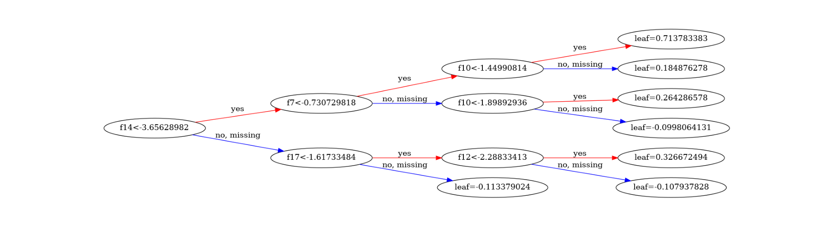
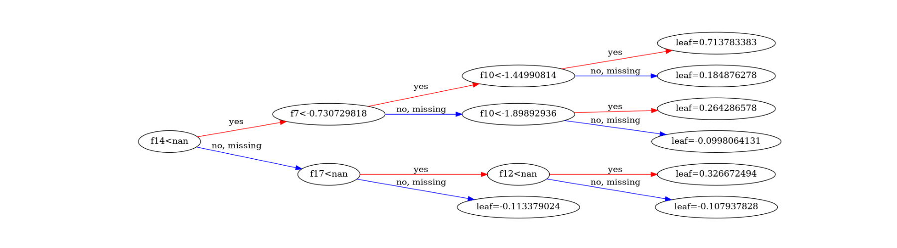
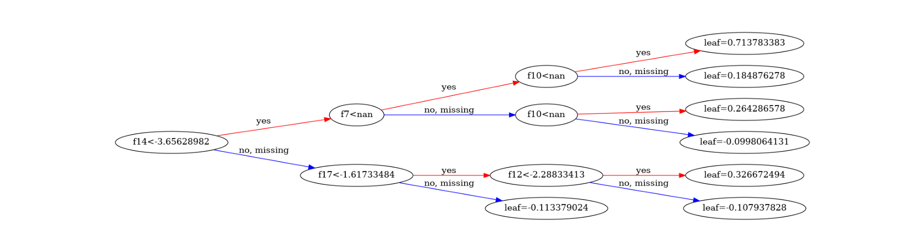
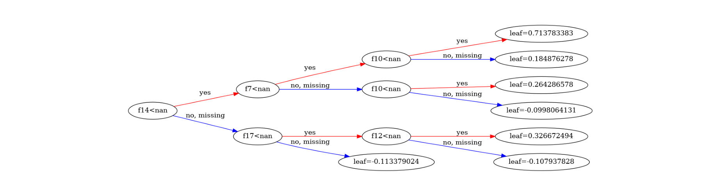

# Secure Federated XGBoost with Homomorphic Encryption
This example illustrates the use of [NVIDIA FLARE](https://nvflare.readthedocs.io/en/main/index.html) enabling secure federated [XGBoost](https://github.com/dmlc/xgboost) under both horizontal and vertical collaborations.
The examples are based on a [finance dataset](https://www.kaggle.com/datasets/mlg-ulb/creditcardfraud) to perform fraud detection.

## Secure Federated Training of XGBoost
Several mechanisms have been proposed for training an XGBoost model in a federated learning setting, e.g. [vertical](https://github.com/NVIDIA/NVFlare/blob/main/examples/advanced/vertical_xgboost/README.md), [histogram-based horizontal](https://github.com/NVIDIA/NVFlare/tree/main/examples/advanced/xgboost/histogram-based/README.md), and [tree-based horizontal](https://github.com/NVIDIA/NVFlare/tree/main/examples/advanced/xgboost/tree-based/README.md). 

In this example, we further extend the existing horizontal and vertical federated learning approaches to support secure federated learning using homomorphic encryption. Depending on the characteristics of the data to be encrypted, we can choose between [CKKS](https://github.com/OpenMined/TenSEAL) and [Paillier](https://github.com/intel/pailliercryptolib_python).

In the following, we illustrate both *horizontal* and *vertical* federated XGBoost, *without* and *with* homomorphic encryption. Please refer to our [documentation]() for more details on the pipeline design and the encryption logic.

## Installation

To be able to run all the examples, please install the requirements first.

```
pip install -r requirements.txt
```

## Data Preparation
### Download and Store Data
To run the examples, we first download the dataset from this [link](https://www.kaggle.com/datasets/mlg-ulb/creditcardfraud), which is a single `.csv` file.
By default, we assume the dataset is downloaded, uncompressed, and stored in `${PWD}/dataset/creditcard.csv`.

> **_NOTE:_** If the dataset is downloaded in another place,
> make sure to modify the corresponding `DATASET_PATH` inside `prepare_data.sh`.

### Data Split
To prepare data for further experiments, we perform the following steps:
1. Split the dataset into training/validation and testing sets. 
2. Split the training/validation set: 
    * Into train and valid for baseline centralized training.
    * Into train and valid for each client under horizontal setting. 
    * Into train and valid for each client under vertical setting.

Data splits used in this example can be generated with
```
bash prepare_data.sh
```

This will generate data splits for 3 clients under all experimental settings. In this example, we assume the Private Set Intersection (PSI) step has already been performed for vertical collaboration.
See [vertical xgboost](https://github.com/NVIDIA/NVFlare/tree/main/examples/advanced/vertical_xgboost) for more details. With this assumption, the overlapping ratio between clients for vertical setting is 1.0, such that the training data amount is the same as baseline and horizontal experiments.

> **_NOTE:_** The generated data files will be stored in the folder `/tmp/nvflare/xgb_dataset/`,
> and will be used by jobs by specifying the path within `config_fed_client.json` 

## Run Baseline Training
First, we run the baseline centralized training with:
```
bash run_training_central.sh
```

## Run Federated Experiments with NVFlare
Next, we run the federated XGBoost training without and with homomorphic encryption using NVFlare. 
We run the NVFlare jobs using simulator with: 
```
bash run_training_fl.sh
```
The running time of each job depends mainly on the encryption workload. 

Comparing the AUC results with centralized baseline, we have three observations:
1. The performance of the model trained with homomorphic encryption is identical to its counterpart without encryption.
2. Vertical federated learning (both secure and non-secure) have identical performance as the centralized baseline.
3. Horizontal federated learning (both secure and non-secure) have performance slightly different from the centralized baseline. This is because under horizontal FL, the local histogram quantiles are based on the local data distribution, which may not be the same as the global distribution.

The AUC of vertical learning is all the same:

[0]	eval-auc:0.90515	train-auc:0.92747
[1]	eval-auc:0.90516	train-auc:0.92748
[2]	eval-auc:0.90518	train-auc:0.92749


Comparing the tree models with centralized baseline, we have the following observations:
1. Vertical federated learning (non-secure) has exactly the same tree model as the centralized baseline.
2. Vertical federated learning (secure) has the same tree structures as the centralized baseline, however, it produces produces different tree records at different parties - because each party holds different feature subsets, as illustrated below.
3. Horizontal federated learning (both secure and non-secure) have different tree models from the centralized baseline.


|           |
|:-------------------------------------------------:|
|                 *Baseline Model*                  |
|  |
|        *Secure Vertical Model at Party 0*         |
|  |
|        *Secure Vertical Model at Party 1*         |
|  |
|        *Secure Vertical Model at Party 2*         |

In this case we can notice that Party 0 holds Feature 7 and 10, Party 1 holds Feature 14, 17, and 12, and Party 2 holds none of the effective features for this tree - parties who do not hold the feature will and should not know the split value if it.

By combining the feature splits at all parties, the tree structures will be identical to the centralized baseline model.

## Switch to different plugins for encryption/decryption in vertical xgboost
For vertical secure xgboost, we can choose from "nvflare" (using intel ipcl lib) or "cuda_paillier".

By default, we are using plugin_name "nvflare" and plugin_path "python3.xx/dist-packages/nvflare/libs".

We can switch to a different plugin by either specifying the environment variable or specify it in the local/resources.json file on clients.

For example, to switch to CUDA encryption/decryption we can do:
```
export NVFLARE_XGB_PLUGIN_NAME=cuda_paillier
```

Then we can just run the xgb_vert_secure job as before.

Please refer to the [documentation]() for more information.


To add:
- link to the documentation
- FL job results for horizontal, specify the computation environment
