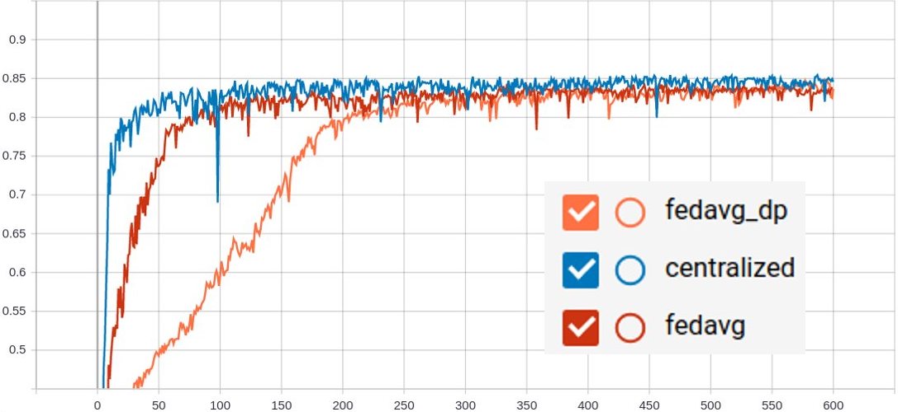

# Federated Learning with Differential Privacy for BraTS18 segmentation

## Introduction to MONAI, BraTS and Differential Privacy

### MONAI
This example shows how to use NVFlare for medical image applications.
It uses a python package [MONAI](https://github.com/Project-MONAI/MONAI),
which is a PyTorch-based, open-source framework for deep learning in healthcare imaging, part of PyTorch Ecosystem.

### BraTS
The application shown in this example is volumetric (3D) segmentation of brain tumor subregions from multimodal MRIs based on BraTS 2018 data.
It uses a deep network model published by [Myronenko 2018](https://arxiv.org/abs/1810.11654) [1].

The model is trained to segment 3 nested subregions of primary brain tumors (gliomas): the "enhancing tumor" (ET), the "tumor core" (TC), the "whole tumor" (WT) based on 4 aligned input MRI scans (T1c, T1, T2, FLAIR). 


- The ET is described by areas that show hyper intensity in T1c when compared to T1, but also when compared to "healthy" white matter in T1c. 
- The TC describes the bulk of the tumor, which is what is typically resected. The TC entails the ET, as well as the necrotic (fluid-filled) and the non-enhancing (solid) parts of the tumor. 
- The WT describes the complete extent of the disease, as it entails the TC and the peritumoral edema (ED), which is typically depicted by hyper-intense signal in FLAIR.

To run this example, please make sure you have downloaded BraTS 2018 data, which can be obtained from [Multimodal Brain Tumor Segmentation Challenge (BraTS) 2018](https://www.med.upenn.edu/sbia/brats2018/data.html) [2-6]. We will refer to the downloaded data as `dataset_base_dir`. It should have a subfolder `${dataset_base_dir}/training`.

### Differential Privacy (DP)
[Differential Privacy (DP)](https://arxiv.org/abs/1910.00962) [7] is method for ensuring that Federated Learning (FL) preserves privacy by obfuscating the model updates sent from clients to the central server.
This example shows the usage of a MONAI-based trainer for medical image applications with NVFlare, as well as the usage of DP filters in your FL training. DP is added as a filter in `config_fed_client.json`. Here, we use the "Sparse Vector Technique", i.e. the [SVTPrivacy](https://nvidia.github.io/NVFlare/apidocs/nvflare.app_common.filters.html#nvflare.app_common.filters.svt_privacy.SVTPrivacy) protocol, as utilized in [Li et al. 2019](https://arxiv.org/abs/1910.00962) [7] (see [Lyu et al. 2016](https://arxiv.org/abs/1603.01699) [8] for more information).

[Li et al. 2019](https://arxiv.org/abs/1910.00962) [7] split BraTS18 dataset into 13 datasets for 13 clients.
Each client requires at least a 12 GB GPU to run. Thus, we need 13 12 GB GPUs to reproduce the results shown [here](https://arxiv.org/abs/1910.00962) [7]

In this readme, we will first go through the process of running 2 clients for users to try it when GPU resources are limited. 
Then we will show the training results for 13 clients, which follows the same settings in the original [paper](https://arxiv.org/abs/1910.00962) [7].


## (Optional) 1. Set up a virtual environment
```
python3 -m pip install --user --upgrade pip
python3 -m pip install --user virtualenv
```
(If needed) make all shell scripts executable using
```
find . -name ".sh" -exec chmod +x {} \;
```
initialize virtual environment.
```
source ./virtualenv/set_env.sh
```
install required packages for training
```
pip install --upgrade pip
pip install -r ./virtualenv/min-requirements.txt
```

## 2. Create your FL workspace 

### 2.1 POC ("proof of concept") workspace
To run FL experiments in POC mode, create your local FL workspace the below command. 
In the following experiments, we will be using 2 clients. Press y and enter when prompted. 
The [create_poc_workpace.sh](./create_poc_workpace.sh) script follows this pattern:
```
./create_poc_workpace.sh [n_clients]
```
For example, to create workspace for 2 clients:
```
./create_poc_workpace.sh 2
```

### 2.2 (Optional) Secure FL workspace
We only cover POC mode in this example. To run it with Secure mode, please refer to the [`cifar10`](../cifar10) example.

> **_NOTE:_** **POC** stands for "proof of concept" and is used for quick experimentation 
> with different amounts of clients.
> It doesn't need any advanced configurations while provisioning the startup kits for the server and clients. 
>
> The **secure** workspace on the other hand is needed to run experiments that require encryption keys such as the 
> homomorphic encryption (HE) one shown below. These startup kits allow secure deployment of FL in real-world scenarios 
> using SSL certificated communication channels.


## 3. Run automated experiments

### 3.1 FedAvg with and without differential privacy

#### 3.1.1 Test FedAvg with and without differential privacy on 2 clients and GPUs
Next, FL training will start automatically. 

The [run_poc.sh](./run_poc.sh) script follows this pattern:
```
./run_poc.sh [n_clients] [config] [run] [dataset_base_dir] [datalist_json_path]
```

`[run]` is the run number for nvflare experiment. You need to assign a unique `[run]` for each experiment.
`[datalist_json_path]` is the path for datalist json files, chosen from the subfolders in `./datalists/brats/`.

For example, 
to run brats FL without differential privacy:
```
./run_poc.sh 2 brats18_fedavg 1 /dataset/brats18/ ${PWD}/datalists/brats/brats_13clients
```
To run brats FL with differential privacy:
```
./run_poc.sh 2 brats18_fedavg_dp 2 /dataset/brats18/ ${PWD}/datalists/brats/brats_13clients
```

These scripts will start the FL server and `[n_clients]` clients automatically to run FL experiments on localhost. 
Each client can be assigned a GPU using `export CUDA_VISIBLE_DEVICES=${gpu_idx}` in the [run_poc.sh](./run_poc.sh). 
Here we test it on 2 clients, each on one GPU with 12 GB memory.

The commands above will use the data split in `./datalists/brats/brats_13clients` to simulate each client having different data distributions.
The `[config]` argument controls which experiment to run. The respective folder under `[configs]` will be selected and 
uploaded to the server for distribution to each client using the admin API with [run_fl.py](./run_fl.py). 
The run will time out if not completed in 36 hours. You can adjust this within the `run()` call of the customized admin API script in [run_fl.py](./run_fl.py). 

#### 3.1.2 Reproduce FedAvg with and without differential privacy on 13 clients and GPUs
[Li et al. 2019](https://arxiv.org/abs/1910.00962) split BraTS18 dataset into [13 datasets](./datalists/brats/brats_13clients) for 13 clients.
To reproduce [Li et al. 2019](https://arxiv.org/abs/1910.00962), we will run the following cmd:
```
./create_poc_workpace.sh 13
./run_poc.sh 13 brats18_fedavg 1 /dataset/brats18/ ${PWD}/datalists/brats/brats_13clients
./run_poc.sh 13 brats18_fedavg_dp 2 /dataset/brats18/ ${PWD}/datalists/brats/brats_13clients
```
In [run_poc.sh](./run_poc.sh), the default server's IP address is `servername="localhost"`. It works when your server and clients run on the same machine. However, if you need to run server and clients on different machines, you would start the server first, then change `servername` to connect clients to the server's IP address. The IP address can be found by `echo "The server starts on IP address: $(hostname --all-ip-addresses)"` and is already in [run_poc.sh](./run_poc.sh).


> **_NOTE:_** You can always use the admin console to manually abort the automatically started runs 
  using `abort all`. If the admin API script is running, the FL system will automatically shut down using
  the current setting defined in [run_fl.py](./run_fl.py). An automatic shutdown is useful here for development as code changes 
> in your FL components will only be picked up on a restart of the FL system. 
> For real-world deployments, the system should be kept running but the admin restart command can be used, 
> see [here](https://nvidia.github.io/NVFlare/user_guide/admin_commands.html).

> To log into the POC workspace admin console, use username "admin" and password "admin". 
> For the secure workspace admin console, use username "admin@nvidia.com"

After training, the final global and the global best model, as selected by `IntimeModelSelectionHandler` (in `config_fed_server.json`) will be used for evaluation at each client. The results can be shown with
for example
```
cat ./workspaces/poc_workspace/server/run_2/cross_site_val/global_val.json
```

### 3.2 Centralized training

To simulate a centralized training baseline, we run FL with 1 client using [all the training data](./datalists/brats/brats_1clients). 
```
./run_poc.sh 1 brats18_central 3 /dataset/brats18/ ${PWD}/datalists/brats/brats_1clients
```
You can visualize the training progress by running `tensorboard --logdir=[workspace]/.`


### 3.3 Running all examples

You can use `./run_experiments.sh` to execute all above-mentioned experiments sequentially if preferred.

## 4. Results on 13 clients for FedAvg vs. FedAvg with DP vs. Central

### 4.1 Validation curve 
Let's summarize the result of the experiments run above. First, we will compare the validation curves of the global models for different settings during FL. In this example, all clients compute their validation scores using the
same BraTS validation set. 

The TensorBoard curves for validation Dice scores of the global model for 600 training epochs:



### 4.2 Best model
Next, we compare the best achieved models. One can see that FedAvg with DP can achieve a similar performance compared with FedAvg while adding privacy to the aggregation step.

| Config	| Val Overall Dice|  	Val TC Dice	|  	Val WT Dice	|  	Val ET Dice	| 
| ----------- | ----------- |----------- |----------- |----------- |  
| brats18_fedavg  	| 	0.84375	| 0.84313	| 0.89811	| 0.78647	| 
| brats18_fedavg_dp | 	0.84871	| 0.85726	| 0.90016	| 0.78327	|
| brats18_central 	| 	0.85442	| 	0.86723	| 0.90317	| 0.78958	| 


## References
[1] Myronenko A. 3D MRI brain tumor segmentation using autoencoder regularization. InInternational MICCAI Brainlesion Workshop 2018 Sep 16 (pp. 311-320). Springer, Cham.

[2] B. H. Menze, A. Jakab, S. Bauer, J. Kalpathy-Cramer, K. Farahani, J. Kirby, et al. "The Multimodal Brain Tumor Image Segmentation Benchmark (BRATS)", IEEE Transactions on Medical Imaging 34(10), 1993-2024 (2015) DOI: 10.1109/TMI.2014.2377694

[3] S. Bakas, H. Akbari, A. Sotiras, M. Bilello, M. Rozycki, J.S. Kirby, et al., "Advancing The Cancer Genome Atlas glioma MRI collections with expert segmentation labels and radiomic features", Nature Scientific Data, 4:170117 (2017) DOI: 10.1038/sdata.2017.117

[4] S. Bakas, M. Reyes, A. Jakab, S. Bauer, M. Rempfler, A. Crimi, et al., "Identifying the Best Machine Learning Algorithms for Brain Tumor Segmentation, Progression Assessment, and Overall Survival Prediction in the BRATS Challenge", arXiv preprint arXiv:1811.02629 (2018)

[5] S. Bakas, H. Akbari, A. Sotiras, M. Bilello, M. Rozycki, J. Kirby, et al., "Segmentation Labels and Radiomic Features for the Pre-operative Scans of the TCGA-GBM collection", The Cancer Imaging Archive, 2017. DOI: 10.7937/K9/TCIA.2017.KLXWJJ1Q

[6] S. Bakas, H. Akbari, A. Sotiras, M. Bilello, M. Rozycki, J. Kirby, et al., "Segmentation Labels and Radiomic Features for the Pre-operative Scans of the TCGA-LGG collection", The Cancer Imaging Archive, 2017. DOI: 10.7937/K9/TCIA.2017.GJQ7R0EF

[7] Li, W., Milletarì, F., Xu, D., Rieke, N., Hancox, J., Zhu, W., Baust, M., Cheng, Y., Ourselin, S., Cardoso, M.J. and Feng, A., 2019, October. Privacy-preserving federated brain tumour segmentation. In International workshop on machine learning in medical imaging (pp. 133-141). Springer, Cham.

[8] Lyu, M., Su, D., & Li, N. (2016). Understanding the sparse vector technique for differential privacy. arXiv preprint arXiv:1603.01699.
