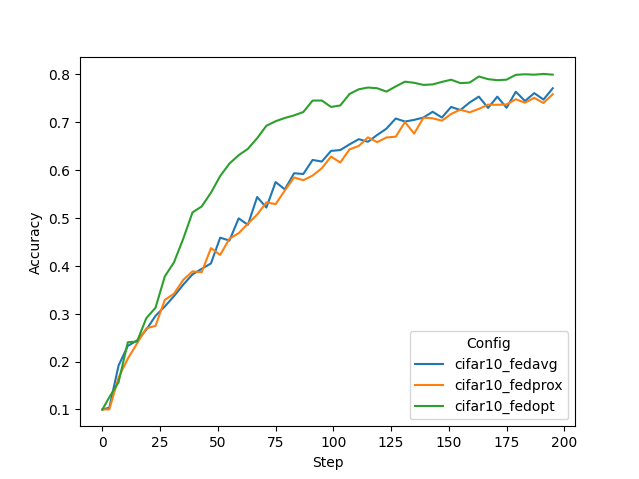

# Federated Learning with CIFAR-10

## (Optional) 1. Set up a virtual environment
```
python3 -m pip install --user --upgrade pip
python3 -m pip install --user virtualenv
```
(If needed) make all shell scripts executable using
```
find . -name ".sh" -exec chmod +x {} \;
```
initialize virtual environment.
```
source ./virtualenv/set_env.sh
```
install required packages for training
```
pip install --upgrade pip
pip install -r ./virtualenv/min-requirements.txt
```
(optional) if you would like to plot the TensorBoard event files as shown below, please also install
```
pip install -r ./virtualenv/plot-requirements.txt
```

## 2. Create your FL workspace 

### 2.1 POC ("proof of concept") workspace
To run FL experiments in POC mode, create your local FL workspace the below command. 
In the following experiments, we will be using 8 clients. Press y and enter when prompted. 
```
./create_poc_workpace.sh 8
```

### 2.2 (Optional) Secure FL workspace

The project file for creating the secure workspace used in this example is shown at 
[./workspaces/secure_project.yml](./workspaces/secure_project.yml).

To create the secure workspace, please use the following to build a package and copy it 
to `secure_workspace` for later experimentation.
```
cd ./workspaces
provision -p ./secure_project.yml
cp -r ./workspace/secure_project/prod_00 ./secure_workspace
cd ..
```
For more information about secure provisioning see the [documentation](https://nvidia.github.io/NVFlare/user_guide/provisioning_tool.html).

> **_NOTE:_** **POC** stands for "proof of concept" and is used for quick experimentation 
> with different amounts of clients.
> It doesn't need any advanced configurations while provisioning the startup kits for the server and clients. 
>
> The **secure** workspace on the other hand is needed to run experiments that require encryption keys such as the 
> homomorphic encryption (HE) one shown below. These startup kits allow secure deployment of FL in real-world scenarios 
> using SSL certificated communication channels.


## 3. Run automated experiments

Next, FL training will start automatically. 

The [run_poc.sh](./run_poc.sh) and [run_secure.sh](./run_secure.sh) scripts follows this pattern:
`./run_secure.sh [n_clients] [config] [run] [alpha]`

These scripts will start the FL server and 8 clients automatically to run FL experiments on localhost. 
Each client can be assigned a GPU using `CUDA_VISIBLE_DEVICES=GPU#`. 
In this example, we run all 8 clients on one GPU with 12 GB memory.

It will then download and split the CIFAR-10 dataset to simulate each client having different data distributions.
The `config` argument controls which experiment to run. The respective folder under `configs` will be selected and 
uploaded to the server for distribution to each client using the admin API with [run_fl.py](./run_fl.py). 
The run will time out if not completed in 2 hours. You can adjust this within the `run()` call of the admin API script. 

### 3.1 Varying data heterogeneity of data splits

We use an implementation to generated heterogeneous data splits from CIFAR-10 based a Dirichlet sampling strategy 
from FedMA (https://github.com/IBM/FedMA), where `alpha` controls the amount of heterogeneity, 
see https://arxiv.org/abs/2002.06440.

We will run most experiments using the POC workspace which makes it easy to define new clients. 
Just copy a client startup dir to a new client name, e.g. `cp -r client1 client9`. 
The `run_*.sh` scripts can then be adjusted to execute the new client.

### 3.2 Centralized training

To simulate a centralized training baseline, we run FL with 1 client for 25 local epochs but only for one round. 
It takes circa 6 minutes on an NVIDIA TitanX GPU.
```
./run_poc.sh 1 cifar10_central 1 1.0
```
You can visualize the training progress by running `tensorboard --logdir=[workspace]/.`


### 3.3 FedAvg on different data splits

FedAvg (8 clients). Here we run for 50 rounds, with 4 local epochs. Corresponding roughly 
to the same number of iterations across clients as in the central baseline above (50*4 divided by 8 clients is 25):
Each run will take about 35 minutes, depending on your system. 

You can copy the whole block into the terminal, and it will execute each experiment one after the other.
```
./run_poc.sh 8 cifar10_fedavg 2 1.0
./run_poc.sh 8 cifar10_fedavg 3 0.5
./run_poc.sh 8 cifar10_fedavg 4 0.3
./run_poc.sh 8 cifar10_fedavg 5 0.1
```

> **_NOTE:_** You can always use the admin console to manually abort the automatically started runs 
  using `abort all`. If the admin API script is running, the FL system will automatically shut down using
  the current setting defined in [run_fl.py](./run_fl.py). An automatic shutdown is useful here for development as code changes 
> in your FL components will only be picked up on a restart of the FL system. 
> For real-world deployments, the system should be kept running but the admin restart command can be used, 
> see [here](https://nvidia.github.io/NVFlare/user_guide/admin_commands.html).

> To log into the POC workspace admin console, use username "admin" and password "admin". 
> For the secure workspace admin console, use username "admin@nvidia.com"

After training, each client's best model will be used for cross-site validation. The results can be shown with
for example
```
  cat ./workspaces/poc_workspace/server/run_2/cross_site_val/cross_site_val.json
```

### 3.4: Advanced FL algorithms (FedProx and FedOpt)

Next, let's try some different FL algorithms on a more heterogeneous split:

FedProx (https://arxiv.org/abs/1812.06127), adds a regularizer to the CIFAR10Trainer loss (`fedproxloss_mu`)`:
```
./run_poc.sh 8 cifar10_fedprox 6 0.1
```
FedOpt (https://arxiv.org/abs/2003.00295), uses a new ShareableGenerator to update the global model on the server using a PyTorch optimizer. 
Here SGD with momentum and cosine learning rate decay:
```
./run_poc.sh 8 cifar10_fedopt 7 0.1
```

### 3.5 Secure aggregation using homomorphic encryption

Next we run FedAvg using homomorphic encryption (HE) for secure aggregation on the server in non-heterogeneous setting (`alpha=1`).

> **_NOTE:_** For HE, we need to use the securely provisioned workspace, i.e. using `run_secure.sh`. 
> It will also take longer due to the additional encryption, decryption, encrypted aggregation, 
> and increased encrypted messages sizes involved.

FedAvg with HE: 
```
./run_secure.sh 8 cifar10_fedavg_he 8 1.0
```

> **_NOTE:_** Currently, FedOpt is not supported with HE as it would involve running the optimizer on encrypted values.

### 3.6 Running all examples

You can use `./run_experiments.sh` to execute all above-mentioned experiments sequentially if preferred. 
This script uses the secure workspace to also support the HE experiment.

## 4. Results

Let's summarize the result of the experiments run above. Next, we will compare the final validation scores of 
the global models for different settings. In this example, all clients compute their validation scores using the
same CIFAR-10 test set. The plotting script used for the below graphs is in 
[./figs/plot_tensorboard_events.py](./figs/plot_tensorboard_events.py) 
(see also [./virtualenv/plot-requirements.txt](./virtualenv/plot-requirements.txt)).

### 4.1 Central vs. FedAvg
With a data split using `alpha=1.0`, i.e. a non-heterogeneous split, we achieve the following final validation scores.
One can see that FedAvg can achieve similar performance to central training and 
that HE does not impact the performance accuracy of FedAvg significantly while adding security to the aggregation step.

| Config	| Alpha	| 	Val score	| 
| ----------- | ----------- |  ----------- |
| cifar10_central | 1.0	| 	0.8798	| 
| cifar10_fedavg  | 1.0	| 	0.8873	| 
| cifar10_fedavg_he | 1.0	| 	0.8864	|


### 4.2 Impact of client data heterogeneity

We also tried different `alpha` values, where lower values cause higher heterogeneity. 
This can be observed in the resulting performance of the FedAvg algorithms.  

| Config |	Alpha |	Val score |
| ----------- | ----------- |  ----------- |
| cifar10_fedavg |	1.0 |	0.8873 |
| cifar10_fedavg |	0.5 |	0.8726 |
| cifar10_fedavg |	0.3 |	0.8315 |
| cifar10_fedavg |	0.1 |	0.7726 |


### 4.3 FedProx vs. FedOpt

Finally, we are comparing an `alpha` setting of 0.1, causing a high client data heterogeneity and its 
impact on more advanced FL algorithms, namely FedProx and FedOpt. Both achieve a better performance compared to FedAvg 
with the same `alpha` setting but FedOpt shows a better convergence rate by utilizing SGD with momentum
to update the global model on the server, and achieves a better performance with the same amount of training steps.

| Config           |	Alpha |	Val score |
|------------------| ----------- |  ----------- |
| cifar10_fedavg   |	0.1 |	0.7726 |
| cifar10_fedprox  |	0.1 |	0.7512 |
| cifar10_fedopt   |	0.1 |	0.7986 |




## 5. Streaming TensorBoard metrics to the server

In a real-world scenario, the researcher won't have access to the TensorBoard events of the individual clients. In order to visualize the training performance in a central place, `AnalyticsSender`, `ConvertToFedEvent` on the client, and `TBAnalyticsReceiver` on the server can be used. For an example using FedAvg and metric streaming during training, run:
```
./run_poc.sh 8 cifar10_fedavg_stream_tb 9 1.0
```
Using this configuration, a `tb_events` folder will be created under the `run_*` folder of the server that includes all the TensorBoard event values of the different clients.
