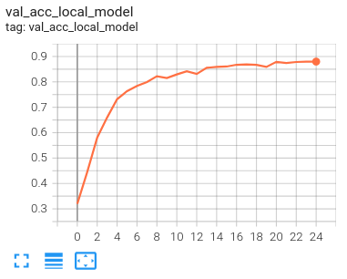
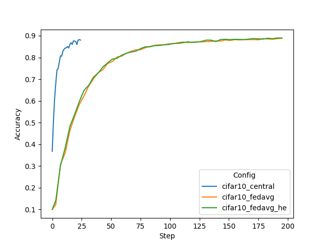
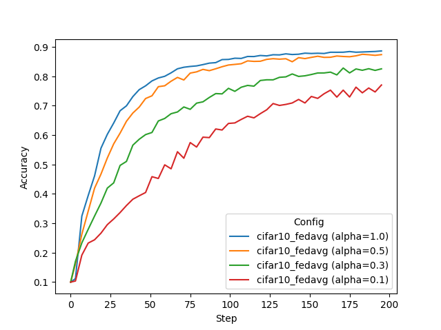
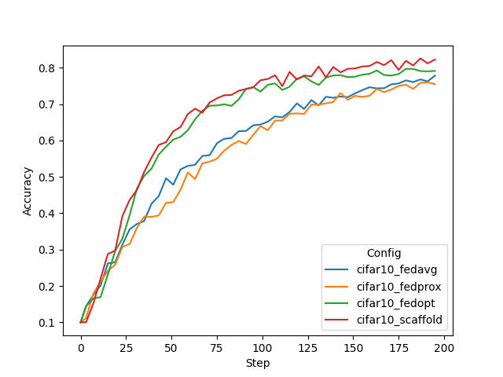

# Federated Learning with CIFAR-10

## (Optional) 1. Set up a virtual environment
```
python3 -m pip install --user --upgrade pip
python3 -m pip install --user virtualenv
```
(If needed) make all shell scripts executable using
```
find . -name ".sh" -exec chmod +x {} \;
```
initialize virtual environment.
```
source ./virtualenv/set_env.sh
```
install required packages for training
```
pip install --upgrade pip
pip install -r ./virtualenv/min-requirements.txt
```
(optional) if you would like to plot the TensorBoard event files as shown below, please also install
```
pip install -r ./virtualenv/plot-requirements.txt
```

## 2. Create your FL workspace and start FL system 

The next scripts will start the FL server and 8 clients automatically to run FL experiments on localhost.
In this example, we run all 8 clients on one GPU with 12 GB memory per job.

### 2.1 Secure FL workspace

The project file for creating the secure workspace used in this example is shown at 
[./workspaces/secure_project.yml](./workspaces/secure_project.yml).

To create the secure workspace, please use the following to build a package and copy it 
to `secure_workspace` for later experimentation.
```
cd ./workspaces
python3 -m nvflare.lighter.provision -p ./secure_project.yml
cp -r ./workspace/secure_project/prod_00 ./secure_workspace
cd ..
```
For more information about secure provisioning see the [documentation](https://nvflare.readthedocs.io/en/2.1.0/user_guide/provisioning_tool.html).

For starting the FL system with 8 clients in the secure workspace, run
```
./start_fl_secure.sh 8
```

### 2.2 (Optional) POC ("proof of concept") workspace
To run FL experiments in POC mode, create your local FL workspace the below command. 
In the following experiments, we will be using 8 clients. Press y and enter when prompted. 
```
./create_poc_workpace.sh 8
```
Then, start the FL system with 8 clients by running
```
./start_fl_poc.sh 8
```

> **_NOTE:_** **POC** stands for "proof of concept" and is used for quick experimentation 
> with different amounts of clients.
> It doesn't need any advanced configurations while provisioning the startup kits for the server and clients. 
>
> The **secure** workspace on the other hand is needed to run experiments that require encryption keys such as the 
> homomorphic encryption (HE) one shown below. These startup kits allow secure deployment of FL in real-world scenarios 
> using SSL certificated communication channels.

### Multi-tasking
In this example, we assume two local GPUs with at least 12GB of memory are available. 
Hence, in the secure project configuration [./workspaces/secure_project.yml](./workspaces/secure_project.yml), 
we set the available GPU indices as `gpu: [0, 1]` using the `ListResourceManager` and `max_jobs: 2` in `DefaultJobScheduler`.

For the POC workspace, adjust the default values in `./workspaces/poc_workspace/site-*/startup/fed_client.json` 
and `./workspaces/poc_workspace/server/startup/fed_server.json`. 

For details, please refer to the [documentation](https://nvflare.readthedocs.io/en/2.1.0/user_guide/job.html).

### 2.3 Download the CIFAR-10 dataset 
To speed up the following experiments, first download the [CIFAR-10](https://www.cs.toronto.edu/~kriz/cifar.html) dataset:
```
python3 ./pt/utils/cifar10_download_data.py
```
> **_NOTE:_** This is important for running multi-task experiments. Otherwise, each job will try to download the dataset 
> to the same location which might cause a file corruption.

## 3. Run automated experiments

Next, we will submit jobs to start FL training automatically. 

The [submit_job.sh](./submit_job.sh) script follows this pattern:
```
./submit_job.sh [config] [alpha]
```
If you want to use the poc workspace, append `--poc` to this command, e.g,: 
```
./submit_job.sh [config] [alpha] --poc
```

In this simulation, the server will split the CIFAR-10 dataset to simulate each client having different data distributions.

The `config` argument controls which experiment job to submit. 
The respective folder under `job_configs` will be submitted using the admin API with [submit_job.py](./submit_job.py) for scheduling.
The admin API script ([submit_job.py](./submit_job.py)) also overwrites the alpha value inside the 
job configuration file depending on the provided commandline argument.
Jobs will be executed automatically depending on the available resources at each client (see "Multi-tasking" section).

### 3.1 Varying data heterogeneity of data splits

We use an implementation to generated heterogeneous data splits from CIFAR-10 based a Dirichlet sampling strategy 
from FedMA (https://github.com/IBM/FedMA), where `alpha` controls the amount of heterogeneity, 
see [Wang et al.](https://arxiv.org/abs/2002.06440)

### 3.2 Centralized training

To simulate a centralized training baseline, we run FL with 1 client for 25 local epochs but only for one round. 
It takes circa 6 minutes on an NVIDIA TitanX GPU.
```
./submit_job.sh cifar10_central 0.0
```
Note, here `alpha=0.0` means that no heterogeneous data splits are being generated.

You can visualize the training progress by running `tensorboard --logdir=[workspace]/.`


### 3.3 FedAvg on different data splits

FedAvg (8 clients). Here we run for 50 rounds, with 4 local epochs. Corresponding roughly 
to the same number of iterations across clients as in the central baseline above (50*4 divided by 8 clients is 25):
Each job will take about 35 minutes, depending on your system. 

You can copy the whole block into the terminal, and it will execute each experiment one after the other.
```
./submit_job.sh cifar10_fedavg 1.0
./submit_job.sh cifar10_fedavg 0.5
./submit_job.sh cifar10_fedavg 0.3
./submit_job.sh cifar10_fedavg 0.1
```

> **_NOTE:_** You can always use the admin console to manually abort a running job. 
  using `abort_job [JOB_ID]`. 
> For a complete list of admin commands, see [here](https://nvflare.readthedocs.io/en/2.1.0/user_guide/admin_commands.html).

> To log into the POC workspace admin console no username is required 
> (use "admin" for commands requiring conformation with username). 

> For the secure workspace admin console, use username "admin@nvidia.com"

After training, each client's best model will be used for cross-site validation. 
The results can be downloaded and shown with the admin console using
```
  download_job [JOB_ID]
```
where `[JOB_ID]` is the ID assigned by the system when submitting the job.

The result will be downloaded to your admin workspace (the exact download path will be displayed when running the command).
You should see the cross-site validation results at
```
[DOWNLOAD_DIR]/[JOB_ID]/workspace/cross_site_val/cross_val_results.json
```

### 3.4: Advanced FL algorithms (FedProx, FedOpt, and SCAFFOLD)

Next, let's try some different FL algorithms on a more heterogeneous split:

[FedProx](https://arxiv.org/abs/1812.06127) adds a regularizer to the loss used in `CIFAR10Learner` (`fedproxloss_mu`)`:
```
./submit_job.sh cifar10_fedprox 0.1
```
[FedOpt](https://arxiv.org/abs/2003.00295) uses a new ShareableGenerator to update the global model on the server using a PyTorch optimizer. 
Here SGD with momentum and cosine learning rate decay:
```
./submit_job.sh cifar10_fedopt 0.1
```
[SCAFFOLD](https://arxiv.org/abs/1910.06378) uses a slightly modified version of the CIFAR-10 Learner implementation, namely the `CIFAR10ScaffoldLearner`, which adds a correction term during local training following the [implementation](https://github.com/Xtra-Computing/NIID-Bench) as described in [Li et al.](https://arxiv.org/abs/2102.02079)
```
./submit_job.sh cifar10_scaffold 0.1
```

### 3.5 Secure aggregation using homomorphic encryption

Next we run FedAvg using homomorphic encryption (HE) for secure aggregation on the server in non-heterogeneous setting (`alpha=1`).

> **_NOTE:_** For HE, we need to use the securely provisioned workspace. 
> It will also take longer due to the additional encryption, decryption, encrypted aggregation, 
> and increased encrypted messages sizes involved.

FedAvg with HE: 
```
./submit_job.sh cifar10_fedavg_he 1.0
```

> **_NOTE:_** Currently, FedOpt is not supported with HE as it would involve running the optimizer on encrypted values.

### 3.6 Running all examples

You can use `./run_experiments.sh` to submit all above-mentioned experiments at once if preferred. 
This script uses the secure workspace to also support the HE experiment.

## 4. Results

Let's summarize the result of the experiments run above. First, we will compare the final validation scores of 
the global models for different settings. In this example, all clients compute their validation scores using the
same CIFAR-10 test set. The plotting script used for the below graphs is in 
[./figs/plot_tensorboard_events.py](./figs/plot_tensorboard_events.py) 
(please install [./virtualenv/plot-requirements.txt](./virtualenv/plot-requirements.txt)).

To use it, download all job results using the `download_job` admin command and specify the `download_dir` in [./figs/plot_tensorboard_events.py](./figs/plot_tensorboard_events.py). 

### 4.1 Central vs. FedAvg
With a data split using `alpha=1.0`, i.e. a non-heterogeneous split, we achieve the following final validation scores.
One can see that FedAvg can achieve similar performance to central training and 
that HE does not impact the performance accuracy of FedAvg significantly while adding security to the aggregation step.

| Config	| Alpha	| 	Val score	| 
| ----------- | ----------- |  ----------- |
| cifar10_central | 1.0	| 	0.8798	| 
| cifar10_fedavg  | 1.0	| 	0.8854	| 
| cifar10_fedavg_he | 1.0	| 	0.8897	|



### 4.2 Impact of client data heterogeneity

We also tried different `alpha` values, where lower values cause higher heterogeneity. 
This can be observed in the resulting performance of the FedAvg algorithms.  

| Config |	Alpha |	Val score |
| ----------- | ----------- |  ----------- |
| cifar10_fedavg |	1.0 |	0.8854 |
| cifar10_fedavg |	0.5 |	0.8633 |
| cifar10_fedavg |	0.3 |	0.8350 |
| cifar10_fedavg |	0.1 |	0.7733 |



### 4.3 FedAvg vs. FedProx vs. FedOpt vs. SCAFFOLD

Finally, we compare an `alpha` setting of 0.1, causing a high client data heterogeneity and its 
impact on more advanced FL algorithms, namely FedProx, FedOpt, and SCAFFOLD. FedProx and SCAFFOLD achieve better performance compared to FedAvg and FedProx with the same `alpha` setting. However, FedOpt and SCAFFOLD show markedly better convergence rates. SCAFFOLD achieves that by adding a correction term when updating the client models, while FedOpt utilizes SGD with momentum
to update the global model on the server. Both achieve better performance with the same number of training steps as FedAvg/FedProx.

| Config           |	Alpha |	Val score |
|------------------| ----------- |  ---------- |
| cifar10_fedavg   |	0.1 |	0.7733 |
| cifar10_fedprox  |	0.1 |	0.7615 |
| cifar10_fedopt   |	0.1 |	0.8013 |
| cifar10_scaffold |	0.1 |	0.8222 |




## 5. Streaming TensorBoard metrics to the server

In a real-world scenario, the researcher won't have access to the TensorBoard events of the individual clients. In order to visualize the training performance in a central place, `AnalyticsSender`, `ConvertToFedEvent` on the client, and `TBAnalyticsReceiver` on the server can be used. For an example using FedAvg and metric streaming during training, run:
```
./submit_job.sh cifar10_fedavg_stream_tb 1.0
```
Using this configuration, a `tb_events` folder will be created under the `[JOB_ID]` folder of the server that includes all the TensorBoard event values of the different clients.
