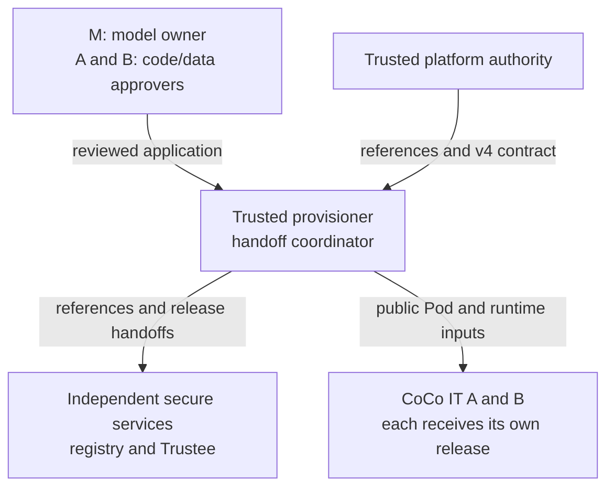
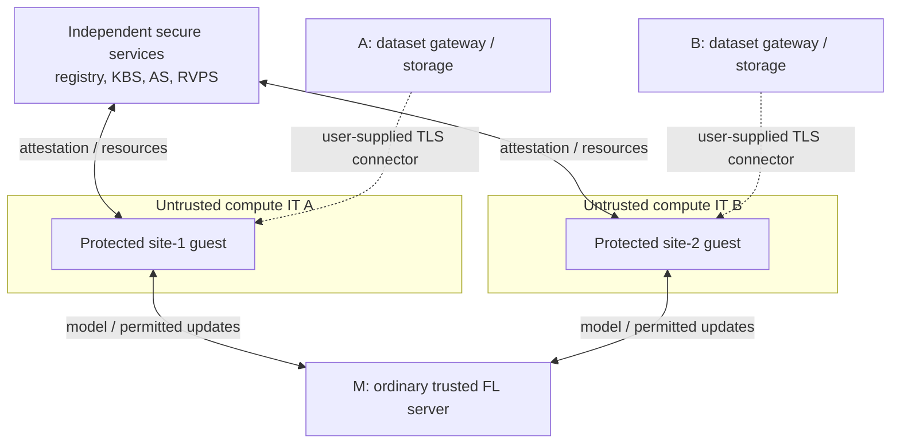

# One model owner and two data owners

Model owner **M** runs an FL server. Data owner **A** participates as `site-1`,
and data owner **B** as `site-2`, each in a confidential guest on a separately
operated, untrusted compute cluster. This guide connects the deployment roles
to that federation; follow the linked runbooks for the installation commands.
A finite mixed TDX CPU-only/SNP+GPU functional run passed on 2026-10-04;
that test is not a supplied training application or complete security qualification.
The [complete mixed project](provision/mixed-tdx-snp/README.md) supplies the normal
ordinary-server/two-client configuration and a baked validation application.

Choose SNP-only, SNP+GPU, TDX-only or TDX+GPU for each protected participant.
Approve and validate the intended hardware independently. See
[target validation status](RUNTIME-VARIANTS.md#support-status-and-hardware-validation). Dataset
delivery also has a separate security gate described [below](#dataset-delivery-and-persistence).

## Architecture and responsibility

Preparation and approval handoffs:



Runtime data flow (after independent release approval):



These diagrams show logical roles and data paths. The provisioner publishes
encrypted images to the registry and sends private release handoffs only to
the independent administrator. A and B must each approve the
code that consumes their data before the provisioner packages it. The dashed
dataset paths require user-supplied integration and recipient authorization;
neither peer attestation nor a diagram establishes that gate. Solid runtime
paths also use authenticated transport; the dashed styling identifies missing
application integration, not weaker transport requirements.

| Actor | Authority and trust agreement |
| --- | --- |
| M, model owner | Supplies the model and reviewed client/server code; operates the ordinary server and trusted FL console. A and B approve permitted model/job inputs and outputs to M. |
| A and B, data owners | Each independently approves its client's code, dependencies, dataset scope, purpose, recipients and output policy, directly or through a delegated reviewer. Compute IT cannot grant that approval. |
| Trusted provisioner (`admin/`) | Builds, signs and encrypts each participant's image. M, A and B must trust it with plaintext application code, startup-kit credentials, signing keys and image keys. M may take this role with their agreement. |
| Platform authority (`trusted_system/`) | Reviews the guest artifacts, effective launch shape and firmware/TCB baseline; verifies evidence and approves reference values and launch contracts. This is separate from untrusted compute IT. |
| Secure-services administrator (`service/`) | Operates registry, Trustee/KBS, Attestation Service (AS) and Reference Value Provider Service (RVPS); checks owners' recorded approvals before installing platform and workload policy. There is no automatic multi-owner approval quorum. |
| Compute IT A and B (`coco/`) | Installs the public runtime and launches its site's unchanged Pod. Receives no plaintext startup kit, image key, publisher credential or secure-services administration credential. |

Code confidentiality from compute IT must not prevent the owners' reviewers
from assessing it. A publisher signature authorizes a publisher; it does not
prove that code preserves data privacy. Record the accepted code/build recipe,
dependencies, releases, permitted inputs and outputs before packaging.

The `admin/` deployment role is distinct from the FL console administrator's
ordinary signed startup kit. Keep both off untrusted compute hosts. Trusted
roles may share a machine only when every affected owner accepts the combined
authority and secret exposure. Separate VMs controlled by the same hostile
administrator do not provide independent trust. Keep secure services and
owner-controlled dataset services outside the untrusted clusters.

## Machines and target choice

| Machine | Prerequisites supplied by the deployment | What the role scripts prepare |
| --- | --- | --- |
| Trusted provisioning node | Ubuntu 26.04 x86_64, matching NVFlare in a project `.venv`, system Python 3.11+, private build storage, reviewed Dockerfiles and authenticated public trust inputs | Admin stage 00 installs Docker/build, image encryption/signing and policy tools; provisioning creates signed kits and separate releases. No TEE is needed here. |
| Trusted platform system | Ubuntu 26.04 x86_64, selected CPU TEE and firmware baseline; confidential GPU only for a GPU target | Host tools, rehearsal Kubernetes, pinned Kata guest/runtime, collectors and verified reference exports |
| Independent secure-services host | Ubuntu 24.04 x86_64, protected administration/TLS keys, DNS and networking; see [host requirements](service/SERVICE-INSTALLATION.md#1-prepare-the-secure-services-host-and-network) | Docker/build tools, TLS registry, Trustee/KBS/AS/RVPS and approved policies; no TEE, GPU or Kubernetes required |
| Two compute hosts, one per site | Ubuntu 26.04 x86_64, selected TEE stack and approved launch profile; one allocatable confidential GPU per concurrently running GPU Pod | Host preflight, Kubernetes, pinned Kata runtime and optional GPU Operator; the host remains untrusted |
| M's ordinary server and FL console | Trusted OS, matching NVFlare, private signed kits, reachable server DNS/TCP endpoint | Provisioning prepares kits; M starts the server and uses the trusted console to verify the federation |
| A's and B's dataset services | Owner-controlled storage, TLS gateway, recipient authorization and reviewed guest connectors | Application-specific integration; these scripts do not install it |

Choose one row per protected participant and use it consistently in the
rehearsal, its CC YAML, admin kit and compute-host configuration:

| Target | `cpu_tee` | `gpu_tee` | `RUNTIME_CLASS` |
| --- | --- | --- | --- |
| SNP-only | `amd_sev_snp` | `none` | `kata-qemu-snp` |
| SNP+GPU | `amd_sev_snp` | `nvidia_cc` | `kata-qemu-nvidia-gpu-snp` |
| TDX-only | `intel_tdx` | `none` | `kata-qemu-tdx` |
| TDX+GPU | `intel_tdx` | `nvidia_cc` | `kata-qemu-nvidia-gpu-tdx` |

CPU-only profiles set bootstrap `GPU_COUNT=0`, allocate no GPU, and need no GPU
Operator or CUDA libraries. GPU profiles set `GPU_COUNT=1`, allocate exactly
one `nvidia.com/pgpu` per Pod and require NVIDIA appraisal even if the application
does not perform GPU work. Two simultaneous GPU clients need two allocatable
GPUs; a GPU-protected server requires another. An ordinary server needs no TEE
and verifies client proofs locally with the pinned AS public key.

For a protected server, enable `cc_config: cc_server.yml` as described in
[server provisioning](provision/README.md#configuration-and-command), choose
its target independently and create its own release. Its logical attestation
identity is `server`; its TLS identity remains the project DNS name. Configure
the [reachable protected-server endpoint](provision/README.md#protected-server-network-endpoint)
without terminating NVFlare TLS outside the guest.

The installers do not enable firmware, install a vendor TEE host baseline,
register an Intel platform, or install and approve TDX QGS/DCAP. Prepare those
externally. TDX requires the reviewed active QGS package and configuration pins
specified in [host prerequisites](RUNTIME-VARIANTS.md#1-prepare-the-trusted-and-untrusted-hosts).
GPU targets additionally require supported hardware in production confidential
computing mode. Historical script names containing `snp` or `gpu` dispatch by
the selected target; do not edit them to select TDX or CPU-only.

Supply DNS, firewall rules and routing yourself. Registry/KBS DNS must resolve
inside each guest, not just on its host. With the supplied registry configuration,
the publisher's authenticated `/32` egress origin must differ from both sites'
pull origins; see [service network setup](service/SERVICE-INSTALLATION.md).

## Guest, application image and collector

The pinned prebuilt Kata artifacts supply the guest kernel, rootfs and guest
services. You do not build a new guest OS per site. The separate application
Dockerfile supplies matching NVFlare, Python 3.11+, bash/coreutils and all reviewed
training/connector code and dependencies. Replace the deliberately non-runnable
bases in the [client](provision/site-1/Dockerfile) and
[server](provision/server/Dockerfile) examples with reviewed, digest-pinned
application bases. Bake dependencies into the image rather than downloading
executable code at startup.

Provisioning inserts each participant's signed startup kit into its own image,
encrypts the layers and signs the immutable manifest. At launch, guest services
pull the ciphertext and request resources from KBS. KBS independently appraises
the CPU, any required GPU and release-specific InitData/resource policy before
releasing resources; image verification and decryption occur inside the guest.
The baked startup then starts NVFlare as UID/GID 65532. Its guest-local writable
state must be explicitly approved with `readOnlyRootFilesystem: false`.

CCManager disables bring-your-own-code (BYOC) jobs. Admit reviewed, fully
qualified application classes through `class_allow_list` where needed. Code,
dependency, startup-kit or policy changes require a new release, new per-release
key and renewed approval; changing measured launch inputs also requires a new
platform rehearsal. Do not patch code through a job or modify a signed kit.

The collector is a temporary diagnostic application on the trusted platform
system. It obtains fresh CPU evidence, captures the actual launch and repeats
it against the approved shape. Its special diagnostic privileges do not become
application permissions. It does not run your encrypted application, prove its
decryption-key release or establish GPU/NRAS appraisal. Follow the
[SNP](trusted_system/SEC-SYS-LAUNCH-PROFILE.md) or
[TDX](trusted_system/TDX-LAUNCH-PROFILE.md) verification procedure.

References can serve more than one site only when the platform authority has
approved their matching target, launch inputs and security baseline. Different
application releases can share that profile but still need independent workload
authorization. Never copy an SNP+GPU reference into another target. Hardware or
firmware changes require review and fresh rehearsal before approving a different
profile; the same CPU model or runtime name is insufficient. A host OS change
is not automatically a guest measurement change; recheck its effect on
the TEE stack, firmware/TCB, effective QEMU launch and compatibility. Guest boot
artifacts, kernel parameters, token-API configuration or launch-shape changes
require reviewed rehearsal and new references/contracts. Local hashes or a
RuntimeClass name do not remotely prove the hostile host's installation or
complete guest rootfs integrity.

## Prepare and package the two clients

Start from a clean, reviewed source revision and assemble the
[complete role kits](README.md#assemble-self-contained-role-kits). Use
[CONFIGURATION.md](CONFIGURATION.md) for private inputs and transfer boundaries.
For TDX CPU-only `site-1`, SNP+GPU `site-2`, and an ordinary server, use the
[complete mixed example](provision/mixed-tdx-snp/README.md). The snippets below
also show how to adapt the original single-client example.

Retain the server, FL admin, builder order and packager in
[provision/project.yaml](provision/project.yaml), set real server/admin identities,
and replace its single client with:

```yaml
  - name: site-1
    type: client
    org: data_owner_a
    cc_config: cc_site-1.yml
  - name: site-2
    type: client
    org: data_owner_b
    cc_config: cc_site-2.yml
```

Copy/adapt [cc_site-1.yml](provision/cc_site-1.yml) for site-2 and provide both
reviewed build contexts. Keep `cc_deployment_mode: coco`; select `cpu_tee` and
`gpu_tee` from the table above. The participant type supplies the client role.

| Per-client input | Site A | Site B |
| --- | --- | --- |
| `workload.source.context` | `./site-1` | `./site-2` |
| `workload.source.dockerfile` | `Dockerfile` | `Dockerfile` |
| `coco.release_name` | `site-1-v1` | `site-2-v1` |
| `coco.registry_repository` | `workloads/site-1` | `workloads/site-2` |

Each `coco.platform_config_file` points to a file named `platform.env` inside its prepared
admin kit, with the matching authenticated v4 launch contract. Use separate
admin kits when profiles or trust inputs differ. Mixed targets may share one
project. Both participants select the same named Trustee service in
`cc_project.yml`; its public key and attestation timing apply project-wide.
Reusing approved application code does not permit sharing site identities or keys.
Put one complete `workload_constraints` mapping in the named Trustee service:
require `cpu_tee: tdx` for `site-1` and `cpu_tee: snp` for `site-2`. Select
`gpu_tee: none` and `gpu_tee: nvidia_cc` in their respective participant files;
provisioning derives the internal GPU evidence requirements. Add independently
approved platform measurement pins when required. The generated ordinary server inherits
these constraints, the AS public key, project audience, and required-participant
mapping. It verifies the two clients directly and issues no CC proof itself.

## Execute the approvals and handoffs in order

1. **M, A and B approve the application and validation job.** Record code,
   dependencies, connector, output policy and permitted model/job inputs. The
   platform authority reviews the application source Pod shape and explicit
   [security context](admin/APPROVED-LAUNCH-PROFILE.md#approved-application-security-context-v3),
   including UID/GID 65532 and writable rootfs for NVFlare. This source Pod is
   an input to rehearsal, not the final encrypted-release handoff. Host volumes,
   sidecars and interactive debugging are outside the approved shape.

2. **The platform authority runs trusted-system stages 01–10** in
   [the documented order](trusted_system/README.md#execution-order), using the
   selected SNP/TDX runbook. Independently approve TCB/security floors before
   accepting fresh evidence; do not promote a collector's observations into
   approval. Stage 08's fresh repeat is mandatory; for TDX the authority explicitly
   approves the candidate tuple hash afterward. Stage 10 exports
   `platform-reference-values.json` for secure services and
   `approved-workload-launch-profile.json` for the provisioner.
   The latter uses `coco-approved-workload-launch/v4`; it is not an AS policy.
   Authenticate both transfers through the trusted coordinator and independently
   pin the [launch-contract digest](admin/APPROVED-LAUNCH-PROFILE.md).
   Retain reports, quotes, collateral, logs and launch evidence privately.

3. **Secure services installs and verifies the references.** Run fresh-host
   stages **01–11** from [the service runbook](service/README.md#installation-order),
   including stage 02's `--configure-only` and explicit target-policy approval
   in stage 09. SNP uses the [five-field handoff](service/PLATFORM-REFERENCE-VALUES-HANDOFF.md);
   TDX uses [complete approved tuples](service/TDX-REFERENCE-VALUES.md).
   A TDX install replaces the full TDX profile set: retain every profile still
   needed by either site; do not mix individual fields across tuples.
   Verify RVPS restart persistence and distribute authenticated registry/KBS
   certificates and the AS signing public key. Only the provisioner receives
   publisher credentials. Once the current CPU policy is installed, later
   reference-only updates use **02 → 10 → 11**; follow the service runbook's
   migration procedure for an older policy. Stage 05 resets workload
   authorization to default-deny.

4. **Each site's IT prepares its public runtime.** Follow
   [CoCo installation](coco/README.md#build-a-fresh-cluster): **00 → 10 → 20 →
   30 → 35 → 40 → 60**, editing and rerunning stage 10 after its initial
   configuration creation. Supply the pinned public chart before stage 30 and
   registry CA before stage 40. This can run alongside packaging. IT does not
   collect approval references or administer a local replacement Trustee.

5. **The provisioner builds the approved releases.** Prepare authenticated
   `public/trustee.crt`, `public/registry-ca.crt`, the AS public key, pinned
   launch contracts, admin tools (stage **00**) and publisher credentials
   (stage **05**). Rehearse the [guest token API](provision/CCMANAGER.md#trusted-platform-owner-rehearse-the-guest-api)
   with the actual reviewed NVFlare image. In the matching environment,
   from `provision/`, run:

   ```bash
   nvflare provision -p project.yaml
   ```

   The runner invokes admin **10 → plaintext-image approval → 20 → 25 → 30 →
   40** per protected participant. Each release uses its own decryption key;
   the registry receives ciphertext and signatures, while the private service
   handoff supplies keys separately to KBS. Review generated identities,
   required CC sites, image digest and policy before delivery. Outputs are separate signed
   kits, encrypted images, release policies and handoffs. Retain all plaintext
   and recovery/build state privately.

6. **Secure services authorizes each confidential release before launch.**
   Send each `trusted-service/` handoff privately: `image_key`, `cosign.pub`,
   `image-security-policy.json`, `release-authorization.json`,
   `resource-policy-fragment.rego`, and `SHA256SUMS`. After checking owners'
   approvals and independently authenticating the SHA-256 of `SHA256SUMS`,
   the service administrator runs:

   ```bash
   ./12-install-trusted-service-handoff.sh /private/incoming/site-1-v1 EXPECTED_MANIFEST_SHA256
   ```

   Repeat for site-2 with its own directory and digest. Follow the
   [trusted-handoff runbook](service/TRUSTED-HANDOFF-RUNBOOK.md): stage 12 merges
   releases into the complete resource policy; do not install one fragment as
   the global policy. Platform approval alone grants no image-key access.

7. **M starts the ordinary server; IT launches only authorized Pods.** After
   service approval, deliver only each site's final Pod YAML and an independently
   authenticated SHA-256. From that site's CoCo kit, use its delivered filename:

   ```bash
   ./50-launch-handoff.sh site-1-v1-pod.yaml EXPECTED_SHA256
   ./70-verify-running-workload.sh site-1-v1-pod.yaml EXPECTED_SHA256
   ```

   Stage 50 invokes `kubectl apply -f` on the authenticated, unchanged Pod YAML;
   stage 70 verifies the actual running workload. Each guest communicates
   directly with the registry, Trustee and the NVFlare server; the provisioner
   or control workstation is not a network relay. Repeat for site-2. For a
   protected server, authorize and launch its separate
   release too. Coordinate participant startup with the required proof interval.
   From the service kit, verify each release with a window containing its launch:

   ```bash
   ./13-verify-workload-release.sh site-1-v1 5m \
     /private/incoming/site-1-v1/release-authorization.json
   ```

   The third argument selects the release's CPU/GPU expectations. Repeat for
   every protected participant. Require CPU appraisal, GPU appraisal when
   selected, and the three exact resource releases. Log checks are diagnostic;
   they do not cryptographically correlate separate entries to one session.

8. **The trusted FL administrator verifies application operation.** Follow
   [federation verification](provision/VERIFY-RUNNING-FEDERATION.md), setting
   `EXPECTED_CLIENTS=site-1,site-2` and `REQUIRED_CC_SITES=site-1,site-2`
   (add `server` to the latter for a protected server). The finite validation
   job must require both clients in `mandatory_clients`, use `min_clients: 2`,
   and actually exercise both. Check registration, expected results and required
   proofs; Pod readiness is insufficient. Complete the positive and negative
   [hardware acceptance checks](RUNTIME-PORTING.md#acceptance-evidence) for each
   selected profile before declaring it validated.

## Dataset delivery and persistence

The dataset path is user-supplied. A and B each provide a TLS/mTLS gateway and
a reviewed connector baked into the appropriate client image. Before releasing
records, that owner's gateway must authenticate and authorize the receiving
site, approved workload, dataset scope and expiry. Keep gateway administration,
storage and credentials outside compute IT's control. Do not put dataset
credentials in public Pod YAML or host-managed Kubernetes Secrets, or export
the private-key-bearing guest AA response.

**Strict approved-code-only dataset delivery remains a deployment gate.** A
participant certificate and CoCoAuthorizer peer proof do not prove the exact
application image or implement a dataset ACL. Establish actual-image
authorization and guest boot/rootfs integrity coverage, then test recipient
authorization before sending sensitive data. The unresolved exact-image-digest
and rootfs coverage concerns are discussed in the
[security architecture companion review](https://github.com/NVIDIA/NVFlare/pull/5351).
Successful CPU/GPU appraisal or key release does not close them. The absence
of a direct effective-image-digest check does not by itself demonstrate a
cross-release substitution: another image encrypted with its own key cannot be
decrypted with this release's key, and its key request must satisfy its own KBS
policy. Treat the documented comparison gap and a demonstrated bypass as
separate findings; use isolated fixtures to test the actual enforcement path.

The current packager rejects volumes, including dataset `hostPath` and PVC
mounts. Writable guest-local state is ephemeral; it is not a durable encrypted
dataset/checkpoint service. Users must implement and review protected storage
and result/checkpoint delivery, key custody, retention and rollback/replay
handling. A host-backed disk does not gain confidentiality and integrity merely
by being accessible inside the guest. For untrusted network storage, encrypt
and authenticate content inside the guest and retain decryption authority with
the owner.

M sends permitted models/configuration over authenticated NVFlare transport;
clients return the outputs their owners approved. Keeping raw records local is
an application/output-policy requirement. Model updates can disclose training
information, and an ordinary server can see them. Differential privacy, secure
aggregation and controls for malicious model inputs require separate design
and validation; this package does not automatically supply them.
