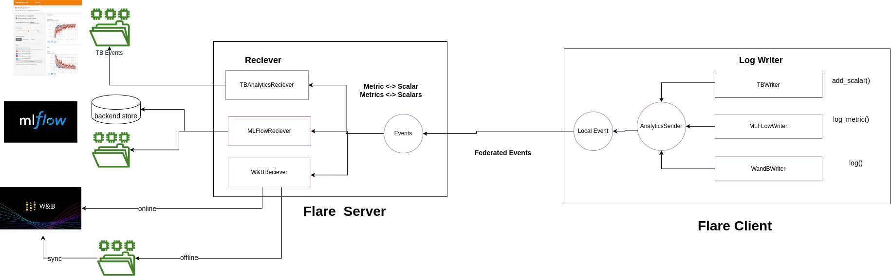
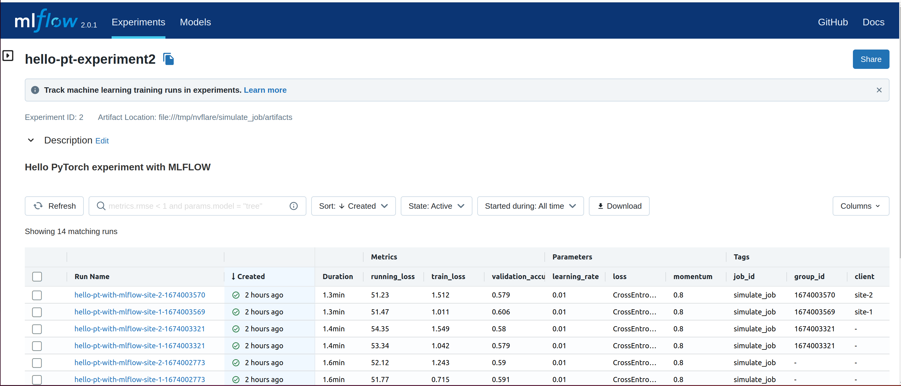
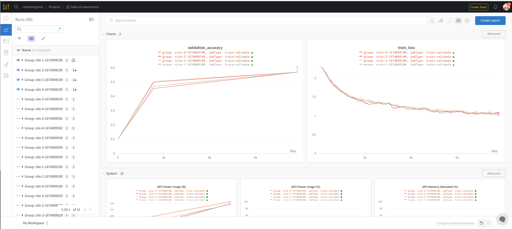

# Federated Machine Learning Experiment Tracking

## Overview and approaches

In a federated computing setting, the data is distributed across multiple devices or systems, and training is run
on each device independently while preserving client’s data privacy.

Federated ML experiment tracking presents unique challenges.

* Authentication and accessibility: with many clients, not every client has access to the experiment tracking server directly and those who do will require additional authentication process
* Networking challenges: high latency, limited bandwidth, and unreliable connectivity if the every client is trying to connect to ML tracking server
* Tracking server load challenges: with many clients sending logging to the same ML tracking server, depending on the number of the iterations (usually in thousands or 10s of thousands) and rate of metrics logs, we could potentially have very high traffic to the ML tracking server.
* Code re-usability: if we develop the code for Tensorboard, but now like to switch to MLFLow, can we do it without having to rewrite the logging statements?

Assuming the Federated System is consists of one server and many clients, the server coordinate the ML training of clients. 
We can interact with ML experiment tracking tools in two different ways: 

* Client-side experiment tracking
  * Each client will directly send the log metrics/parameters to the ML experiment tracking server or local file system
* Server-side experiment tracking
  * clients will send the log metrics/parameters to FL server, and the FL server will send the metrics to ML experiment
    tracking server or local file system

Each approach will have its use cases and unique challenges. In NVFLARE, we developed a server-side approach:

* clients don't need to have access to tracking server, avoiding the additional 
authentication for every clients. In many cases, the clients may from different organizations, 
and different from the host organization of the experiment tracking server. 

* since we reduced connection to tracking server from N clients to 1 server, the traffic to the tracking server 
could be highly reduced. In some cases, such as in MLFLow, the events can be buffered in the server and batch to the tracking
server, which further reduce the traffic to the tracking server. The buffer may add additional latency, you can disable the buffering
if you can set the buffer flush time to 0 assuming the tracking server can take the traffic.  

* another key benefit of using server-side experiment tracking is that we separate the metrics data collection 
from the metrics data delivery to tracking server, where Clients are only responsible to collect metrics, and only server needs to 
to know which tracking server to send. This allows us to have different tools for data collection and data delivery. 
For example, if have written the training code with logging in Tensorboard syntax, without changing the code, we could deliver the metrics to MLFlow. 

* server-side experiment tracking also can organize different client's results into different experiment runs. 
so they can easily compare side-by-side. 


## Tools, Sender, LogWriter and Receivers

Through several example, we will show how to track and visualize experiments in real time, compare results
by leverage several experiment tracking tools. 
* Tensorboard
* MLFlow 
* Weights and Biases 
  * **Note**: user needs to signup at Weights and Biases to access service, NVFLARE will not provide the access

During Federated Learning phase, user can choose and API syntax that they are used to, 
such as APIs from one of above tools, the NVFLARE has developed component that mimic these tool's APIs. 
These components are called experiment tracking LogWriters. All clients experiment logs are streamed over FL server, 
where the actual experiment logs are recorded. The components that receive these logs are called Receivers.
The receiver component will leverage the experiment tracking tool and record the logs during the experiment run. 

In normal setting, we would have pairs of sender and receivers, such as
* TBWriter  <-> TBReceiver
* MLFlowWriter <-> MLFlowReceiver
* WandBWriter <-> WandBReceiver

We could also mix-match for any pairs. This allows one write the ML code using one API, 
but be able to switch different experiment tracking tool(s), as matter of facts, one can use many receivers for the 
same log data send from one sender. 



## Experiment logs streaming

On the client side, When writer write the metrics, instead of writing to files, it actually generates NVFLARE events 
of type `analytix_log_stats`. The `ConvertToFedEvent` widget will turn the local event `analytix_log_stats` into a 
fed event `fed.analytix_log_stats`, which will be delivered to the server side.

On the server side, the `Receiver` is configured to process `fed.analytix_log_stats` events,
which writes received log data into appropriate end points.

## Support custom experiment tracking tools

There are many different experiment tracking tools, you might want to write a different writer and/or receiver for your needs.

There are three things to consider develop a custom experiment tracking tool. 

**Data Type**

Currently, we choose to support metrics, params, and text data type. If you require other data type, may sure you add
the AnalyticsDataType
   
**Writer**

implement LogWriter Interface to specify the API syntax. 
For each tool, we **mimic** the underline tools API syntax, so user can follow without learning the new APIs. 
For example, for Tensorboard, The TBWriter will use add_scalar(), add_scalars() syntax; while for MLFlow, the same syntax
could be log_metric(), log_metrics(), log_parameter(), log_parameters(); and W&B writer will simply log().
But the data collected from above API will simply send to the AnalyticsSender to deliver to the FL server. 

**Receiver**

Implement AnalyticsReceiver Interface, and determine how to represent different sites' log.  In all three implementations
(Tensorboard, MLFlow, WandB), each site's log is represented as one run. Depending on the individual tool, the implementation 
can be different. For example, Both Tensorboard and MLFLow, we simple create different runs for each client and map to the 
site-name. In WandB implementation, we have to leverage multiprocess and let each run in different process.  

## Examples Overview

We illustrate how to leverage different writers and receivers via different examples.
All examples will leverage the example hello-pt. 

[hello-pt-tb](hello-pt-tb)
* The first example shows how to use Tensorboard Tracking Tool ( both sender and receiver)
* The second example shows how to use Tensorboard Sender only, while the receivers are MLFlow 


[hello-pt-mlflow](hello-pt-mlflow)
* The first example shows how to use MLFlow Tracking Tool ( both sender and receiver)
* The second example shows how to use MLFlow Sender only, while the receivers are Tensorboard




[wandb_tracker](hello-pt-wandb/wandb)
* This example shows how to create a custom integration with a new experimentation tracking system.
We use Weights and Biases for this example. Then in the next example, we use the newly developed WandB receiver and
log writer in hello-pt-wandb to log metrics.


[hello-pt-wandb](hello-pt-wandb)
* The example shows how to use Weights & Biases Tracking Tool ( both sender and receiver)




## Setup for all examples

Example of using [NVIDIA FLARE](https://nvflare.readthedocs.io/en/main/index.html) to train an image classifier using federated averaging ([FedAvg]([FedAvg](https://arxiv.org/abs/1602.05629))) and [PyTorch](https://pytorch.org/) as the deep learning training framework. This example also highlights the TensorBoard streaming capability from the clients to the server.

> **_NOTE:_** This example uses the [CIFAR-10](https://www.cs.toronto.edu/~kriz/cifar.html) dataset and will load its data within the trainer code.

### 1. Prepare venv.

```
python -m venv ~/nvflare-hello

source ~/nvflare-hello/bin/activate
```


### 2. Install NVIDIA FLARE

Follow the [Installation](https://nvflare.readthedocs.io/en/main/quickstart.html) instructions.

### 3. Install Jupyter Notebook

```
pip install notebook
```

### 4. Examples in Notebook

For detailed examples explanation, please check the notebook

```
jupyter notebook experiment_tracking.ipynb
```


