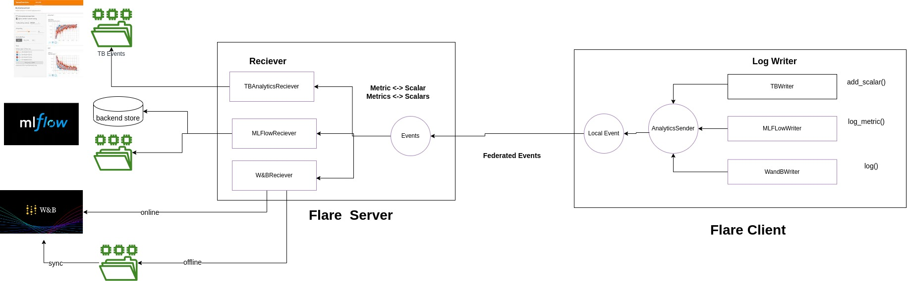
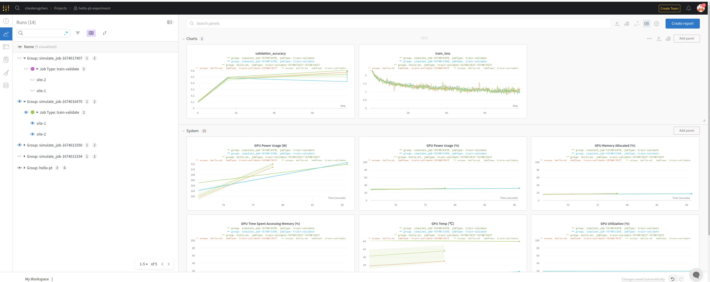

# Develop a custom log writer and receiver for Weights & Biases

## High Level design 

First Looking at the high level design.


The main integration is to write a Weights & Biases (WandB) receiver.

Before we dive to the code, we need to make few decision, in particular 
 
* How to represent each site's log when tracking the overall metrics ?
* How to make sure all site's metrics are not separate jobs, but the same job metrics from different sites ?  

We probably want to represent the site's run similar to the 
where each site represent one run,but they need to be group together as they are part of the same job

We decided to use [group run](https://docs.wandb.ai/guides/track/advanced/grouping) to tie all sites together
for example ```{ "group": "hello-pt"}```

for different site, we will need to have concurrent multiple runs of wandb, To do this, we leverage multiprocess
described in https://docs.wandb.ai/guides/track/advanced/distributed-training

*_Note_* : With multiprocess, the common issues as noted in [WandB documentation](https://docs.wandb.ai/guides/track/advanced/distributed-training)
* *_Hanging at the beginning of training_* 
* *_Hanging at the end of training_*

## Detailed design

### Receiver Class
```
class WandBReceiver(AnalyticsReceiver):
    def __init__(self, config: dict, kwargs: dict, mode: str = "offline", events=None, process_timeout=10):
    ...
```
The Receiver simply inherited the ```AnalyticsReceiver``` class, which implements the 

```
    @abstractmethod
    def initialize(self, fl_ctx: FLContext):
        pass

    @abstractmethod
    def save(self, fl_ctx: FLContext, shareable: Shareable, record_origin: str):
        pass

    @abstractmethod
        pass
```
methods. 

config represents and can be directly used in ``wandb.init(config)`` during setup. 

```
         "config": {
            "architecture": "CNN",
            "dataset_id": "CIFAR10",
            "momentum": 0.9,
            "optimizer": "SGD",
            "learning rate": 0.01,
            "epochs": 5
          },

```

kwargs are parameters to setup the experiment. 

``` 
     "kwargs" :  {
            "project": "hello-pt-experiment",
            "notes": "Federated Experiment tracking with W&B \n Example of using [NVIDIA FLARE](https://nvflare.readthedocs.io/en/main/index.html) to train an image classifier using federated averaging ([FedAvg]([FedAvg](https://arxiv.org/abs/1602.05629))) and [PyTorch](https://pytorch.org/) as the deep learning training framework. This example also highlights the Flare streaming capability from the clients to the server and deliver to MLFLow.\\n\\n> **_NOTE:_** \\n This example uses the *[CIFAR-10](https://www.cs.toronto.edu/~kriz/cifar.html) dataset and will load its data within the trainer code.\n",
            "tags": ["baseline", "paper1"],
            "group": "hello-pt",
            "job_type": "train-validate"
          }
      }
```
WandB supports three modes: "disabled", "online", "offline", so we give user the choice to specify

The last argument ```process_timeout``` is used to make sure the process can be terminated if it is hung. 


### Writer Class

The writer class will implement log 
```

class WandBWriter(LogWriter):
    def __init__(self, event_type: str = ANALYTIC_EVENT_TYPE):
        super().__init__(event_type)

    def get_writer_name(self) -> LogWriterName:
        return LogWriterName.WANDB

    def log(self, metrics: Dict[str, float], step: Optional[int] = None):
        self.sender.add(tag="metrics", value=metrics, data_type=AnalyticsDataType.METRICS, global_step=step)
```

### Save to Tracking Server

  We create Queue for each site (record_origin), when save, we simply put the to do task into the job Queue
  Then the job will call
  ```wandb.log(wandb_task.task_data, wandb_task.step)```
  to log data to WandB

```
    def save(self, fl_ctx: FLContext, shareable: Shareable, record_origin: str):
        dxo = from_shareable(shareable)
        data = AnalyticsData.from_dxo(dxo, receiver=LogWriterName.WANDB)
        if not data:
            return

        q: Optional[Queue] = self.get_job_queue(record_origin)
        if q:
            if data.data_type == AnalyticsDataType.PARAMETER or data.data_type == AnalyticsDataType.METRIC:
                log_data = {data.tag: data.value}
                q.put_nowait(WandBTask(task_owner=record_origin, task_type="log", task_data=log_data, step=data.step))
            elif data.data_type == AnalyticsDataType.PARAMETERS or data.data_type == AnalyticsDataType.METRICS:
                q.put_nowait(WandBTask(task_owner=record_origin, task_type="log", task_data=data.value, step=data.step))
```