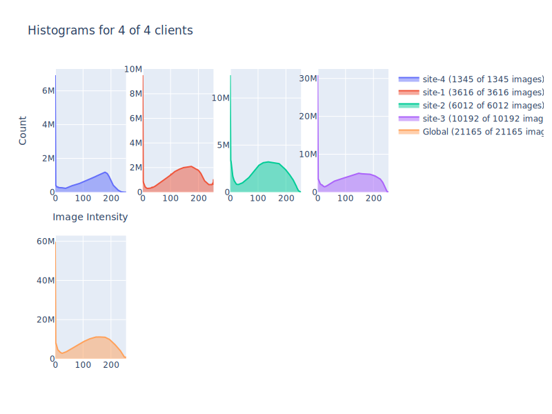

# Federated Analysis with NVIDIA FLARE

## (Optional) 0. Set up a virtual environment
```
python3 -m pip install --user --upgrade pip
python3 -m pip install --user virtualenv
```
(If needed) make all shell scripts executable using
```
find . -name ".sh" -exec chmod +x {} \;
```
initialize virtual environment.
```
source ./virtualenv/set_env.sh
```
install required packages.
```
pip install --upgrade pip
pip install -r ./virtualenv/requirements.txt
```

## 1. Download the example data

As an example, we use the dataset from the ["COVID-19 Radiography Database"](https://www.kaggle.com/tawsifurrahman/covid19-radiography-database).
First, download the `archive.zip` and extract to `./data/.`.

Next, create the data lists simulating different clients with varying amounts and types of images. 
The downloaded archive contains subfolders for four different classes: `COVID`, `Lung_Opacity`, `Normal`, and `Viral Pneumonia`.
Here we assume each class of image corresponds to a different sites.
```
python3 data/prepare_data.py --input_dir ./data
```

With this ratio setting, site-3 will have the largest number of images. You should see the following output
```
Created 4 data lists for ['COVID', 'Lung_Opacity', 'Normal', 'Viral Pneumonia'].
Saved 3616 entries at ./data/site-1_COVID.json
Saved 6012 entries at ./data/site-2_Lung_Opacity.json
Saved 10192 entries at ./data/site-3_Normal.json
Saved 1345 entries at ./data/site-4_Viral Pneumonia.json
```

## 2. Create your POC workspace
To run FL experiments in POC mode, create your local FL workspace the below command. 
In the following experiments, we will be using three clients. One for each data list prepared above. Press "y" when prompted.
```
./create_poc_workpace.sh 4
```

## 3. Compute the local and global intensity histograms

First, we add the current directory path to `config_fed_client.json` files to generate the absolute path for `data_root`.  
```
sed -i "s|PWD|${PWD}|g" configs/fed_analysis/config/config_fed_client.json
```

### 3.1 Start the server and clients

Next, we start the federated analysis by startup up the server and clients using the [start_fl_poc.sh](./start_fl_poc.sh) script. In this example, we assume four clients.
```
./start_fl_poc.sh 4
```

Next, we submit the federated analysis job configuration to execute the histogram tasks on the clients and gather the computed histograms on the server. 

### 3.2 Submit job using admin console

To do this, you need to log into the NVFlare admin console.

1. Open a new terminal
2. Activate the virtual environment (if needed): `source ./virtualenv/set_env.sh`
3. Start the admin console: `./workspaces/poc_workspace/admin/startup/fl_admin.sh`
4. Inside the console, submit the job: `submit_job [PWD]/configs/fed_analysis` (replace `[PWD]` with your current path) 

For a complete list of available admin console commands, see [here](https://nvflare.readthedocs.io/en/main/user_guide/operation.html).

### 3.2 List the submitted job

You should see the server and clients in your first terminal executing the job now.
You can list the running job by using `list_jobs` in the admin console.
Your output should be similar to the following.

```
> list_jobs 
----------------------------------------------------------------------------------------------------
| JOB ID                               | NAME         | STATUS  | SUBMIT TIME                      |
----------------------------------------------------------------------------------------------------
| a0deac00-25fa-4517-9e0c-7a74df53256f | fed_analysis | RUNNING | 2022-06-14T17:02:22.204339-04:00 |
----------------------------------------------------------------------------------------------------
```

**Note:** This example uses the [k-anonymity](https://en.wikipedia.org/wiki/K-anonymity) approach to ensure that no individual patient's data is leaked to the server. 
Clients will only send intensity histogram statistics if computed on at least `k` images. The default number is set by `min_images=10` in `AnalysisExecutor`.

Other default parameters of the `AnalysisExecutor` are chosen to work well with the used example data. For other datasets, the histogram parameters (`n_bins`, `range_min`, and `range_max`) might need to be adjusted.

## 4. Visualize the result

If successful, the computed histograms can be downloaded using this admin command:
```
download_job [JOB_ID]
```
After download, it will be available in the stated download directory under `[JOB_ID]/workspace` as `histograms.html` and `histograms.svg`. 

Note, `[JOB_ID]` will be assigned by the system when submitting the job (it is also shown in the `list_jobs` command). 

For example, the gathered local and global histograms will look like this.


