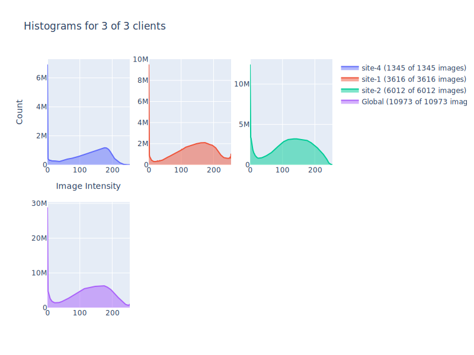

# Federated Analysis with NVIDIA FLARE

## (Optional) 0. Set up a virtual environment
```
python3 -m pip install --user --upgrade pip
python3 -m pip install --user virtualenv
```
(If needed) make all shell scripts executable using
```
find . -name ".sh" -exec chmod +x {} \;
```
initialize virtual environment.
```
source ./virtualenv/set_env.sh
```
install required packages.
```
pip install --upgrade pip
pip install -r ./virtualenv/requirements.txt
```

## 1. Download the example data

As an example, you can download the dataset from the ["COVID-19 Radiography Database"](https://www.kaggle.com/tawsifurrahman/covid19-radiography-database).
Download the `archive.zip` and extract to `./data/.`.

Next, create the data lists simulating different clients with varying amounts and types of images. 
The downloaded archive contains subfolders for four different classes: `COVID`, `Lung_Opacity`, `Normal`, and `Viral Pneumonia`.
Here we assume each class of image corresponds to a different sites.
```
python3 data/prepare_data.py --input_dir ./data
```

With this ratio setting, site-3 will have the largest number of images. You should see the following output
```
Created 4 data lists for ['COVID', 'Lung_Opacity', 'Normal', 'Viral Pneumonia'].
Saved 3616 entries at ./data/site-1_COVID.json
Saved 6012 entries at ./data/site-2_Lung_Opacity.json
Saved 10192 entries at ./data/site-3_Normal.json
Saved 1345 entries at ./data/site-4_Viral Pneumonia.json
```

## 2. Create your POC workspace
To run FL experiments in POC mode, create your local FL workspace the below command. 
In the following experiments, we will be using three clients. One for each data list prepared above. Press "y" when prompted.
```
./create_poc_workpace.sh 4
```

## 3. Compute the local and global intensity histograms

First, we add the current directory path to `config_fed_client.json` files to generate the absolute path for `data_root`.  
```
sed -i "s|PWD|${PWD}|g" configs/fed_analysis/config/config_fed_client.json
```
Next, we start the federated analysis by executing the [run_poc.sh](./run_poc.sh) script. This will start the federated workflow automatically, execute the tasks on the clients and gather the histograms on the server. 

**Note:** The [run_poc.sh](./run_poc.sh) script follows this pattern: `./run_poc.sh [n_clients] [config] [run]`

FOr example, to run three clients and under `run_1`, run the following:
```
./run_poc.sh 4 fed_analysis 1
```

**Note:** This example uses the [k-anonymity](https://en.wikipedia.org/wiki/K-anonymity) approach to ensure that no individual patient's data is leaked to the server. 
Clients will only send intensity histogram statistics if computed on at least `k` images. The default number is set by `min_images=10` in `AnalysisExecutor`.

Other default parameters of the `AnalysisExecutor` are chosen to work well with the used example data. For other datasets, the histogram parameters (`n_bins`, `range_min`, and `range_max`) might need to be adjusted.

## 4. Visualize the result

If successful, the computed histograms will be shown in the `run_*` folders as `histograms.html` and `histograms.svg`.
For example, the gathered local and global histograms will look like this.



## 5. Get results using the admin client

In real-world FL scenarios, the researcher might not have direct access to the server machine. Hence, the researcher can use the admin client console to control the experimentation. See [here](https://nvidia.github.io/NVFlare/user_guide/admin_commands.html) for details.
After completing the federated analysis run, you can check the histogram files have been created:
```
> ls server run_1
app_server
fl_app.txt
histograms.html
histograms.svg
```
The result can be downloaded to the admin's machine using this command:
```
> download_folder ../run_1
```

After download, the files will be available in the admin workspace under `transfer`.

