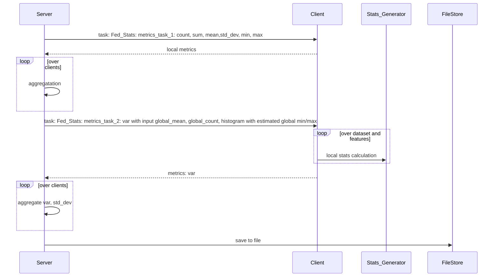

# Objective
Describe the main objective intended with this design, to give an overview to the reader. This should be less than 3 sentences so that the reader can quickly grasp why this is important.

## Goals:

The goal of Federated Statistics project is to make it easier for end-user to leverage pre-built-in FLARE federated statistics controller to easily get the most common used statistics. So they can perform data analysis quickly. These common used statistics are:  count, sum, mean, std_dev and histogram for numerical data.

           For given datasets (such train and test datasets), we calculate all numeric features statistics   
           The global statistics and clients' statistics are put together saved to a file, that can be used for site-to-site comparison. 

Client will only need to implement stats generator which follow statistics_spec. 

* configure the NVFLARE configuration to indicate the specific metrics he needs (for example, count and histogram only)
* provide client local stats calculate for given stats
* Output directory
Then he will get a json file that contains all the statistics from all sides + global statistics

# How it works



```
