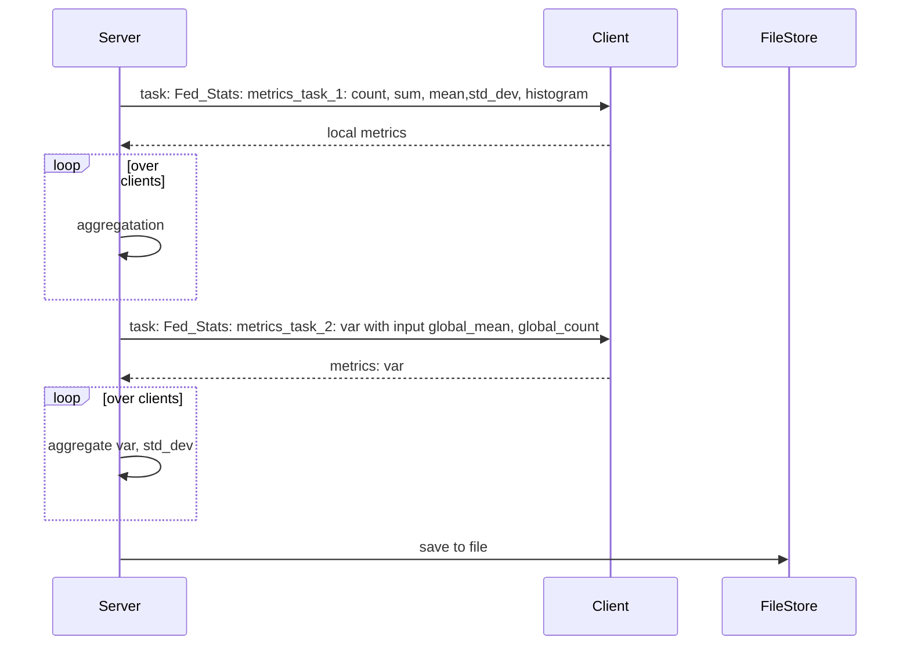

# Objective
Describe the main objective intended with this design, to give an overview to the reader. This should be less than 3 sentences so that the reader can quickly grasp why this is important.

## Goals:

The goal of Federated Statistics project is to make it easier for end-user to leverage pre-built-in FLARE federated statistics controller to easily get the most common used statistics. So they can perform data analysis quickly. These common used statistics are:  count, sum, mean, std_dev and histogram for numerical data.

           We could like not only provide these statistics for one feature, but a set of features in a given data sets, but also multiple data sets (such as training and test datasets). 

           then the global statistics and clients' statistics are put together, that can be used for site-to-site comparison. 

Specifically, we would like to build Flare statistics controllers in such a way, that if user wants to get all statistics from all sites  plus global status, he will only need to the followings

* configure the NVFLARE configuration to indicate the specific metrics he needs (for example, count and histogram only)
* provide client side executor to calculate the local corresponding metrics such as count, sum, histogram
* provide load_data method
* provide client_data_valiation method (to check if the data features are numerical features) or simply return true
* Output directory
Then he will get a json file that contains all the statistics from all sides + global statistics

# How it works



```
