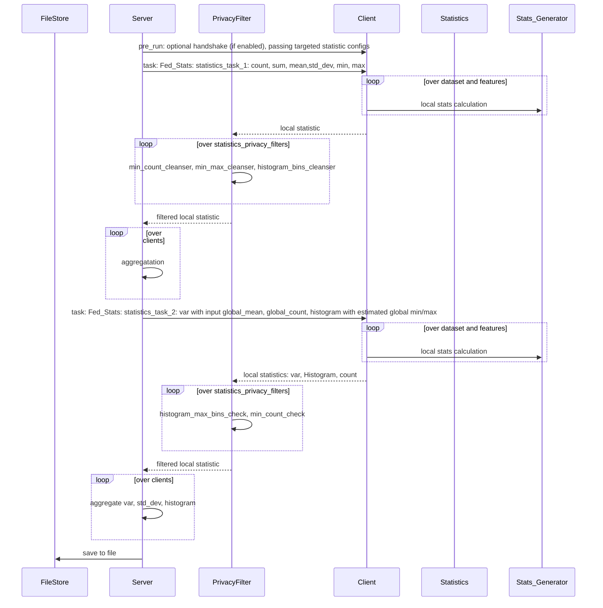

# Objective
Federated Statistics will provide built-in NVFLARE federated statistics operators ( controller and executors) that 
will generate global statistics based on local client side statistics.

At each clide site, we could have one or more datasets (such as "train" and "test" datasets); each dataset may have many 
features. For each feature in the dataset, we will calculate the statistics and combined to produce 
global statistics for all the numeric features. The output would be complete statistics for all datasets in clients and global.    

The statistics used here are commonly used statistics: count, sum, mean, std_dev and histogram for the numerical features. 

If the statistics sum and count are selected, the mean will be calculated with count and sum. 

A client will only need to implement the "Statistics" class from statistics_spec 

* configure the config_fed_server.json to indicate the specific statistics you need
  * Note: count is always required as we use count to enforce data privacy policy
* Client will required to supply features ( feature name, and data type) of datasets 
* Client will need to provides local statistics for given dataset and feature
* Categorical features are filter out, remains are numerical features
* 
* Output directory
  * The result will be saved to job workspace, which can be downloaded via download_job command 
  * The result is in json format, which can be loaded in pandas data frame. 
  * We provided some visualization utilities, one can visualize via jupyter notebook

# How it works



```
