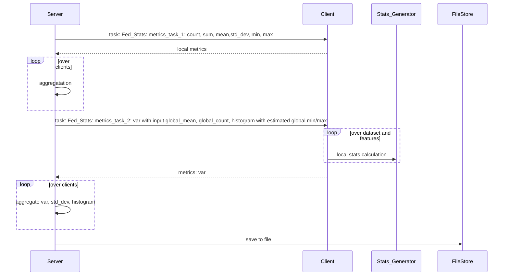

# Objective
Federated Statistics will provide pre-built-in NVFLARE federated statistics operators ( controller and executors) that 
generate global statistics based on local client side statistics.

At each clide site, we could have one more datasets (such as "train" and "test" datasets); each datasets may have many 
features. For each named dataset, for each feature in the dataset, we will calculate the statistics and combined to produce 
global statistics for the combined features. 

These commonly used statistic metrics are count, sum, mean, std_dev and histogram for numerical data.

If the metric sum and count are selected, the mean will be calculated with count and sum. 

A client will only need to implement the "Statistics" class from statistics_spec 

* configure the config_fed_server.json to indicate the specific metrics you need
  * Note: count is always required as we use count to enforce data privacy policy
* Client will required to supply features ( feature name, and data type) of datasets 
* Client will need to provides local metrics for given dataset and feature
* Categorical features are filter out, remains are numerical features
* 
* Output directory
  * The result will be saved to job workspace, which can be downloaded via download_job command 

# How it works



```
