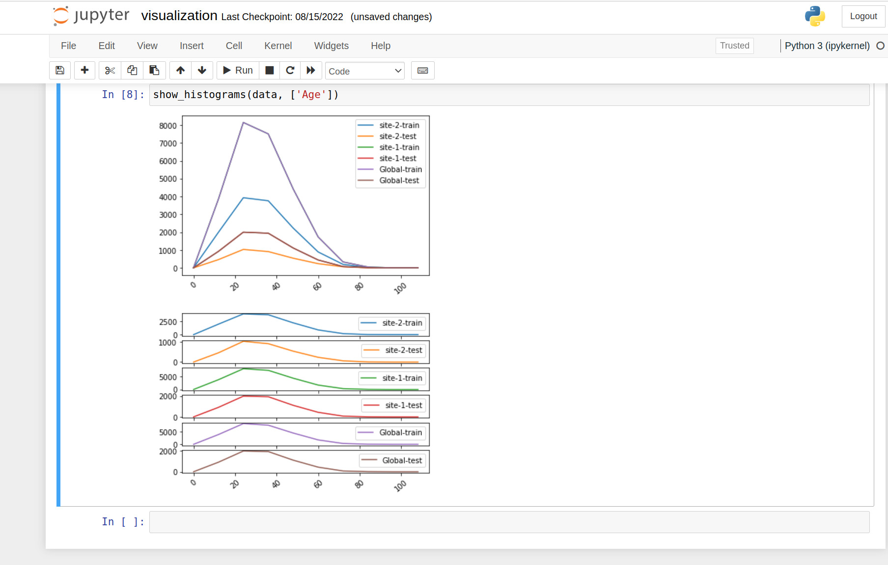

# Federated Statistics of Panda DataFame

## setup NVFLARE
follow the [Quick Start Guide](https://nvflare.readthedocs.io/en/main/quickstart.html) to setup virtual environment and install NVFLARE
```
install required packages.
```
pip install --upgrade pip
pip install -r ./requirements.txt

## 1. prepare POC workspace

```
   nvflare poc --prepare
```
This will create a poc at /tmp/nvflare/poc with n = 2 clients.


## 2. Download the example data
In this example, we are using UCI (University of California, Irwin) [adult dataset](https://archive.ics.uci.edu/ml/datasets/adult)
The original dataset has already contains "training" and "test" datasets. Here we simply assume that "training" and test data sets are belong to different clients.
so we assigned the training data and test data into two clients.


```applicaiton.conf

fed_stats {
data {
features = ["Age", "Workclass", "fnlwgt", "Education", "Education-Num", "Marital Status",
             "Occupation", "Relationship", "Race", "Sex", "Capital Gain", "Capital Loss",
            "Hours per week", "Country", "Target"]

        clients { # inherit common properties
            site-1 {
                url = "https://archive.ics.uci.edu/ml/machine-learning-databases/adult/adult.data"
                filename = "data.csv"
                skiprows = [] # Line numbers to skip (0-indexed) or number of lines to skip (int) at the start of the file.
            }
            site-2 {
                url = "https://archive.ics.uci.edu/ml/machine-learning-databases/adult/adult.test"
                filename = "data.csv"
                skiprows = [0] # Line numbers to skip (0-indexed) or number of lines to skip (int) at the start of the file.
            }
        }
    }

}

```
The application.conf format is [pyhocon](https://github.com/chimpler/pyhocon) format.

Now we use data utility to download UCI datasets to separate client package directory in POC workspace

<poc workspace>/site-1/data.csv
<poc workspace>/site-2/data.csv


```
python3 data_utils.py  -h

usage: data_utils.py [-h] [--prepare-data]

fed_stats parser

optional arguments:
  -h, --help            show this help message and exit
  --prepare-data        prepare data based on configuration

```

```
python3 data_utils.py  --prepare-data

prepare data for poc workspace:/tmp/nvflare/poc
remove existing data at /tmp/nvflare/poc/site-1/data.csv
wget download to /tmp/nvflare/poc/site-1/data.csv
100% [..........................................................................] 3974305 / 3974305remove existing data at /tmp/nvflare/poc/site-2/data.csv
wget download to /tmp/nvflare/poc/site-2/data.csv
100% [..........................................................................] 2003153 / 2003153done with prepare data

```
If your poc_workspace is in a different location, use the following command

```
export NVFLARE_POC_WORKSPACE=<new poc workspace location>
```
then repeat above


## 3. Compute the local and global statistics for each numerical feature

### 3.1 Specify client side configuration

We are using a built-in NVFLARE executor,  

```
 "executor": {
        "id": "Executor",
        "path": "nvflare.app_common.executors.statistics_executor.StatisticsExecutor",
        "args": {
          "generator_id": "df_stats_generator",
          "min_count" : 10,
          "min_random": 0.1,
          "max_random": 0.3
  },

```
Here we specify a min_count = 10. It means each site should have at least 10 records. 
This is required to protect data privacy. (Todo: this will be moved to data_privacy.json policy files) 
if the number of record less than min_count, the job will fail.

To generate histogram, user need to provide the range of the histogram for each feature; or 
rely on the NVFlare to estimate the histogram range based on features local min, max values. 

To avoid real user's private data from min/max values, the data privacy policy will be applied 
to add some noise to min and max values before they are returned to FL Server

In current example, we calculate tabular dataset statistics via Pandas DataFrame with DFStatistics

### 3.2 Specify Server side configuration
 
Here we use the built-in Controller, called GlobalStatistics. Here we selected all the available metrics.  

```
"workflows": [
    {
      "id": "fed_stats_controller",
      "path": "nvflare.app_common.workflows.statistics_controller.StatisticsController",
      "args": {
        "metric_configs": {
          "count": {},
          "mean": {},
          "sum": {},
          "stddev": {},
          "histogram": { "*": {"bins": 10 },
                         "Age": {"bins": 5, "range":[0,120]}
                       }
        },
        "writer_id": "stats_writer"
      }
    }
  ],
```
In above configuration "*" indicate default feature.  Here we specify feature "Age" needs 5 bins and histogram range is within 0.120
for all other features, the bin is 10, range is not specified, i.e. the ranges will be dynamically estimated.

the writer_id identify the output writer component, defined as 

```
 "components": [
    {
      "id": "stats_writer",
      "path": "nvflare.app_common.statistics.json_stats_file_persistor.JsonStatsFileWriter",
      "args": {
        "output_path": "statistics/adults_stats.json",
        "json_encoder_path": "nvflare.app_common.utils.json_utils.ObjectEncoder"
      }
    }
```
This configuration shows a JSON file output writer, output path indicates the file path in the job result store. 
 
### 3.3 write a local statistics generator 

   The statistics generator implements `Statistics` spec. 

```

class DFStatistics(Statistics):
    # rest of code 

```
### 3.4 prepare poc workspace

Follow the quick start instructions to prepare POC workspace.
``
    nvflare poc --prepare
``
### 3.5 prepare data

```
cd $NVFLARE_HOME/examples/federated_statistics/df_stats
python data_utils.py -h 
```
it should show the help commands, to prepare the data, you can use

```
python data_utils.py -prepare-data 
```

### 3.5 start nvflare in poc mode

```
nvflare poc --start
```
 
once you have done with above command, you are already login to the NVFLARE console (aka Admin Console) 


### 3.5 Submit job using flare console

Inside the console, submit the job:
```
submit_job federated_statistics/df_stats
```

For a complete list of available flare console commands, see [here](https://nvflare.readthedocs.io/en/main/user_guide/operation.html).

### 3.2 List the submitted job

You should see the server and clients in your first terminal executing the job now.
You can list the running job by using `list_jobs` in the admin console.
Your output should be similar to the following.

```
> list_jobs 
-------------------------------------------------------------------------------------------------==--------------------------------
| JOB ID                               | NAME     | STATUS                       | SUBMIT TIME                                    |
-----------------------------------------------------------------------------------------------------------------------------------
| 10a92352-5459-47d2-8886-b85abf70ddd1 | df_stats | FINISHED:COMPLETED           | 2022-08-05T22:50:40.968771-07:00 | 0:00:29.4493|
-----------------------------------------------------------------------------------------------------------------------------------
```
 
## 4. get the result

If successful, the computed statis can be downloaded using this admin command:
```
download_job [JOB_ID]
```
After download, it will be available in the stated download directory under `[JOB_ID]/workspace/statistics` as  `adult_stats.json`

## 5. Output Format
By default, save the result in JSON format. You are free to write another StatsWriter to output in other format.

### JSON FORMAT
The output of the json is like the followings
``` 
{ 
     "feature-1": {
        "metric-1": {
            "site-1-dataset-1" : metric_value
            "site-1-dataset-2":  metric_value
            "site-2-dataset-1":  metric_value
            "site-2-dataset-2":  metric_value
            ...
            "Global-dataset-1": metric_value
            "Global-dataset-2"  metric_value
            }
        },
        "metric-2": {
            "site-1-dataset-1" : metric_value
            "site-1-dataset-2":  metric_value
            "site-2-dataset-1":  metric_value
            "site-2-dataset-2":  metric_value
            ...
            "Global-dataset-1": metric_value
            "Global-dataset-2"  metric_value
            }
        },
        ...
     },  
     "feature-2": {
        "metric-1": {
            "site-1-dataset-1" : metric_value
            "site-1-dataset-2":  metric_value
            "site-2-dataset-1":  metric_value
            "site-2-dataset-2":  metric_value
            ...
            "Global-dataset-1": metric_value
            "Global-dataset-2"  metric_value
            }
        },
        "metric-2": {
            "site-1-dataset-1" : metric_value
            "site-1-dataset-2":  metric_value
            "site-2-dataset-1":  metric_value
            "site-2-dataset-2":  metric_value
            ...
            "Global-dataset-1": metric_value
            "Global-dataset-2"  metric_value
            }
        },
        ...
     },
```

## 6. Visualization
   with json format, the data can be easily visualized via pandas dataframe and plots. 
   A visualization utility tools are showed in show_stats.py in visualization directory
   You can run jupyter notebook visualization.ipynb

```python
    jupyter notebook  visualization.ipynb
```
   you can some snapshots of the visualizations in  and 


   
