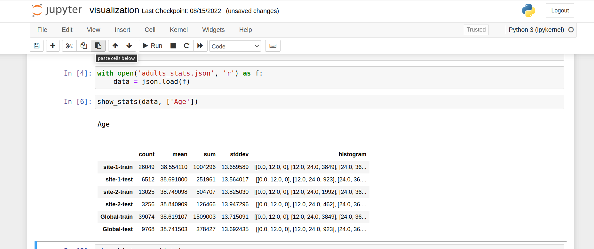

# Data Frame Federated Statistics 

In this example, we will show how to generate federated statistics for data that be represented as Pandas Data Frame

## setup NVFLARE
follow the [Quick Start Guide](https://nvflare.readthedocs.io/en/main/quickstart.html) to setup virtual environment and install NVFLARE
```
install required packages.
```
pip install --upgrade pip
pip install -r ./requirements.txt

## 1. Compute the local and global statistics for each numerical feature

### 1.1 Specify client side configuration

We are using a built-in NVFLARE executor,  

```
 "executor": {
        "id": "Executor",
        "path": "nvflare.app_common.executors.statistics_executor.StatisticsExecutor",
        "args": {
          "generator_id": "df_stats_generator",
          "min_count" : 10,
          "min_random": 0.1,
          "max_random": 0.3
  },

```
Here we specify a min_count = 10. It means each site should have at least 10 records. 
This is required to protect data privacy. (Todo: this will be moved to data_privacy.json policy files) 
if the number of record less than min_count, the job will fail.

To generate histogram, user need to provide the range of the histogram for each feature; or 
rely on the NVFlare to estimate the histogram range based on features local min, max values. 

To avoid real user's private data from min/max values, the data privacy policy will be applied 
to add some noise to min and max values before they are returned to FL Server

In current example, we calculate tabular dataset statistics via Pandas DataFrame with DFStatistics

### 1.2 Specify server side configuration
 
Here we use the built-in Controller, called GlobalStatistics. Here we selected all the available metrics.  

```
"workflows": [
    {
      "id": "fed_stats_controller",
      "path": "nvflare.app_common.workflows.statistics_controller.StatisticsController",
      "args": {
        "metric_configs": {
          "count": {},
          "mean": {},
          "sum": {},
          "stddev": {},
          "histogram": { "*": {"bins": 10 },
                         "Age": {"bins": 5, "range":[0,120]}
                       }
        },
        "writer_id": "stats_writer"
      }
    }
  ],
```
In above configuration "*" indicate default feature.  Here we specify feature "Age" needs 5 bins and histogram range is within 0.120
for all other features, the bin is 10, range is not specified, i.e. the ranges will be dynamically estimated.

the writer_id identify the output writer component, defined as 

```
 "components": [
    {
      "id": "stats_writer",
      "path": "nvflare.app_common.statistics.json_stats_file_persistor.JsonStatsFileWriter",
      "args": {
        "output_path": "statistics/adults_stats.json",
        "json_encoder_path": "nvflare.app_common.utils.json_utils.ObjectEncoder"
      }
    }
```
This configuration shows a JSON file output writer, output path indicates the file path in the job result store. 
 
### 1.3 Write a local statistics generator 

   The statistics generator implements `Statistics` spec. 

```

class DFStatistics(Statistics):
    # rest of code 

```

## 2. Prepare data

In this example, we are using UCI (University of California, Irwin) [adult dataset](https://archive.ics.uci.edu/ml/datasets/adult)
The original dataset has already contains "training" and "test" datasets. Here we simply assume that "training" and test data sets are belong to different clients.
so we assigned the training data and test data into two clients.
 
Now we use data utility to download UCI datasets to separate client package directory to /tmp/nvflare/data/ directory

```
python3 data_utils.py  -h

usage: data_utils.py [-h] [--prepare-data]

fed_stats parser

optional arguments:
  -h, --help            show this help message and exit
  --prepare-data        prepare data based on configuration

```

```
python3 data_utils.py  --prepare-data
prepare data for data directory

remove existing data at /tmp/nvflare/data/site-1/data.csv
wget download to /tmp/nvflare/data/site-1/data.csv
100% [..........................................................................] 3974305 / 3974305
remove existing data at /tmp/nvflare/data/site-2/data.csv
wget download to /tmp/nvflare/data/site-2/data.csv
100% [..........................................................................] 2003153 / 2003153
done with prepare data

```

## 3. Using FL Simulator

With FL simulator 

```bash
nvflare simulator -h
usage: nvflare simulator [-h] -w WORKSPACE [-n N_CLIENTS] [-c CLIENTS] [-t THREADS] [-gpu GPU] job_folder

positional arguments:
  job_folder

optional arguments:
  -h, --help            show this help message and exit
  -w WORKSPACE, --workspace WORKSPACE
                        WORKSPACE folder
  -n N_CLIENTS, --n_clients N_CLIENTS
                        number of clients
  -c CLIENTS, --clients CLIENTS
                        client names list
  -t THREADS, --threads THREADS
                        number of parallel running clients
  -gpu GPU, --gpu GPU   list of GPU Device Ids, comma separated

```
we can just run the example as CLI command 

```
nvflare simulator $NVFLARE_HOME/examples/federated_statistics/df_stats/df_stats -w /tmp/nvflare -n 2 -t 2
```

The results are stored in workspace "/tmp/nvflare"
```
/tmp/nvflare/simulate_job/statistics/adults_stats.json
```


## 4. Run Example using POC command

```
nvflare poc -h
usage: nvflare poc [-h] [-n [NUMBER_OF_CLIENTS]] [-p [PACKAGE]] [-ex [EXCLUDE]] [-gpu [GPU [GPU ...]]] [--prepare] [--start] [--stop] [--clean]

optional arguments:
  -h, --help            show this help message and exit
  -n [NUMBER_OF_CLIENTS], --number_of_clients [NUMBER_OF_CLIENTS]
                        number of sites or clients, default to 2
  -p [PACKAGE], --package [PACKAGE]
                        package directory, default to all = all packages, only used for start/stop-poc commands when specified
  -ex [EXCLUDE], --exclude [EXCLUDE]
                        exclude package directory during --start or --stop, default to , i.e. nothing to exclude
  -gpu [GPU [GPU ...]], --gpu [GPU [GPU ...]]
                        gpu device ids will be used as CUDA_VISIBLE_DEVICES. used for poc start command
  --prepare             prepare poc workspace
  --start               start poc
  --stop                stop poc
  --clean               cleanup poc workspace

```

### 4.1 Prepare POC Workspace

```
   nvflare poc --prepare 
```
This will create a poc at /tmp/nvflare/poc with n = 2 clients.

If your poc_workspace is in a different location, use the following command

```
export NVFLARE_POC_WORKSPACE=<new poc workspace location>
```
then repeat above

### 4.2 Start nvflare in POC mode

```
nvflare poc --start
```
once you have done with above command, you are already login to the NVFLARE console (aka Admin Console)
if you prefer to have NVFLARE Console in separate terminal, you can do 

```
nvflare poc --start ex admin
```
Then open a separate terminal to start the NVFLARE console 
```
nvflare poc --start -p admin
```

### 4.3 Submit job

Inside the console, submit the job:
```
submit_job federated_statistics/df_stats/df_stats
```

For a complete list of available flare console commands, see [here](https://nvflare.readthedocs.io/en/main/user_guide/operation.html).

### 4.4 List the submitted job

You should see the server and clients in your first terminal executing the job now.
You can list the running job by using `list_jobs` in the admin console.
Your output should be similar to the following.

```
> list_jobs 
-------------------------------------------------------------------------------------------------==--------------------------------
| JOB ID                               | NAME     | STATUS                       | SUBMIT TIME                                    |
-----------------------------------------------------------------------------------------------------------------------------------
| 10a92352-5459-47d2-8886-b85abf70ddd1 | df_stats | FINISHED:COMPLETED           | 2022-08-05T22:50:40.968771-07:00 | 0:00:29.4493|
-----------------------------------------------------------------------------------------------------------------------------------
```
 
### 4.4 Get the result

If successful, the computed statis can be downloaded using this admin command:
```
download_job [JOB_ID]
```
After download, it will be available in the stated download directory under `[JOB_ID]/workspace/statistics` as  `adult_stats.json`


## 5. RESULT FORMAT

The output of the json is like the followings
``` 
{ 
     "feature-1": {
        "metric-1": {
            "site-1-dataset-1" : metric_value
            "site-1-dataset-2":  metric_value
            "site-2-dataset-1":  metric_value
            "site-2-dataset-2":  metric_value
            ...
            "Global-dataset-1": metric_value
            "Global-dataset-2"  metric_value
            }
        },
        "metric-2": {
            "site-1-dataset-1" : metric_value
            "site-1-dataset-2":  metric_value
            "site-2-dataset-1":  metric_value
            "site-2-dataset-2":  metric_value
            ...
            "Global-dataset-1": metric_value
            "Global-dataset-2"  metric_value
            }
        },
        ...
     },  
     "feature-2": {
        "metric-1": {
            "site-1-dataset-1" : metric_value
            "site-1-dataset-2":  metric_value
            "site-2-dataset-1":  metric_value
            "site-2-dataset-2":  metric_value
            ...
            "Global-dataset-1": metric_value
            "Global-dataset-2"  metric_value
            }
        },
        "metric-2": {
            "site-1-dataset-1" : metric_value
            "site-1-dataset-2":  metric_value
            "site-2-dataset-1":  metric_value
            "site-2-dataset-2":  metric_value
            ...
            "Global-dataset-1": metric_value
            "Global-dataset-2"  metric_value
            }
        },
        ...
     },
```

## 6. Visualization
   with json format, the data can be easily visualized via pandas dataframe and plots. 
   A visualization utility tools are showed in show_stats.py in visualization directory
   You can run jupyter notebook visualization.ipynb

```python
    jupyter notebook  visualization.ipynb
```
   you can some snapshots of the visualizations in  and 


   
