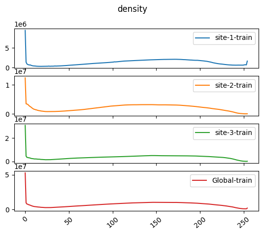

# Calculate Image Histogram with NVIDIA FLARE

Compute the local and global image statistics


## (Optional) 0. Set up a virtual environment
```
python3 -m pip install --user --upgrade pip
python3 -m pip install --user virtualenv
```

initialize virtual environment.
```
source ./virtualenv/set_env.sh
```
install required packages.
```
pip install --upgrade pip
pip install -r ./virtualenv/requirements.txt
```

## 1. Download the example data

As an example, we use the dataset from the ["COVID-19 Radiography Database"](https://www.kaggle.com/tawsifurrahman/covid19-radiography-database).
it contains png image files in four different classes: `COVID`, `Lung_Opacity`, `Normal`, and `Viral Pneumonia`.
First, download and extract to `/tmp/nvflare/data/.`.

Next, create the data lists simulating different clients with varying amounts and types of images. 
The downloaded archive contains subfolders for four different classes: `COVID`, `Lung_Opacity`, `Normal`, and `Viral Pneumonia`.
Here we assume each class of image corresponds to a different sites.
```
python3 data/prepare_data.py --input_dir /tmp/nvflare/data
```

With this ratio setting, site-3 will have the largest number of images. You should see the following output
```
Created 4 data lists for ['COVID', 'Lung_Opacity', 'Normal', 'Viral Pneumonia'].
Saved 3616 entries at ./data/site-1_COVID.json
Saved 6012 entries at ./data/site-2_Lung_Opacity.json
Saved 10192 entries at ./data/site-3_Normal.json
Saved 1345 entries at ./data/site-4_Viral Pneumonia.json
```
## 2. Federated Statistics Configuration

Since FLARE has already built-in operators, all we need to supply the followings
* config_fed_server.json
* config_fed_client.json
* local statistics generator 

### 2.1 Server configuration
```
{
  "format_version": 2,
  "workflows": [
    {
      "id": "fed_stats_controller",
      "path": "nvflare.app_common.workflows.statistics_controller.StatisticsController",
      "args": {
        "min_clients": 4,
        "metric_configs": {
          "count": {},
          "histogram": {
            "*": {
              "bins": 255, "range": [0,256]
            }
          }
        },
        "writer_id": "stats_writer"
      }
    }
  ],
  "components": [
    {
      "id": "stats_writer",
      "path": "nvflare.app_common.statistics.json_stats_file_persistor.JsonStatsFileWriter",
      "args": {
        "output_path": "statistics/image_statistics.json",
        "json_encoder_path": "nvflare.app_common.utils.json_utils.ObjectEncoder"
      }
    }
  ]
}
```

Here we ask the statistics_controller (server side operator) to compute & display the following metrics: count and histogram
````
     "metric_configs": {
          "count": {},
          "histogram": {
            "*": {
              "bins": 255, "range": [0,256]
            }
          }
        },
````
for histogram, we specified the histogram range, for all features ("*"), to be [0,256), and bins = 255. 
The writer component
```
  "components": [
    {
      "id": "stats_writer",
      "path": "nvflare.app_common.statistics.json_stats_file_persistor.JsonStatsFileWriter",
      "args": {
        "output_path": "statistics/image_statistics.json",
        "json_encoder_path": "nvflare.app_common.utils.json_utils.ObjectEncoder"
      }
    }
  ]
```
provided by FLARE is going to output the result as JSON format to the <workspace>/statistics/image_statistics.json

### 2.2 Client configuration
```
{
  "format_version": 2,
  "executors": [
    {
      "tasks": [
        "fed_stats"
      ],
      "executor": {
        "id": "Executor",
        "path": "nvflare.app_common.executors.statistics.statistics_executor.StatisticsExecutor",
        "args": {
          "generator_id": "local_hist_generator"
        }
      }
    }
  ],
  "task_result_filters": [
    {
      "tasks": ["fed_stats"],
      "filters":[
        {
          "name": "StatisticsPrivacyFilter",
          "args": {
            "result_cleanser_ids": [
              "min_count_cleanser",
              "hist_bins_cleanser"
            ]
          }
        }
      ]
    }
  ],
  "task_data_filters": [],
  "components": [
    {
      "id": "local_hist_generator",
      "path": "image_statistics.ImageStatistics",
      "args": {
        "data_root": "/tmp/nvflare/data"
      }
    },
    {
      "id": "hist_bins_cleanser",
      "path": "nvflare.app_common.statistics.histogram_bins_cleanser.HistogramBinsCleanser",
      "args": {
        "max_bins_percent": 10
      }
    },
    {
      "id": "min_count_cleanser",
      "path": "nvflare.app_common.statistics.min_count_cleanser.MinCountCleanser",
      "args": {
        "min_count": 10
      }
    }
  ]
}

```
On client side, we first specify the client's side operator (StatisticExecutor) and specify the pre-defined task to be "fed_stats"
and generator_id = "local_hist_generator". Where local_hist_generator will be local statistics generator defined by custom code. 

```
 "executors": [
    {
      "tasks": [
        "fed_stats"
      ],
      "executor": {
        "id": "Executor",
        "path": "nvflare.app_common.executors.statistics.statistics_executor.StatisticsExecutor",
        "args": {
          "generator_id": "local_hist_generator"
        }
      }
    }
  ],
```
the local stats generator is defined as FLComponent (ImageStatistics)
```
    {
      "id": "local_hist_generator",
      "path": "image_statistics.ImageStatistics",
      "args": {
        "data_root": "/tmp/nvflare/data"
      }
    },
```

In addition, we also specified privacy filter as task_result_filter, in production, this is usually set as privacy policy 
on site-level by the company, there is no need to set privacy filter at job level (see later discuss on privacy)

```
  "task_result_filters": [
    {
      "tasks": ["fed_stats"],
      "filters":[
        {
          "name": "StatisticsPrivacyFilter",
          "args": {
            "result_cleanser_ids": [
              "min_count_cleanser",
              "hist_bins_cleanser"
            ]
          }
        }
      ]
    }
  ],
```


### 2.3 Local statistics generator

```python

class ImageStatistics(Statistics):

    def __init__(
            self,
            data_root: str = "/tmp/nvflare/data",
            data_list_key: str = "data"
    ):
```
The local statistics generator implements `Statistics` spec. 

Besides loading data methods, the class mainly implements few functions

```

    def features(self) -> Dict[str, List[Feature]]:
        return {"train": [Feature("density", DataType.FLOAT)]}

    def count(self,
              dataset_name: str,
              feature_name: str) -> int:
        image_paths = self.data_list[dataset_name]
        return len(image_paths)

    def histogram(self, dataset_name: str, feature_name: str, num_of_bins: int, global_min_value: float,
                  global_max_value: float) -> Histogram:
       ...
```
additional optional failure_count methods is used if you would like to make sure the data privacy is against effective
count - failure_count 

```
    def failure_count(self,
              dataset_name: str,
              feature_name: str) -> int:
        return self.failure_images
```

If you would like to see failure_count as one metrics in reporting, you will need to add "failure_count" to the metric_config 
arguments for the statistics controller. 


## 3. Run the Fed Statistics Job in Simulator 

## 3.1. Simulator CLI

you can run the job in CLI command. Assuming NVFLARE_HOME env point to the location where your NVFlare project directory.

This example job directory is at `$NVFLARE_HOME/examples/federated_statistics/image_stats/image_stats_job`
we like to use `/tmp/nvflare` as workspace, the output goes to that directory
since we have 4 clients, we will set `-n 4` with 4 threads `-t 4`

```
nvflare simulator $NVFLARE_HOME/examples/federated_statistics/image_stats/image_stats_job -w /tmp/nvflare -n 4 -t 4
```

The results are stored in workspace "/tmp/nvflare"
```
/tmp/nvflare/simulate_job/statistics/image_histogram.json
```

## 3.2 Visualization

```python
    jupyter notebook  visualization.ipynb
```  




## 4. Run the Fed Statistics Job in POC command

Another way to run the statistics job is via POC command

### 4.1 Create your POC workspace

Another way to run the job is to run in POC mode. 

Before you create your POC workspace, let's first setup the NVFLARE_HOME env. 
export NVFLARE_HOME=<NVFLARE>, NVFLARE is your github clone directory, which contains this example.
This allows us to automated create symlink to the current examples, when we create the POC workspace.

To run FL experiments in POC mode, create your FL workspace at the default `/tmp/nvflare/poc` location with the below command. 
In the following experiments, we will be using three clients. One for each data list prepared above. Press "y" when prompted.
```
nvflare poc -n 4 --prepare 
```

### 4.2 Start the server and clients

First, we start the federated analysis by startup up the server and clients using `nvflare poc` command. In this example, we assume four clients.
```
nvflare poc --start -ex admin
```

Next, we submit the federated analysis job configuration to execute the histogram tasks on the clients and gather the computed histograms on the server. 

### 4.3 Submit job using FLARE console

To do this, you need to log into the NVFlare console.

1. Open a new terminal
2. Activate the virtual environment (if needed): `source ./virtualenv/set_env.sh`
3. Start the admin console: `nvflare poc --start -p admin`
4. Inside the console, submit the job: `submit_job federated_statistics/fed_analysis/fed_analysis_job`  

For a complete list of available admin console commands, see [here](https://nvflare.readthedocs.io/en/main/user_guide/operation.html).

### 4.4 List the submitted job

You should see the server and clients in your first terminal executing the job now.
You can list the running job by using `list_jobs` in the admin console.
Your output should be similar to the following.

```
> list_jobs 
--------------------------------------------------------------------------------------------------------
| JOB ID                               | NAME             | STATUS  | SUBMIT TIME                      |
--------------------------------------------------------------------------------------------------------
| a0deac00-25fa-4517-9e0c-7a74df53256f | image_stats_job | RUNNING | 2022-06-14T17:02:22.204339-04:00 |
--------------------------------------------------------------------------------------------------------
```

**Note on data privacy:** This example uses the [k-anonymity](https://en.wikipedia.org/wiki/K-anonymity) approach to ensure that no individual patient's data is leaked to the server. 
Clients will only send intensity histogram statistics if computed on at least `k` images. The default number is set by `min_count=10`.

## 5. Download and Visualize the result

If successful, the computed histograms can be downloaded using this admin command:
```
download_job [JOB_ID]
```
After download, it will be available in the stated download directory under `[JOB_ID]/workspace/statistics/image_histograms.json`  

Note, `[JOB_ID]` will be assigned by the system when submitting the job (it is also shown in the `list_jobs` command). 

copy the histogram.json to the demo directory, one can use the jupyter notebook to visualize
 
```python
    jupyter notebook  visualization.ipynb
```  

## 6. Privacy Policy

There are different ways to set privacy filter depending the use cases

### 3.1 Set Privacy Policy as researcher

one can specify the "task_result_filters" config_fed_client.json to specify
the privacy control.  This is useful when you develop these filters

### 3.2 setup site privacy policy as org admin

Once the company decides to instrument certain privacy policy independent of individual
job, one can copy the local directory privacy.json content to clients' local privacy.json ( merge not overwrite).

This can only demonstrated in POC mode, where the privacy.json is put in each site's local directory

**NOTE** we need to remove the same filters from the job definition in config_fed_client.json
by simply set the   "task_result_filters" to empty list to avoid **double** filtering.

```
"task_result_filters": []
```

In current example, two cleanser in the StatisticsPrivacyFilter are put in place.
"min_count_cleanser",
"hist_bins_cleanser"

Notice: 
```
  {
      "id": "hist_bins_cleanser",
      "path": "nvflare.app_common.statistics.histogram_bins_cleanser.HistogramBinsCleanser",
      "args": {
        "max_bins_percent": 10
      }
    },
```
requires max number of bins shouldn't more than 10% of the images count. For site-4, we only have 1345 images, 
and numbers of bins = 255. Thus the site-4 violate the privacy policy and the metrics is removed from the final result. 