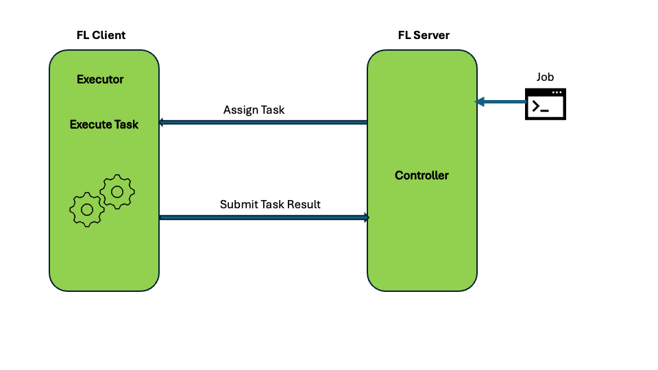

# Getting Started with NVFlare
NVFlare is an open-source framework that allows researchers and data scientists to seamlessly move their 
machine learning and deep learning workflows into a federated paradigm.

### Basic Concepts
At the heart of NVFlare lies the concept of collaboration through "tasks." An FL controller assigns tasks 
(e.g., training on local data) to one or more FL clients, processes returned results (e.g., model weight updates), 
and may assign additional tasks based on these results and other factors (e.g., a pre-configured number of training rounds). 
The clients run executors which can listen for tasks and perform the necessary computations locally, such as model training. 
This task-based interaction repeats until the experiment’s objectives are met.

We can also add data filters (for example, for [homomorphic encryption](https://www.usenix.org/conference/atc20/presentation/zhang-chengliang)
or [differential privacy filters](https://arxiv.org/abs/1910.00962)) to the task data
or results received or produced by the server or clients.



### Installation

Install nvflare
```shell
(nvflare_example)$ pip install nvflare
```

In each example folder, install required packages for training:
```shell
(nvflare_example)$ pip install --upgrade pip
(nvflare_example)$ pip install -r requirements.txt
```

Note that if you already have a specific version of nvflare installed in your environment, you may want to remove nvflare in the requirements to avoid reinstalling nvflare.

For more detailed installation instructions including virtual environment setup, cloning the repository and checking out the examples,
or how to use Docker, see the installation section of the [documentation](https://nvflare.readthedocs.io/en/main/quickstart.html).

### Examples
We provide several examples to quickly get you started using NVFlare's Job API. 
Each example folder includes basic job configurations for running different FL algorithms. 
Starting from [FedAvg](https://arxiv.org/abs/1602.05629), to more advanced ones, 
such as [FedOpt](https://arxiv.org/abs/2003.00295), or [SCAFFOLD](https://arxiv.org/abs/1910.06378).

### 1. [PyTorch Examples](./pt/README.md)
### 2. [Tensorflow Examples](./tf/README.md)
### 3. [Scikit-Learn Examples](./sklearn/README.md)

Once you have finished the above examples, you can also look at the
["hello-world"](../hello-world) examples or check out more examples at tutorial catalog: https://nvidia.github.io/NVFlare/.
