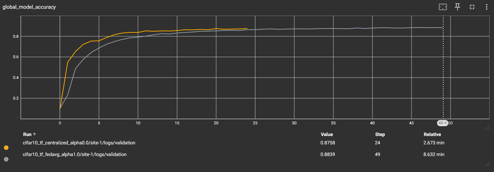

# Getting Started with NVFlare (TensorFlow)
[](https://tensorflow.org/)

We provide several examples to help you quickly get started with NVFlare.
All examples in this folder are based on using [TensorFlow](https://tensorflow.org/) as the model training framework.

## Simulated Federated Learning with CIFAR10 Using Tensorflow

This example demonstrates TensorFlow-based federated learning algorithms,
FedAvg and FedOpt, on the CIFAR-10 dataset.

In this example, the latest Client APIs were used to implement
client-side training logics (details in file
[`cifar10_tf_fl_alpha_split.py`](src/cifar10_tf_fl_alpha_split.py)),
and the new
[`FedJob`](https://github.com/NVIDIA/NVFlare/blob/main/nvflare/job_config/api.py)
APIs were used to programmatically set up an
NVFlare job to be exported or ran by simulator (details in file
[`tf_fl_script_runner_cifar10.py`](tf_fl_script_runner_cifar10.py)),
alleviating the need of writing job config files, simplifying
development process.

## 1. Install requirements

Install required packages
```
pip install --upgrade pip
pip install -r ./requirements.txt
```

> **_NOTE:_**  We recommend either using a containerized deployment or virtual environment,
> please refer to [getting started](https://nvflare.readthedocs.io/en/latest/getting_started.html).


## 2. Run experiments

This example uses simulator to run all experiments. The script
[`tf_fl_script_runner_cifar10.py`](tf_fl_script_runner_cifar10.py)
is the main script to be used to launch different experiments with
different arguments (see sections below for details). A script
[`run_jobs.sh`](run_jobs.sh) is also provided to run all experiments
described below at once:
```
bash ./run_jobs.sh
```
The CIFAR10 dataset will be downloaded when running any experiment for
the first time. `Tensorboard` summary logs will be generated during
any experiment, and you can use `Tensorboard` to visualize the
training and validation process as the experiment runs. Data split
files, summary logs and results will be saved in a workspace
directory, which defaults to `/tmp` and can be configured by setting
`--workspace` argument of the `tf_fl_script_runner_cifar10.py`
script.

> [!WARNING]
> If you are using GPU, make sure to set the following
> environment variables before running a training job, to prevent
> `TensorFlow` from allocating full GPU memory all at once:
> `export TF_FORCE_GPU_ALLOW_GROWTH=true && export
> TF_GPU_ALLOCATOR=cuda_malloc_asyncp`

We apply Dirichlet sampling (as implemented in FedMA: https://github.com/IBM/FedMA) to
CIFAR10 data labels to simulate data heterogeneity among client sites, controlled by an
alpha value between 0 (exclusive) and 1. A high alpha value indicates less data
heterogeneity, i.e., an alpha value equal to 1.0 would result in homogeneous data 
distribution among different splits.

### 2.1 Centralized training

To simulate a centralized training baseline, we run FedAvg algorithm
with 1 client for 25 rounds, where each round consists of one single epoch.

```
python ./tf_fl_script_runner_cifar10.py \
       --algo centralized \
       --n_clients 1 \
       --num_rounds 25 \
       --batch_size 64 \
       --epochs 1 \
       --alpha 0.0
```
Note, here `--alpha 0.0` is a placeholder value used to disable data
splits for centralized training.

### 2.2 FedAvg with different data heterogeneity (alpha values)

Here we run FedAvg for 50 rounds, each round with 4 local epochs. This
corresponds roughly to the same number of iterations across clients as
in the centralized baseline above (50*4 divided by 8 clients is 25):
```
for alpha in 1.0 0.5 0.3 0.1; do

    python ./tf_fl_script_runner_cifar10.py \
       --algo fedavg \
       --n_clients 8 \
       --num_rounds 50 \
       --batch_size 64 \
       --epochs 4 \
       --alpha $alpha

done
```

## 3. Results

Now let's compare experimental results.

### 3.1 Centralized training vs. FedAvg for homogeneous split
Let's first compare FedAvg with homogeneous data split
(i.e. `alpha=1.0`) and centralized training. As can be seen from the
figure and table below, FedAvg can achieve similar performance to
centralized training under homogeneous data split, i.e., when there is
no difference in data distributions among different clients.

| Config          | Alpha | Val score |
|-----------------|-------|-----------|
| cifar10_central | n.a.  | 0.8758    |
| cifar10_fedavg  | 1.0   | 0.8839    |



### 3.2 Impact of client data heterogeneity

Here we compare the impact of data heterogeneity by varying the
`alpha` value, where lower values cause higher heterogeneity. As can
be observed in the table below, performance of the FedAvg decreases
as data heterogeneity becomes higher.

| Config |	Alpha |	Val score |
| ----------- | ----------- |  ----------- |
| cifar10_fedavg |	1.0 |	0.8838 |
| cifar10_fedavg |	0.5 |	0.8685 |
| cifar10_fedavg |	0.3 |	0.8323 |
| cifar10_fedavg |	0.1 |	0.7903 |


> [!NOTE]
> More examples can be found at https://nvidia.github.io/NVFlare.

