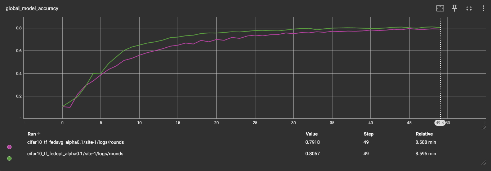

# Simulated Federated Learning with CIFAR10 Using Tensorflow

This example shows `Tensorflow`-based classic Federated Learning
algorithms, namely FedAvg, FedProx, FedOpt and Scaffold on CIFAR10
dataset. This example is analogous to [the example using `Pytorch`
backend](https://github.com/NVIDIA/NVFlare/tree/main/examples/advanced/cifar10/cifar10-sim)
on the same dataset, where same experiments
were conducted and analyzed. You should expect the same
experimental results when comparing this example with the `Pytorch` one.

In this example, the latest Client APIs were used to implement
client-side training logics (details in file
[`cifar10_tf_fl_alpha_split.py`](src/cifar10_tf_fl_alpha_split.py)),
and the new
[`FedJob`](https://github.com/NVIDIA/NVFlare/blob/main/nvflare/job_config/fed_job.py#L106)
APIs were used to programmatically set up an
`nvflare` job to be exported or ran by simulator (details in file [`tf_fl_script_executor_cifar10.py`](tf_fl_script_executor_cifar10.py)), alleviating the need
of writing job config files, simplifying development process.


## 1. Install requirements

Install required packages for training
```
pip install --upgrade pip
pip install -r ./requirements.txt
```

> **_NOTE:_**  We recommend either using a containerized deployment or virtual environment,
> please refer to [getting started](https://nvflare.readthedocs.io/en/latest/getting_started.html).


## 2. Run experiments

This example uses simulator to run all experiments. The script
[`tf_fl_script_executor_cifar10.py`](tf_fl_script_executor_cifar10.py)
is the main script to be used to launch different experiments with
different arguments (see sections below for details). A script
[`run_jobs.sh`](run_jobs.sh) is also provided to run all experiments
described below at once:
```
bash ./run_jobs.sh
```
The CIFAR10 dataset will be downloaded when running any experiment for
the first time. `Tensorboard` summary logs will be generated during
any experiment, and you can use `Tensorboard` to visualize the
training and validation process as the experiment runs. Data split
files, summary logs and results will be saved in a workspace
directory, which defaults to `/tmp` and can be configured by setting
`--workspace` argument of the `tf_fl_script_executor_cifar10.py`
script.

The set-up of all experiments in this example are kept the same as
[the example using `Pytorch`
backend](https://github.com/NVIDIA/NVFlare/tree/main/examples/advanced/cifar10/cifar10-sim). Refer
to the `Pytorch` example for more details. Similar to the Pytorch
example, we here also use Dirichelet sampling on CIFAR10 data labels
to simulate data heterogeneity among data splits for different client
sites, controlled by an alpha value, ranging from 0 (not including 0)
to 1. A high alpha value indicates less data heterogeneity, i.e., an
alpha value equal to 1.0 would result in homogeneous data distribution
among different splits.

### 2.1 Centralized training

To simulate a centralized training baseline, we run FedAvg algorithm
with 1 client for 25 rounds, where each round consists of one single epoch.

```
python ./tf_fl_script_executor_cifar10.py \
       --algo centralized \
       --n_clients 1 \
       --num_rounds 25 \
       --batch_size 64 \
       --epochs 1 \
       --alpha 0.0
```
Note, here `--alpha 0.0` is a placeholder value used to disable data
splits for centralized training.

### 2.2 FedAvg with different data heterogeneity (alpha values)

Here we run FedAvg for 50 rounds, each round with 4 local epochs. This
corresponds roughly to the same number of iterations across clients as
in the centralized baseline above (50*4 divided by 8 clients is 25):
```
for alpha in 1.0 0.5 0.3 0.1; do

    python ./tf_fl_script_executor_cifar10.py \
       --algo fedavg \
       --n_clients 8 \
       --num_rounds 50 \
       --batch_size 64 \
       --epochs 4 \
       --alpha $alpha

done
```

### 2.3 Advanced FL algorithms (FedProx, FedOpt and SCAFFOLD)

Next, let's try some different FL algorithms on a more heterogeneous split:

[FedProx](https://arxiv.org/abs/1812.06127) adds a regularizer to the loss:
```
python ./tf_fl_script_executor_cifar10.py \
       --algo fedprox \
       --n_clients 8 \
       --num_rounds 50 \
       --batch_size 64 \
       --epochs 4 \
       --fedprox_mu 1e-5 \
       --alpha 0.1
```

[FedOpt](https://arxiv.org/abs/2003.00295) uses optimizers on server
side to update the global model from client-side gradients. Here we
use SGD with momentum and cosine learning rate decay:
```
python ./tf_fl_script_executor_cifar10.py \
       --algo fedopt \
       --n_clients 8 \
       --num_rounds 50 \
       --batch_size 64 \
       --epochs 4 \
       --alpha 0.1
```

[SCAFFOLD](https://arxiv.org/abs/1910.06378) adds a correction term
during local training following the
[implementation](https://github.com/Xtra-Computing/NIID-Bench) as
described in [Li et al.](https://arxiv.org/abs/2102.02079)


## 3. Results

Now let's compare experimental results.

### 3.1 Centralized training vs. FedAvg for homogeneous split
Let's first compare FedAvg with homogeneous data split
(i.e. `alpha=1.0`) and centralized training. As can be seen from the
figure and table below, FedAvg can achieve similar performance to
centralized training under homogeneous data split, i.e., when there is
no difference in data distributions among different clients.

| Config          | Alpha | Val score |
|-----------------|-------|-----------|
| cifar10_central | n.a.  | 0.8758    |
| cifar10_fedavg  | 1.0   | 0.8839    |


### 3.2 Impact of client data heterogeneity

Here we compare the impact of data heterogeneity by varying the
`alpha` value, where lower values cause higher heterogeneity. As can
be observed in the table below, performance of the FedAvg decreases
as data heterogeneity becomes higher.

| Config |	Alpha |	Val score |
| ----------- | ----------- |  ----------- |
| cifar10_fedavg |	1.0 |	0.8838 |
| cifar10_fedavg |	0.5 |	0.8685 |
| cifar10_fedavg |	0.3 |	0.8323 |
| cifar10_fedavg |	0.1 |	0.7903 |


### 3.3 Impact of different FL algorithms

Lastly, we compare the performance of different FL algorithms, with
`alpha` value fixed to 0.1, i.e., a high client data
heterogeneity. We can observe from the figure below that, FedOpt and
SCAFFOLD achieve better performance, with better convergence rates
compared to FedAvg and FedProx with the same alpha setting. SCAFFOLD
achieves that by adding a correction term when updating the client
models, while FedOpt utilizes SGD with momentum to update the global
model on the server.

| Config |	Alpha |	Val score |
| ----------- | ----------- |  ----------- |
| cifar10_fedavg |	0.1 |	0.7903 |
| cifar10_fedprox |	0.1 |	0.7897 |
| cifar10_fedopt |	0.1 |	0.8145 |
| cifar10_scaffold |	TODO |	TODO |


