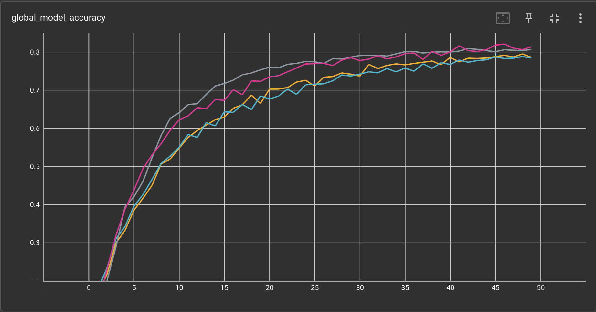

# Simulated Federated Learning with CIFAR10 Using Tensorflow

This example shows how to develop and run classic Federated Learning
algorithms, namely FedAvg, FedProx, FedOpt and Scaffold on CIFAR10,
using `Tensorflow` backend. This example is analogous to [the example
using `Pytorch`
backend](https://github.com/NVIDIA/NVFlare/tree/main/examples/advanced/cifar10/cifar10-sim)
on the same dataset, where same experiments
will be conducted and analyzed. You should expect the same
experimental results when comparing this example with the `Pytorch` one.

In this example, client-side training logics are implemented using the
new `Script Executor` APIs, which alleviate the need of job
config files, simplifying client-side development.


## 1. Install requirements

Install required packages for training
```
pip install --upgrade pip
pip install -r ./requirements.txt
```

> **_NOTE:_**  We recommend either using a containerized deployment or virtual environment,
> please refer to [getting started](https://nvflare.readthedocs.io/en/latest/getting_started.html).


## 2. Run experiments

This example uses simulator to run all experiments. A script
`run_jobs.sh` is provided to run experiments described below all at
once:
```
bash ./run_jobs.sh
```

The set-up of all experiments in this example are kept the same as
[the example using `Pytorch`
backend](https://github.com/NVIDIA/NVFlare/tree/main/examples/advanced/cifar10/cifar10-sim). Refer
to the `Pytorch` example for more details. Similar to the Pytorch
example, we here also use Dirichelet sampling on CIFAR10 data labels
to simulate data heterogeneity from different client sites, which is controlled by an alpha
value, ranging from 0 (not including 0) to 1. A high alpha value indicates less data
heterogeneity, while alpha = 0 here is used to disable Dirichelet
sampling, a.k.a. resulting in homogeneous data distribution among
different sites.

### 2.1 Centralized training

To simulate a centralized training baseline, we run FedAvg algorithm
with 1 client for 25 local epochs, for one single round.

```
python ./tf_fl_script_executor_cifar10.py \
       --algo centralized \
       --n_clients 1 \
       --num_rounds 1 \
       --batch_size 64 \
       --epochs 25 \
       --alpha 0.0
```
Note, here `--alpha 0.0` means that no heterogeneous data splits are being generated.

### 2.2 FedAvg with different data heterogeneity (alpha values)

Here we run FedAvg for 50 rounds, each with 4 local epochs. This
corresponds roughly to the same number of iterations across clients as
in the centralized baseline above (50*4 divided by 8 clients is 25):
```
for alpha in 1.0 0.5 0.3 0.1; do

    python ./tf_fl_script_executor_cifar10.py \
       --algo fedavg \
       --n_clients 8 \
       --num_rounds 50 \
       --batch_size 64 \
       --epochs 4 \
       --alpha $alpha

done
```

### 2.3 Advanced FL algorithms (FedProx, FedOpt and SCAFFOLD)

Next, let's try some different FL algorithms on a more heterogeneous split:

[FedProx](https://arxiv.org/abs/1812.06127) adds a regularizer to the loss:
```
python ./tf_fl_script_executor_cifar10.py \
       --algo fedprox \
       --n_clients 8 \
       --num_rounds 50 \
       --batch_size 64 \
       --epochs 4 \
       --fedprox_mu 1e-5 \
       --alpha 0.1
```

For [FedOpt](https://arxiv.org/abs/2003.00295), here we use SGD with momentum and cosine learning rate
decay to update server-side model:
```
python ./tf_fl_script_executor_cifar10.py \
       --algo fedopt \
       --n_clients 8 \
       --num_rounds 50 \
       --batch_size 64 \
       --epochs 4 \
       --alpha 0.1
```

[SCAFFOLD](https://arxiv.org/abs/1910.06378) adds a correction term
during local training following the
[implementation](https://github.com/Xtra-Computing/NIID-Bench) as
described in [Li et al.](https://arxiv.org/abs/2102.02079)


## 3. Results

Now let's compare experimental results. For all experiments, you can
use `Tensorboard` to visualize the training and validation process as
the experiment is running.


### 3.1 Central vs. FedAvg
With a data split using `alpha=1.0`, i.e. a non-heterogeneous split,
we achieve the following final validation scores.
One can see that FedAvg can achieve similar performance to central training.

| Config	| Alpha	| 	Val score	|
| ----------- | ----------- |  ----------- |
| cifar10_central | 1.0	| 	0.8756	|
| cifar10_fedavg  | 1.0	| 	0.8525	|


### 3.2 Impact of client data heterogeneity

Here we compare the impact of data heterogeneity by varying the
`alpha` value, where lower values cause higher heterogeneity. This can
be observed in the resulting performance of the FedAvg algorithms.

| Config |	Alpha |	Val score |
| ----------- | ----------- |  ----------- |
| cifar10_fedavg |	1.0 |	0.8838 |
| cifar10_fedavg |	0.5 |	0.8685 |
| cifar10_fedavg |	0.3 |	0.8323 |
| cifar10_fedavg |	0.1 |	0.7903 |


### 3.3 Impact of different FL algorithms

Lastly we compare the performance of different FL algorithms, with
`alpha` value fixed to 0.1, indicating a high client data
heterogeneity. We can observe from the figure below that, FedProx and
SCAFFOLD achieve better performance, with better convergence rates
compared to FedAvg and FedProx with the same alpha setting. SCAFFOLD
achieves that by adding a correction term when updating the client
models, while FedOpt utilizes SGD with momentum to update the global
model on the server. Both achieve better performance with the same
number of training steps as FedAvg/FedProx.
If the distribution of the data is too uneven, problems can also arise with the SCAFFOLD implementation using TensorFlow. 
However, these only become noticeable after too many training rounds and epochs. At a certain point, it no longer converges, and the model weights explode, causing weights and losses to become NaN. This problem only occurred with a distribution of alpha = 0.1 and is a well known [issue](https://discuss.ai.google.dev/t/failing-to-implement-scaffold-in-tensorfow/31665). 
To counteract this problem, a so called [clip norm](https://www.tensorflow.org/api_docs/python/tf/keras/optimizers/Adam) was added. 
This ensures that the gradient of each weight is clipped individually so that its norm does not exceed the specified value. Since this is a hyperparameter, clipnorm=1.5 was tested as the best value in our case. The specific use of the clip norm is based on this [code](https://github.com/google-research/public-data-in-dpfl/blob/7655a6b7165dc2cbdfe3d2e1080721223aa2c79b/scaffold_v2.py#L192C5-L192C14).
This allows the accuracy to converge until the end of the training and achieves an as good accuracy as FedOpt.

| Config |	Alpha |	Val score |
| ----------- | ----------- |  ----------- |
| cifar10_fedavg |	0.1 |	0.7858 |
| cifar10_fedprox |	0.1 |	0.7843 |
| cifar10_fedopt |	0.1 |	0.8066 |
| cifar10_scaffold |	0.1 |	0.8138 |


