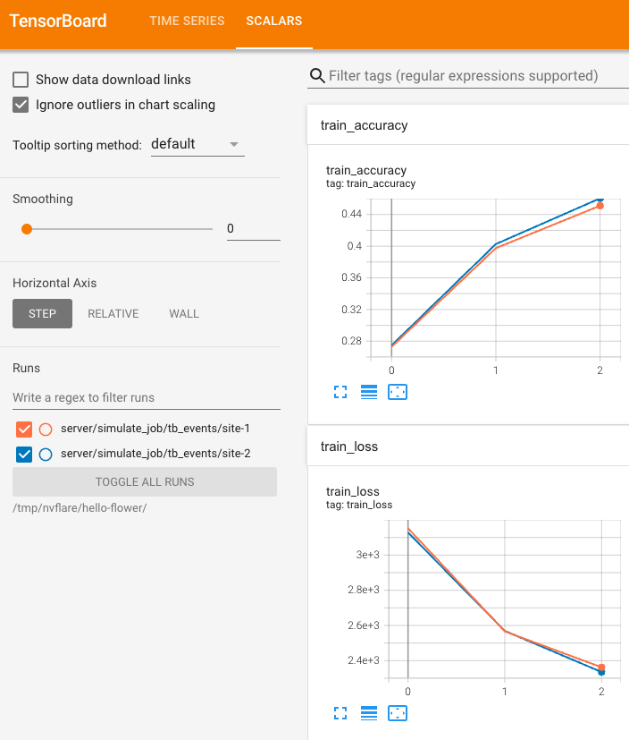

# Flower App (PyTorch) in NVIDIA FLARE

In this example, we run 2 Flower clients and Flower Server in parallel using NVFlare's simulator.

## Preconditions

To run Flower code in NVFlare, we created a job, including an app with the following custom folder content 
```bash
$ tree jobs/hello-flwr-pt/app/custom

├── flwr_pt
│   ├── client.py   # <-- contains `ClientApp`
│   ├── __init__.py # <-- to register the python module
│   ├── server.py   # <-- contains `ServerApp`
│   └── task.py     # <-- task-specific code (model, data)
└── pyproject.toml  # <-- Flower project file
```
Note, this code is adapted from Flower's [app-pytorch](https://github.com/adap/flower/tree/main/examples/app-pytorch) example.

## 1. Install dependencies
If you haven't already, we recommend creating a virtual environment.
```bash
python3 -m venv nvflare_flwr
source nvflare_flwr/bin/activate
```
We recommend installing an older version of NumPy as torch/torchvision doesn't support NumPy 2 at this time.
```bash
pip install numpy==1.26.4
```
## 2.1 Run a simulation

To run flwr-pt job with NVFlare, we first need to install its dependencies.
```bash
pip install ./flwr-pt/
```

Next, we run 2 Flower clients and Flower Server in parallel using NVFlare's simulator.
```bash
python job.py --job_name "flwr-pt" --content_dir "./flwr-pt"
```

## 2.2 Run a simulation with TensorBoard streaming

To run flwr-pt_tb_streaming job with NVFlare, we first need to install its dependencies.
```bash
pip install ./flwr-pt-tb/
```

Next, we run 2 Flower clients and Flower Server in parallel using NVFlare while streaming 
the TensorBoard metrics to the server at each iteration using NVFlare's metric streaming.

```bash
python job.py --job_name "flwr-pt-tb" --content_dir "./flwr-pt-tb" --stream_metrics
```

You can visualize the metrics streamed to the server using TensorBoard.
```bash
tensorboard --logdir /tmp/nvflare/hello-flower
```


## Notes
Make sure your `pyproject.toml` files in the Flower apps contain an "address" field. This needs to be present as the `--federation-config` option of the `flwr run` command tries to override the `“address”` field.
Your `pyproject.toml` should include a section similar to this:
```
[tool.flwr.federations]
default = "xxx"

[tool.flwr.federations.xxx]
options.num-supernodes = 2
address = "127.0.0.1:9093"
insecure = false
```
The number `options.num-supernodes` should match the number of NVFlare clients defined in [job.py](./job.py), e.g., `job.simulator_run(args.workdir, gpu="0", n_clients=2)`.
