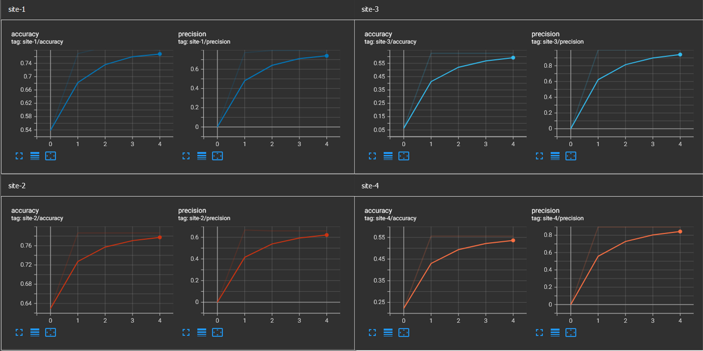

# Federated Logistic Regression with Newton-Raphson Optimization

This example demonstrates federated binary classification using logistic regression and second-order Newton-Raphson optimization. The complete example code is in `examples/hello-world/hello-lr`.

## NVIDIA FLARE Installation

For complete installation instructions, see [Installation](https://nvflare.readthedocs.io/en/main/installation.html).

```bash
pip install nvflare
pip install -r requirements.txt
```

## Code Structure

First get the example code from GitHub:

```bash
git clone https://github.com/NVIDIA/NVFlare.git
```

Then navigate to this example directory:

```bash
git switch <release branch>
cd examples/hello-world/hello-lr
```

```bash
hello-lr
|
|-- client.py              # client local training script
|-- job.py                 # job recipe that defines client and server configurations
|-- download_data.py       # download dataset
|-- prepare_data.py        # convert dataset to numpy files for training
|-- train_centralized.py   # centralized baseline for comparison
|-- requirements.txt       # dependencies
|-- figs/                  # visualization figures
```

> Note: This example does not have a separate `model.py`. The model logic for Newton-Raphson logistic regression is implemented in `client.py` and coordinated by `job.py`.

## Data

This example uses the [UCI Heart Disease dataset](https://archive.ics.uci.edu/dataset/45/heart+disease).

In a real FL experiment, each client would have its own local dataset. Here, the data is prepared into site-specific splits for four simulated client sites:

| Site         | Sample Split                          |
|--------------|---------------------------------------|
| Cleveland    | train: 199 samples, test: 104 samples |
| Hungary      | train: 172 samples, test: 89 samples  |
| Switzerland  | train: 30 samples, test: 16 samples   |
| Long Beach V | train: 85 samples, test: 45 samples   |

Each sample has 13 features.

### Publication Request from Dataset Authors

The dataset authors requested that publications include the names of principal investigators responsible for data collection:

1. Hungarian Institute of Cardiology, Budapest: Andras Janosi, M.D.
2. University Hospital, Zurich, Switzerland: William Steinbrunn, M.D.
3. University Hospital, Basel, Switzerland: Matthias Pfisterer, M.D.
4. V.A. Medical Center, Long Beach and Cleveland Clinic Foundation: Robert Detrano, M.D., Ph.D.

## Model

This example solves logistic regression using Newton-Raphson updates.

For sample $x$, the probability of positive class is:

$$
p(x) = \sigma(\beta \cdot x + \beta_0)
$$

Using parameter vector $\theta = (\beta_0, \beta)$, the matrix form is:

$$
p(X) = \sigma(X\theta)
$$

The update at round $n$ is:

$$
    heta^{n+1} = \theta^n - H_{\theta^n}^{-1} \nabla L_{\theta^n}
$$

where:

$$
\nabla L_{\theta^n} = X^T(y - p(X)), \quad H_{\theta^n} = -X^TDX
$$

In federated training, each client computes local gradient/Hessian terms from its own data, and the server aggregates them to produce the global update.

## Client Code

The client logic is implemented in [client.py](./client.py) using the NVFlare [Client API](https://nvflare.readthedocs.io/en/main/programming_guide/execution_api_type.html#client-api).

At each training round, each client:

1. Receives the global model (`flare.receive()`).
2. Evaluates the received model locally and streams metrics.
3. Computes local gradient and Hessian terms in `train_newton_raphson()`.
4. Sends results back in `FLModel` format (`flare.send()`).

The training flow remains close to centralized logic, with only minimal FL-specific integration for model exchange.

## Server Side

Server-side aggregation uses NVFlare's built-in logistic regression FedAvg workflow:

- `nvflare.app_common.workflows.lr.fedavg.FedAvgLR`

This handles orchestration and global update computation from aggregated client contributions.

## Job Recipe

The job recipe in `job.py` wires the client script and server workflow together:

```python
recipe = FedAvgLrRecipe(
    min_clients=n_clients,
    num_rounds=num_rounds,
    damping_factor=0.8,
    num_features=13,
    # For pre-trained weights: initial_ckpt="/server/path/to/lr_model.npy",
    train_script="client.py",
    train_args=f"--data_root {data_root}",
)
env = SimEnv(num_clients=n_clients, num_threads=n_clients)
run = recipe.execute(env)
```

## Run Job

Prepare data first:

```bash
python download_data.py
python prepare_data.py
```

This creates prepared data under `/tmp/flare/dataset/heart_disease_data/`.

Run federated training:

```bash
python job.py
```

Optional: customize the number of clients and rounds:

```bash
python job.py --n_clients 4 --num_rounds 5
```

## Result

Run a centralized baseline for comparison:

```bash
python train_centralized.py --solver custom
```

Supported solvers in `train_centralized.py`:

- `custom`: manual Newton-Raphson implementation
- `sklearn`: `sklearn.LogisticRegression` with `newton-cholesky`

View federated metrics in TensorBoard:

```bash
tensorboard --logdir=<workspace_dir>/server/simulate_job/tb_events
```

Per-site accuracy and precision in federated training should be comparable to centralized baseline results.



