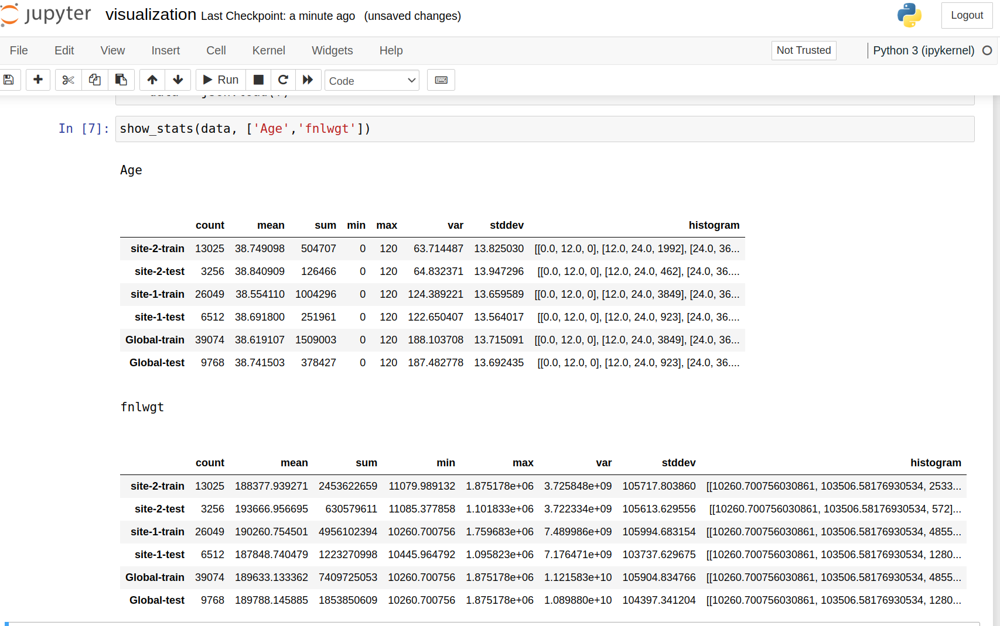
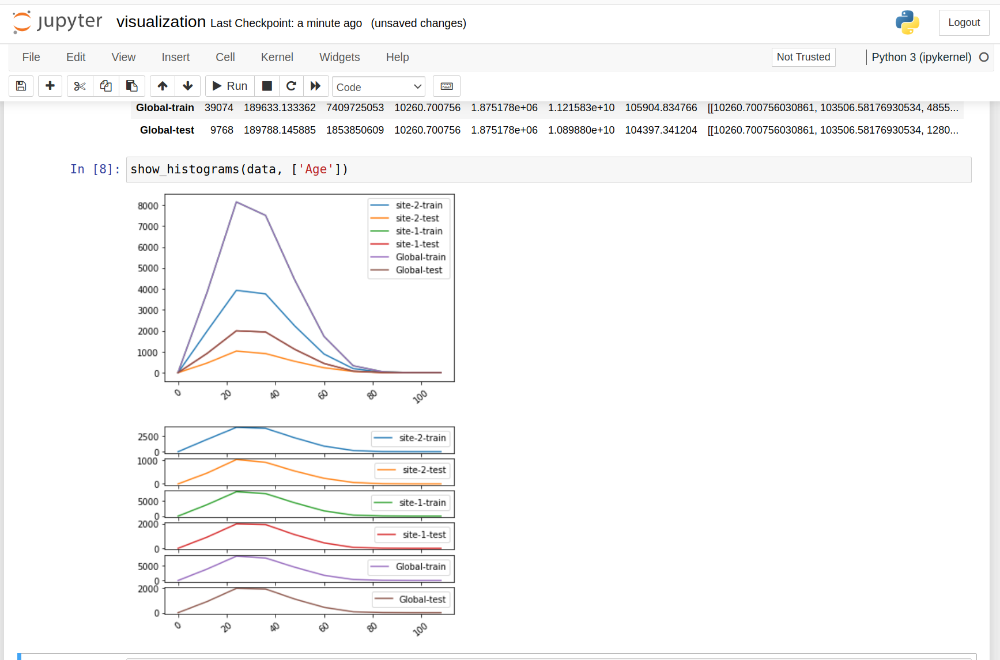

# Tabular Data Federated Statistics 

In this example, we will show how to generate federated statistics for tabular data that can be represented as Pandas Data Frame.


## NVIDIA FLARE Installation
For the complete installation instructions, see [Installation](https://nvflare.readthedocs.io/en/main/installation.html)

```
    pip install nvflare

```

Get the example code from github:

```
    git clone https://github.com/NVIDIA/NVFlare.git
```

Then navigate to the hello-tabular-stats directory:

```
    git switch <release branch>
    cd NVFlare/examples/hello-world/hello-tabular-stats
```

## Install the dependency

```
pip install -r requirements.txt
```


### Install Optional Quantile Dependency -- fastdigest

If you intend to calculate quantiles, you need to install fastdigest. 

Skip this step if you don't need quantile statistics. 

```
    pip install fastdigest==0.4.0
```

On Ubuntu, you might get the following error:

  Cargo, the Rust package manager, is not installed or is not on PATH.
  This package requires Rust and Cargo to compile extensions. Install it through
  the system's package manager or via https://rustup.rs/
      
  Checking for Rust toolchain....

This is because fastdigest (or its dependencies) requires Rust and Cargo to build. 

You need to install Rust and Cargo on your Ubuntu system. Follow these steps:
Install Rust and Cargo
Run the following command to install Rust using rustup:

```
    ./install_cargo.sh
```

Then you can install fastdigest again
```
    pip install fastdigest==0.4.0
```

## Code Structure

``` bash
hello-tabular-stats
    |
    ├── client.py         # client local training script
    ├── job.py            # job recipe that defines client and server configurations
    ├── prepare_data.py   # utilities to download data
    ├── install_cargo.sh  # scripts to install rust and cargo needed for quantile dependency, only needed if you plan to install quantile dependency
    └── requirements.txt  # dependencies
    ├── demo
    │   └── visualization.ipynb # Visualization Notebook
 
```

## Data

In this example, we are using UCI (University of California, Irvine) [adult dataset](https://archive.ics.uci.edu/dataset/2/adult)

The original dataset already contains "training" and "test" datasets. Here we simply assume that the "training" and test datasets belong to different clients.
So we assigned the training data and test data into two clients.
 
Now we use the data utility to download UCI datasets to separate client package directory to /tmp/nvflare/data/ directory

Please note that the UCI's website may experience occasional downtime.

```shell
python prepare_data.py
```
It should show something like
```
prepare data for data directory /tmp/nvflare/df_stats/data

download to /tmp/nvflare/df_stats/data/site-1/data.csv
skip empty line


download to /tmp/nvflare/df_stats/data/site-2/data.csv
skip empty line

done with prepare data
```

## Client Code

**Local statistics generator**

The statistics generator `AdultStatistics` implements `Statistics` spec.

```
class AdultStatistics(DFStatisticsCore):
    # rest of code 
```
Many of the functions needed for tabular statistics have already been implemented in DFStatisticsCore

In the `AdultStatistics` class, we really need to have the following
* data_features -- here we hard-coded the feature name array. 
* implement `load_data() -> Dict[str, pd.DataFrame]` function, where 
  the method will return a dictionary of panda DataFrames with one for each data source ("train", "test")
* `data_path = f"{self.data_root_dir}/<site-name>/<filename>`

## Server Code
The server aggregation has already been implemented in Statistics Controller

## Job Recipe

The job is defined via a recipe, and we will run it in Simulation Execution Env.

```
    recipe = FedStatsRecipe(
        name="stats_df",
        stats_output_path=output_path,
        sites=sites,
        statistic_configs=statistic_configs,
        stats_generator=df_stats_generator,
    )

    env = SimEnv(clients=sites, num_threads=n_clients)
    recipe.execute(env=env)

```

The statistics configuration determines which statistics we need to generate
Here is an example
```
    statistic_configs = {
        "count": {},
        "mean": {},
        "sum": {},
        "stddev": {},
        "histogram": {"*": {"bins": 20}, "Age": {"bins": 20, "range": [0, 100]}},
        "quantile": {"*": [0.1, 0.5, 0.9]},
    }
```

## Run Job
From the terminal, try to run the code
 
```
python job.py
```

You should see something like

```
2025-09-03 20:42:03,392 - INFO - save statistics result to persistence store
2025-09-03 20:42:03,392 - INFO - job dir = /tmp/nvflare/simulation/stats_df/server/simulate_job
2025-09-03 20:42:03,395 - INFO - trying to save data to /tmp/nvflare/simulation/stats_df/server/simulate_job/statistics/adults_stats.json
2025-09-03 20:42:03,395 - INFO - file /tmp/nvflare/simulation/stats_df/server/simulate_job/statistics/adults_stats.json saved

```
The results are stored in workspace "/tmp/nvflare"
```
/tmp/nvflare/simulation/stats_df/server/simulate_job/statistics/adults_stats.json
```

## Visualization
   With the JSON format, the data can be easily visualized via pandas dataframe and plots. 
   Download and copy the output adults_stats.json file to the demo directory, then you can run jupyter notebook visualization.ipynb 


```bash
    cp /tmp/nvflare/simulation/stats_df/server/simulate_job/statistics/adults_stats.json demo/.
    
    cd demo
    
    jupyter notebook  visualization.ipynb
```
you should be able to get the visualization similar to the followings

 and 
