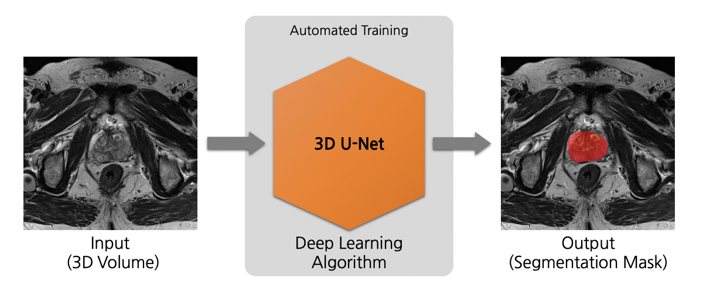
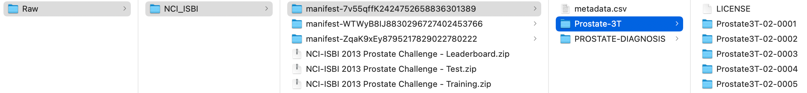
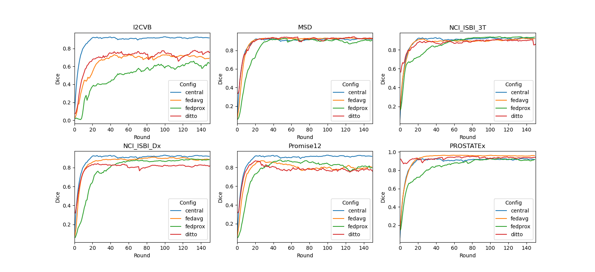

# Federated Learning for Prostate Segmentation from Multi-source Data

## Introduction to MONAI, Prostate and Multi-source Data

### MONAI
This example shows how to use [NVIDIA FLARE](https://nvidia.github.io/NVFlare) on medical image applications.
It uses [MONAI](https://github.com/Project-MONAI/MONAI),
which is a PyTorch-based, open-source framework for deep learning in healthcare imaging, part of the PyTorch Ecosystem.

### Prostate
The application shown in this example is volumetric (3D) segmentation of the prostate in T2-weighted MRIs based on three datasets that can be split into four clients with comparable sizes.

The [3D U-Net](https://arxiv.org/abs/1606.06650) model is trained to segment the whole prostate region (binary) in a T2-weighted MRI scan. 




## (Optional) 1. Set up a virtual environment
```
python3 -m pip install --user --upgrade pip
python3 -m pip install --user virtualenv
```
(If needed) make all shell scripts executable using
```
find . -name ".sh" -exec chmod +x {} \;
```
initialize virtual environment.
```
source ./virtualenv/set_env.sh
```
install required packages for training
```
pip3 install --upgrade pip
pip3 install -r ./virtualenv/min-requirements.txt
```

## 2. Multi-source Data Preparation
To run this example, we are going to make use of three open prostate datasets which we split into four FL clients with comparable sizes. Each of them needs some special preprocessing steps. 

Please go to the `./data_preparation` folder to perform the download, preprocessing, and data list generation. 

```
cd ./data_preparation
```

From now on, for this section, we assume the current directory (`PWD`) to be `./data_preparation`.  
We will download the three datasets to `./Raw/$dataset_id/`, store the client-specif datasets to `./dataset/$client_id`, and use `dicom2nifti` and pynrrd tools for data format conversion

```
mkdir Raw
mkdir dataset
for dataset in I2CVB MSD NCI_ISBI; do
  mkdir Raw/${dataset}
done
```

### 2.1 Downloading steps for each dataset: 

[**I2CVB**](https://i2cvb.github.io/): [data link](https://zenodo.org/record/162231#.YZvNc_HMJuG) 

Download all files to `./Raw/I2CVB`. 
I2CVB contains files ending with .aa, .ab, etc. These are parts of a .tar.gz file (split for sharing). To extract, run the following

```
cat ./Raw/I2CVB/ge-1-5t* > ./Raw/I2CVB/ge-1-5t.tar.gz
tar xzvf ./Raw/I2CVB/ge-1-5t.tar.gz -C ./Raw/I2CVB/
cat ./Raw/I2CVB/siemens-3t* > ./Raw/I2CVB/siemens-3t.tar.gz
tar xzvf ./Raw/I2CVB/siemens-3t.tar.gz -C ./Raw/I2CVB/
```

This will produce two folders, `./Raw/I2CVB/GE` with 21 cases and `./Raw/I2CVB/Siemens` with 19 cases. Multi-sequence images and multi-region masks are stored individually in DICOM format. We use `dicom2nifti` tool to perform data format conversion to NIfTI on T2 images and ground truth for the prostate region.
Due to the small data size, we combined the two into one client. Note that there is one case (Patient_428260) with a missing slice from ground truth segmentation. Thus, we discarded this case.

```
bash data_conversion_I2CVB.sh
```  

[**MSD**](http://medicaldecathlon.com/): [data link](https://drive.google.com/drive/folders/1HqEgzS8BV2c7xYNrZdEAnrHk7osJJ--2)

Download "Task05_Prostate.tar" to `./Raw/MSD`, and extract with

```
tar xf ./Raw/MSD/Task05_Prostate.tar -C ./Raw/MSD
```

This will produce folder ./Raw/MSD/Task05_Prostate containing 32 training images with labels and 16 testing images without labels. Images in this dataset have two channels, and we select the first one, which is T2. Masks in this dataset have two values. We combine the two to get the mask of the prostate.

```
bash data_conversion_MSD.sh
```

[**NCI_ISBI**](https://wiki.cancerimagingarchive.net/display/Public/NCI-ISBI+2013+Challenge+-+Automated+Segmentation+of+Prostate+Structures): [data link](https://wiki.cancerimagingarchive.net/pages/viewpage.action?pageId=21267207)

Download the first 3 .tcia files and download the actual DICOM image data with [NBIA Data Retriever](https://wiki.cancerimagingarchive.net/display/NBIA/Downloading+TCIA+Images), store them to `./Raw/NCI_ISBI/`. Then download the second 3 .zip files containing the NRRD ground truth segmentations and store them to `./Raw/NCI_ISBI/`. The downloaded folder structure will look like

The three `manifest-*` folders correspond to the TCIA download path to the three image datasets.  
We extract the mask files and reorganize the image folders as  

```
mkdir ./Raw/NCI_ISBI/Image
mkdir ./Raw/NCI_ISBI/Mask
unzip ./Raw/NCI_ISBI/NCI-ISBI\ 2013\ Prostate\ Challenge\ -\ Training.zip -d ./Raw/NCI_ISBI/Mask/
unzip ./Raw/NCI_ISBI/NCI-ISBI\ 2013\ Prostate\ Challenge\ -\ Test.zip -d ./Raw/NCI_ISBI/Mask/
unzip ./Raw/NCI_ISBI/NCI-ISBI\ 2013\ Prostate\ Challenge\ -\ Leaderboard.zip -d ./Raw/NCI_ISBI/Mask/
mv ./Raw/NCI_ISBI/manifest*/Prostate-3T/*/ ./Raw/NCI_ISBI/Image
mv ./Raw/NCI_ISBI/manifest*/PROSTATE-DIAGNOSIS/*/ ./Raw/NCI_ISBI/Image
```
There is one mask case needing renaming:

```
mv ./Raw/NCI_ISBI/Mask/Training/ProstateDx-01-0006_correctedLabels.nrrd ./Raw/NCI_ISBI/Mask/Training/ProstateDx-01-0006.nrrd
```
This dataset can be split into two clients, one for "Prostate-3T", and the other for "PROSTATE-DIAGNOSIS". Each has 30 training, 5 test, and 5 leaderboard image/label pairs. The images are T2 only, in DICOM format, and labels have two values in NRRD format. We convert DICOM/NRRD to NIfTI, and combine the two label values.  
Note that there is one case (ProstateDx-01-0055.nii.gz) with image/label mismatch. Thus, we discarded this case.

```
bash data_conversion_NCI_ISBI.sh
```

### 2.2 Create data lists
Now we have all data we need for this example under `./dataset` after data download and preprocessing above, we randomly generate a data split for each dataset, training:validation:testing=8:2:0, and combine all JSON files for simulating centralized training while keeping each data split unchanged.

```
bash datalists_gen.sh
bash merge_all_jsons.sh
```
The expected output for these steps is:
```
Generate data split for ./dataset/I2CVB, with train:validation:test 8:2:0
Save json to ./datalists/client_I2CVB.json
In total 39 cases, 32 for training, 7 for validation, and 0 for testing
Generate data split for ./dataset/MSD, with train:validation:test 8:2:0
Save json to ./datalists/client_MSD.json
In total 32 cases, 26 for training, 6 for validation, and 0 for testing
Generate data split for ./dataset/NCI_ISBI_3T, with train:validation:test 8:2:0
Save json to ./datalists/client_NCI_ISBI_3T.json
In total 40 cases, 32 for training, 8 for validation, and 0 for testing
Generate data split for ./dataset/NCI_ISBI_Dx, with train:validation:test 8:2:0
Save json to ./datalists/client_NCI_ISBI_Dx.json
In total 39 cases, 32 for training, 7 for validation, and 0 for testing
```

The resulting data lists will be stored in `./datalists`. Note that the ratio among training, validation, and testing can be adjusted.

## 3. Create your FL workspace 
From now on, we assume the PWD to be `./prostate`, one level higher than the previous section.

If you haven't done so, run
``
cd ..
``

### 3.1 POC ("proof of concept") workspace
In this example, we run FL experiments in POC mode, starting with creating local FL workspace with

```
poc
```

Press y and enter when prompted.   
In the following experiments, we will be using 4 clients. Let's rename and make additional client folders as

```
mv poc workspace_prostate
mv workspace_prostate/site-1 workspace_prostate/client_All
for dataset in I2CVB MSD NCI_ISBI_3T NCI_ISBI_Dx; do
  cp -r workspace_prostate/client_All workspace_prostate/client_${dataset}
done
```

### 3.2 (Optional) Secure FL workspace
We only cover POC mode in this example. To run it with Secure mode, please refer to the [`cifar10`](../cifar10) example.
> **_NOTE:_** **POC** stands for "proof of concept" and is used for quick experimentation 
> with different amounts of clients.
> It doesn't need any advanced configurations while provisioning the startup kits for the server and clients. 
>
> The **secure** workspace, on the other hand, is needed to run experiments that require encryption keys. These startup kits allow secure deployment of FL in real-world scenarios 
> using SSL certificated communication channels.

## 4. Run automated experiments
First, we add the current directory path to `config_train.json` files for generating the absolute path to dataset and datalist.  
```
for alg in prostate_central prostate_fedavg prostate_fedprox prostate_ditto
do
  sed -i "s|PWD|${PWD}|g" configs/${alg}/config/config_train.json
done
```
Then FL training will be run with an automatic script utilizing the FLAdminAPI functionality.    
The [run_poc.sh](./run_poc.sh) script follows the pattern:
```
./run_poc.sh [config] [run] [client_ids]
```
`[config]` is the app that will be used for the FL training, in this example, this includes `prostate_fedavg`, `prostate_fedprox`, and prostate_central.  
`[run]` is the run number for FL experiment. A unique run number will be needed for each experiment.  
`[client_ids]` is the list of all candidate client IDs. In this experiment it is either "I2CVB MSD NCI_ISBI_3T NCI_ISBI_Dx" for 4-client experiment or "All" for centralized training.    

This script will start the FL server and clients automatically to run FL experiments on localhost. 
Each client will be alternately assigned a GPU using `export CUDA_VISIBLE_DEVICES=${gpu_idx}` in the [run_poc.sh](./run_poc.sh). 
In this example, we run 4 clients on two GPUs, two clients for each GPU with 12 GB memory.  

Note that in order to make it working under most system resource conditions, the current script used regular `Dataset` for data loading in `pt/learners/prostate_learner.py`, which could be slow. If resource permits, it will make the training much faster by replacing it with `CacheDataset`. More information available [here](https://docs.monai.io/en/stable/data.html#cachedataset).  

### 4.1 Centralized training
To simulate a centralized training baseline, we run FL with 1 client using all the training data. 
```
./run_poc.sh prostate_central 1 "All"
```
### 4.2 FedAvg 
To run FL with standard [fedAvg](https://arxiv.org/abs/1602.05629), we use
```
./run_poc.sh prostate_fedavg 2 "I2CVB MSD NCI_ISBI_3T NCI_ISBI_Dx"
```
### 4.3 FedProx 
To run FL with [FedProx](https://arxiv.org/abs/1812.06127), which adds a regularizer to the loss used in `SupervisedProstateLearner` (`fedproxloss_mu`), we use
```
./run_poc.sh prostate_fedprox 3 "I2CVB MSD NCI_ISBI_3T NCI_ISBI_Dx"
```
### 4.4 Ditto 
To run FL with [Ditto](https://arxiv.org/abs/2012.04221)(official [implementation](https://github.com/litian96/ditto)), which uses a slightly modified version of the prostate Learner implementation, namely the `ProstateDittoLearner`, which decouples local personalized model from global model via an additional model training and a controllable prox term (`ditto_lambda`), we use
```
./run_poc.sh prostate_ditto 4 "I2CVB MSD NCI_ISBI_3T NCI_ISBI_Dx"
```

> **_NOTE:_** You can always use the admin console to manually abort the automatically started runs 
  using `abort all`. An automatic shutdown is useful here for development as code changes 
> in your FL components will only be picked up on a restart of the FL system. 
> For real-world deployments, the system should be kept running but the admin restart command can be used, 
> see [here](https://nvidia.github.io/NVFlare/user_guide/admin_commands.html).

> To log into the POC workspace admin console, use username "admin" and password "admin". 
> For the secure workspace admin console, use username "admin@nvidia.com"

After training, each client's best model will be used for cross-site validation. The results can be shown with
for example
```
cat ./workspace_prostate/server/run_1/cross_site_val/global_val.json
```

## 5. Results on 4 clients for Central vs. FedAvg vs. FedProx

### Validation curve 
Let's summarize the result of the experiments run above. We compare the final validation scores of 
the global models for different settings. In this example, each client computes their validation scores using their own
validation set, and the centralized model computes the validation score using the combined validation set. Please note that due to the limited size of data set, the validation curve can have significant variations across runs.

The TensorBoard curves for validation Dice of the global model for the 1000 epochs (100 rounds, 10 local epochs per round) during training are shown below:

