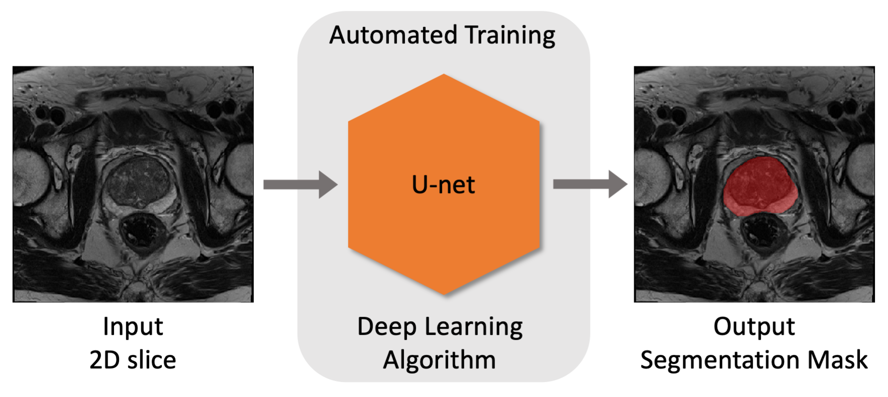
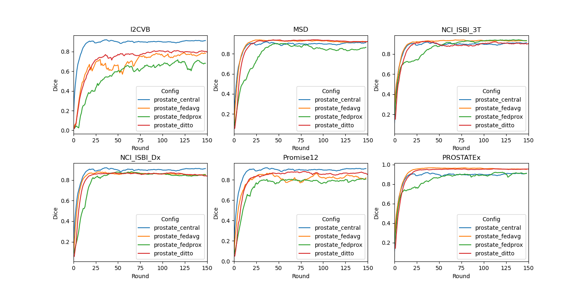

### Prostate 2D
The application shown in this example is slice (2D) segmentation of the prostate in T2-weighted MRIs based on five datasets that can be split into six clients.

The [U-Net](https://arxiv.org/abs/1505.04597) model is trained to segment the whole prostate region (binary) in a T2-weighted MRI scan. 



## 1. Create your FL workspace 
From now on, we assume the PWD to be `./prostate_2D`.

### 1.1 POC ("proof of concept") workspace
In this example, we run FL experiments in POC mode, starting with creating local FL workspace with

```
python3 -m nvflare.lighter.poc
```

Press y and enter when prompted.   
In the following experiments, we will be using 6 clients. Let's rename and make additional client folders as

```
mv poc workspace_prostate
mv workspace_prostate/site-1 workspace_prostate/client_All
for dataset in I2CVB MSD NCI_ISBI_3T NCI_ISBI_Dx Promise12 PROSTATEx; do
  cp -r workspace_prostate/client_All workspace_prostate/client_${dataset}
done
```

### 1.2 (Optional) Secure FL workspace
We only cover POC mode in this example. To run it with Secure mode, please refer to the [`cifar10`](../cifar10) example.
> **_NOTE:_** **POC** stands for "proof of concept" and is used for quick experimentation 
> with different amounts of clients.
> It doesn't need any advanced configurations while provisioning the startup kits for the server and clients. 
>
> The **secure** workspace, on the other hand, is needed to run experiments that require encryption keys. These startup kits allow secure deployment of FL in real-world scenarios 
> using SSL certificated communication channels.

### GPU resource and Multi-tasking
In this example, we assume two local GPUs with at least 12GB of memory are available. 

As we use the POC workspace without `meta.json`, we control the client GPU directly when starting the clients by specifying `CUDA_VISIBLE_DEVICES`. 

To enable multi-tasking, here we adjust the default value in `workspace_server/server/startup/fed_server.json` by setting `max_jobs: 2` (defualt value 1). Please adjust this properly accodrding to resource available and task demand. 

(Optional) If using secure workspace, in secure project configuration `secure_project.yml`, we can set the available GPU indices as `gpu: [0, 1]` using the `ListResourceManager` and `max_jobs: 2` in `DefaultJobScheduler`.

For details, please refer to the [documentation](https://nvflare.readthedocs.io/en/main/user_guide/job.html).

## 2. Run automated experiments
The next scripts will start the FL server and clients automatically to run FL experiments on localhost.
### 2.1 Prepare local configs
First, we add the image directory root to `config_train.json` files for generating the absolute path to dataset and datalist. In the current folder structure, it will be `${PWD}/..`, it can be any arbitary path where the data locates.  
```
for alg in prostate_central prostate_fedavg prostate_fedprox prostate_ditto
do
  sed -i "s|DATASET_ROOT|${PWD}/../data_preparation|g" configs/${alg}/config/config_train.json
done
```
### 2.2 Start the FL system and submit jobs
Next, we will start the FL system and submit jobs to start FL training automatically.

Start the FL system with either 1 client for centralized training, or 6 clients for federated learning by running
```
bash start_fl_poc.sh "All"
```
or
```
bash start_fl_poc.sh "I2CVB MSD NCI_ISBI_3T NCI_ISBI_Dx Promise12 PROSTATEx"
```
This script will start the FL server and clients automatically to run FL experiments on localhost. 
Each client will be alternately assigned a GPU using `export CUDA_VISIBLE_DEVICES=${gpu_idx}` in the [start_fl_poc.sh](./start_fl_poc.sh). 
In this example, we run six clients on two GPUs, three clients for each GPU with 12 GB memory.  

Then FL training will be run with an automatic script utilizing the FLAdminAPI functionality.    
The [submit_job.sh](./submit_job.sh) script follows the pattern:
```
bash ./submit_job.sh [config]
```
`[config]` is the experiment job that will be submitted for the FL training, in this example, this includes `prostate_central`, `prostate_fedavg`, `prostate_fedprox`, and `prostate_ditto`.  

Note that since the current experiments are performed on a light 2D dataset, we used [`CacheDataset`](https://docs.monai.io/en/stable/data.html#cachedataset) and set cache rate to 1.0 to accelerate the training process. Please adjust the cache rate if memory resource is limited on your system.

### 2.3 Centralized training
To simulate a centralized training baseline, we run FL with 1 client using all the training data. 
```
bash start_fl_poc.sh "All"
bash submit_job.sh prostate_central
```
### 2.4 Federated learning
Start 6 FL clients
```
bash start_fl_poc.sh "I2CVB MSD NCI_ISBI_3T NCI_ISBI_Dx Promise12 PROSTATEx"
```
#### 2.4.1 FedAvg 
To run FL with standard [fedAvg](https://arxiv.org/abs/1602.05629), we use
```
bash submit_job.sh prostate_fedavg
```
#### 2.4.2 FedProx 
To run FL with [FedProx](https://arxiv.org/abs/1812.06127), which adds a regularizer to the loss used in `SupervisedProstateLearner` (`fedproxloss_mu`), we use
```
bash submit_job.sh prostate_fedprox 
```
#### 2.4. Ditto 
To run FL with [Ditto](https://arxiv.org/abs/2012.04221)(official [implementation](https://github.com/litian96/ditto)), which uses a slightly modified version of the prostate Learner implementation, namely the `ProstateDittoLearner`, which decouples local personalized model from global model via an additional model training and a controllable prox term (`ditto_lambda`), we use
```
bash submit_job.sh prostate_ditto
```
> **_NOTE:_** You can always use the admin console to manually abort a running job. 
  using `abort_job [JOB_ID]`. 
> For a complete list of admin commands, see [here](https://nvflare.readthedocs.io/en/main/user_guide/operation.html).

> To log into the POC workspace admin console no username is required 
> (use "admin" for commands requiring conformation with username). 

## 3. Results on 6 clients for Central vs. FedAvg vs. FedProx vs. Ditto
In this example, for Central/FedAvg/FedProx, only the global model gets evaluated at each round, and saved as the final model. For Ditto, each client will have its own personalized model, which is validated and saved locally.
### Validation curve on each site

Let's summarize the result of the experiments run above. We compare the validation scores of 
the global model for Central/FedAvg/FedProx, and personalized models for Ditto. In this example, each client computes their validation scores using their own
validation set, and the centralized model computes the validation score using the combined validation set. 

We provide a script for plotting the tensorboard records, running
```
python3 ./result_stat/plot_tensorboard_events.py
```
The TensorBoard curves (smoothed with weight 0.8) for validation Dice for the 150 epochs (150 rounds, 1 local epochs per round) during training are shown below:


### Testing score
The testing score is computed based on the best global model for Central/FedAvg/FedProx, and the six best personalized models for Ditto.
We provide a script for performing validation on testing data split.

To get the model after training, the results can be downloaded and shown with the admin console using
```
  download_job [JOB_ID]
```
where `[JOB_ID]` is the ID assigned by the system when submitting the job.

The results/models will be downloaded to your admin workspace (the exact download path will be displayed when running the command).
You should see the best global model at
```
[DOWNLOAD_DIR]/[JOB_ID]/workspace/app_server/best_FL_global_model.pt
```

Please then add the correct paths and job_ids to the testing script, and run

```
bash ./result_stat/testing_models_2d.sh
```
Note that for Ditto, the score is the average Dice among all 6 personalized models evaluated on their own testing data weighted by testing data size.

The Dice results for the above run are:

| Config	          | 	Val Dice	 | 
|------------------|------------|
| prostate_central | 	0.8590	 | 
| prostate_fedavg  |   0.8324   | 
| prostate_fedprox |   0.8131   | 
| prostate_ditto   | 	0.8474	 |