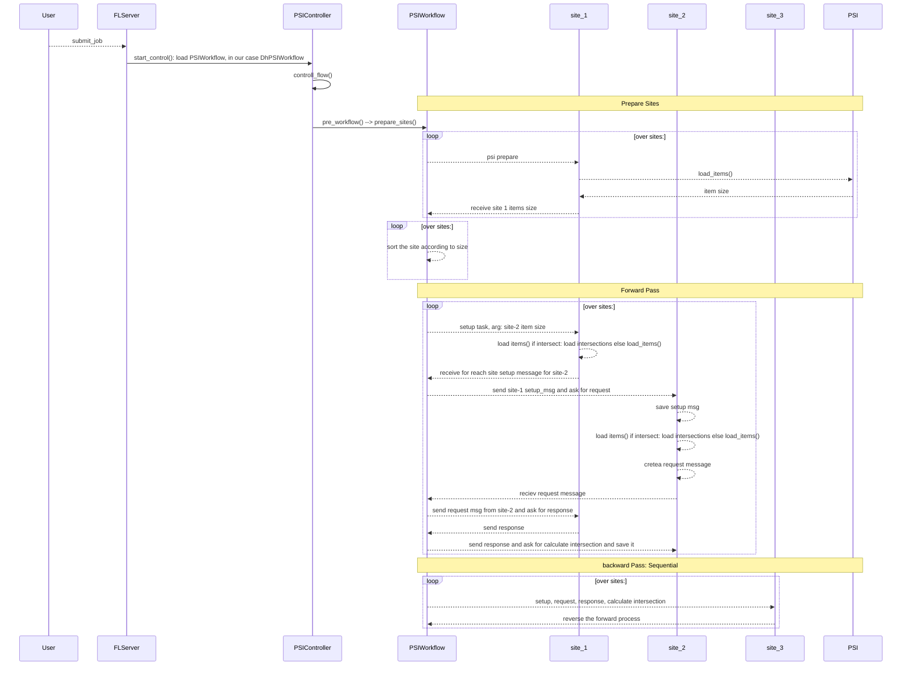

## PSI Client Server Interaction
#### The interaction is based on DH-Based PSI algorithm, openmined PSI implementation < Todo Reference>

```mermaid
 
sequenceDiagram
    
    participant User 
    participant FLServer
    participant PSIController 
    participant PSIWorkflow
    participant site_1
    participant site_2
    participant site_3
    participant PSI
    
    User -->> FLServer : submit_job
    FLServer->> PSIController: start_control(): load PSIWorkflow, in our case DhPSIWorkflow 
    PSIController->>PSIController: controll_flow() 
    
    note over PSIWorkflow, PSI: Prepare Sites
    PSIController->>PSIWorkflow: pre_workflow() --> prepare_sites()
    loop over sites:
        PSIWorkflow -->> site_1 : psi prepare
        site_1 -->> PSI : load_items() 
        PSI -->> site_1: item size
        site_1 -->> PSIWorkflow: receive site 1 items size
    end

    loop over sites:
        PSIWorkflow -->> PSIWorkflow : sort the site according to size 
    end 

    note over PSIWorkflow, PSI : Forward Pass
    loop over sites: 
        
        PSIWorkflow -->> site_1 : setup task, arg: site-2 item size
        site_1 -->> site_1 :  load items() if intersect: load intersections else load_items() 
        site_1 -->> PSIWorkflow: receive for reach site setup message for site-2
            
        PSIWorkflow -->> site_2 : send site-1 setup_msg and ask for request 
        site_2 -->> site_2 : save setup msg
        site_2 -->> site_2 : load items() if intersect: load intersections else load_items() 
        site_2 -->> site_2 : cretea request message
         
        site_2 -->> PSIWorkflow: reciev request message  
        PSIWorkflow -->> site_1: send request msg from site-2 and ask for response
        site_1 -->> PSIWorkflow: send response
        PSIWorkflow -->> site_2: send response and ask for calculate intersection and save it
    end    
    
      note over PSIWorkflow, PSI : backward Pass: Sequential
    loop over sites:   
      PSIWorkflow -->> site_3 : setup, request, response, calculate intersection
      site_3 -->> PSIWorkflow : reverse the forward process
    end

```
## Client Side interactions

