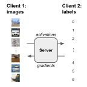

# Split Learning with CIFAR-10

This example includes instructions on how to run [split learning](https://arxiv.org/abs/1810.06060) (SL) using the CIFAR-10 dataset and the FL simulator.

We assume one client holds the images, and the other clients holds the labels to compute losses and accuracy metrics. 
Activations and corresponding gradients are being exchanged between the clients through the NVFlare server.



For instructions of how to run CIFAR-10 in real-world deployment settings, 
see the example on ["Real-world Federated Learning with CIFAR-10"](../cifar10-real-world/README.md).

## (Optional) Set up a virtual environment
```
python3 -m pip install --user --upgrade pip
python3 -m pip install --user virtualenv
```
(If needed) make all shell scripts executable using
```
find . -name ".sh" -exec chmod +x {} \;
```
initialize virtual environment.
```
source ./virtualenv/set_env.sh
```
install required packages for training
```
pip install --upgrade pip
pip install -r ./virtualenv/min-requirements.txt
```

## Start Jupyter notebook
Set `PYTHONPATH` to include custom files of this example and some reused files from the [CIFAR-10](../cifar10) examples:
```
export PYTHONPATH=${PWD}/src:${PWD}/../../../cifar10
```
Start a Jupyter Lab
```
jupyter lab .
```
and open [cifar10_split_learning.ipynb](./cifar10_split_learning.ipynb).

See [here](https://jupyterlab.readthedocs.io/en/stable/getting_started/installation.html) for installing Jupyter Lab.
