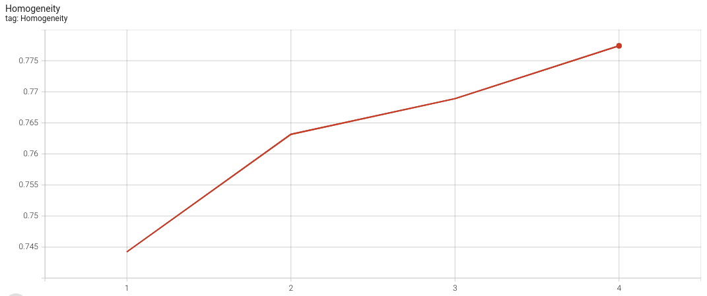

# Federated K-Means Clustering with Scikit-learn

Please make sure you set up virtual environment and Jupyterlab follows [example root readme](../../README.md)

## Introduction to Scikit-learn, tabular data, and federated k-Means
### Scikit-learn
This example shows how to use [NVIDIA FLARE](https://nvflare.readthedocs.io/en/main/index.html) on tabular data.
It uses [Scikit-learn](https://scikit-learn.org/),
a widely used open-source machine learning library that supports supervised 
and unsupervised learning.
Follow along in this [notebook](./sklearn_kmeans_iris.ipynb) for an interactive experience.
### Tabular data
The data used in this example is tabular in a format that can be handled by [pandas](https://pandas.pydata.org/), such that:
- rows correspond to data samples
- the first column represents the label 
- the other columns cover the features.    

Each client is expected to have one local data file containing both training 
and validation samples. To load the data for each client, the following 
parameters are expected by the local learner:
- data_file_path: string, the full path to the client's data file 
- train_start: int, start row index for the training set
- train_end: int, end row index for the training set
- valid_start: int, start row index for the validation set
- valid_end: int, end row index for the validation set

### Federated k-Means clustering
The machine learning algorithm in this example is [k-Means clustering](https://scikit-learn.org/stable/modules/generated/sklearn.cluster.KMeans.html).
The aggregation follows the scheme defined in [Mini-batch k-Means](https://scikit-learn.org/stable/modules/generated/sklearn.cluster.MiniBatchKMeans.html). 
Under this setting, each round of federated learning can be formulated as follows:
- local training: starting from global centers, each client trains a local MiniBatchKMeans model with their own data
- global aggregation: server collects the cluster center, 
  counts information from all clients, aggregates them by considering 
  each client's results as a mini-batch, and updates the global center and per-center counts.

For center initialization, at the first round, each client generates its 
initial centers with the k-means++ method. Then, the server collects all 
initial centers and performs one round of k-means to generate the initial 
global center.

## Data preparation 
This example uses the Iris dataset available from Scikit-learn's dataset API.  
```commandline
bash prepare_data.sh
```
This will load the data, format it properly by removing the header, order 
the label and feature columns, randomize the dataset, and save it to a CSV file with comma separation. 
The default path is `/tmp/nvflare/dataset/sklearn_iris.csv`. 

Note that the dataset contains a label for each sample, which will not be 
used for training since k-Means clustering is an unsupervised method. 
The entire dataset with labels will be used for performance evaluation 
based on [homogeneity_score](https://scikit-learn.org/stable/modules/generated/sklearn.metrics.homogeneity_score.html).

## Prepare clients' configs with proper data information 
For real-world FL applications, the config JSON files are expected to be 
specified by each client individually, according to their own local data path and splits for training and validation.

In this simulated study, to efficiently generate the config files for a 
study under a particular setting, we provide a script to automate the process. 
Note that manual copying and content modification can achieve the same.

For an experiment with `K` clients, we split one dataset into `K+1` parts in a non-overlapping fashion: 
`K` clients' training data and `1` common validation data. 
To simulate data imbalance among clients, we provided several options for client data splits by specifying how a client's data amount correlates with its ID number (from `1` to `K`):
- Uniform
- Linear
- Square
- Exponential

These options can be used to simulate no data imbalance (uniform), moderate 
data imbalance (linear), and high data imbalance (square for larger client 
number, e.g. `K=20`, exponential for smaller client number, e.g. `K=5` as 
it will be too aggressive for a larger number of clients)

This step is performed by 
```commandline
bash prepare_job_config.sh
```
In this example, we experiment with 3 clients under a uniform data split. 

Below is a sample config for site-1, saved to `./jobs/sklearn_kmeans_3_uniform/app_site-1/config/config_fed_client.json`:
```json
{
    "format_version": 2,
    "executors": [
        {
            "tasks": [
                "train"
            ],
            "executor": {
                "id": "Executor",
                "path": "app_opt.sklearn.sklearn_executor.SKLearnExecutor",
                "args": {
                    "learner_id": "kmeans_learner"
                }
            }
        }
    ],
    "task_result_filters": [],
    "task_data_filters": [],
    "components": [
        {
            "id": "kmeans_learner",
            "path": "kmeans_learner.KMeansLearner",
            "args": {
                "data_path": "/tmp/nvflare/dataset/sklearn_iris.csv",
                "train_start": 0,
                "train_end": 50,
                "valid_start": 0,
                "valid_end": 150,
                "random_state": 0
            }
        }
    ]
}
```

## Run experiment with FL simulator
The [FL simulator](https://nvflare.readthedocs.io/en/latest/user_guide/nvflare_cli/fl_simulator.html) simulates FL experiments or debugging codes,
not for real-world FL deployment.
We can run the FL simulator with 3 clients under the uniform data split with
```commandline
bash run_experiment_simulator.sh
```
Running with the deterministic setting `random_state=0`, the resulting curve for `homogeneity_score` is

It can be visualized using
```commandline
tensorboard --logdir ./workspaces
```
