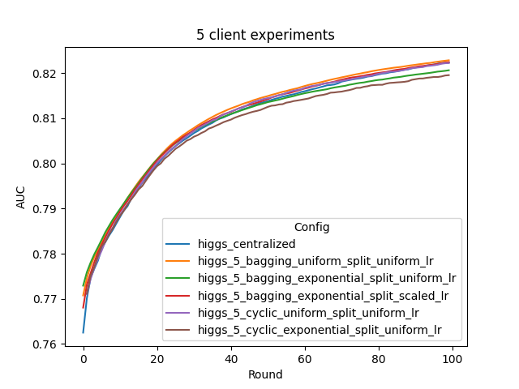
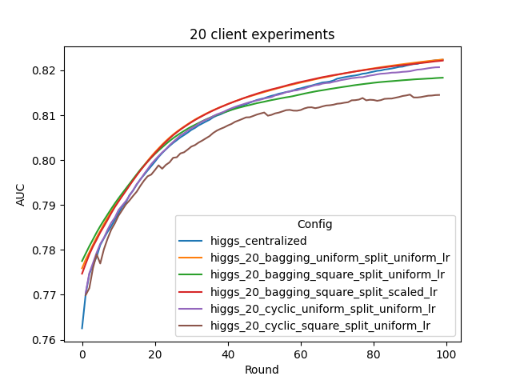

# Federated Learning for XGBoost 

## Introduction to XGBoost and HIGGS Data

### XGBoost
This example shows how to use [NVIDIA FLARE](https://nvflare.readthedocs.io/en/main/index.html) on tabular data applications.
It uses [XGBoost](https://github.com/dmlc/xgboost),
which is an optimized distributed gradient boosting library.

### HIGGS
This example illustrates a binary classification task based on [HIGGS dataset](https://archive.ics.uci.edu/ml/datasets/HIGGS). This dataset contains 11 million instances, each with 28 attributes.

## Data Preparation
To run the examples, we first download the dataset, which is a single `.csv` file. The dataset will be downloaded, uncompressed, and stored under `./dataset` as `./dataset/HIGGS.csv`.

### Data Split
Since HIGGS dataset is already randomly recorded, data split will be specified by the continuous index ranges for each client, rather than a vector of random instance indices. We provide four options to split the dataset: 

1. uniform: all clients has the same amount of data 
2. linear: the amount of data is linearly correlated with the client ID (1 to M)
3. square: the amount of data is correlated with the client ID in a squared fashion (1^2 to M^2)
4. exponential: the amount of data is correlated with the client ID in an exponential fashion (exp(1) to exp(M))

The choice of data split depends on dataset and the number of participants. For a large dataset as HIGGS, if the number of clients is small (e.g. 5), each client will still have sufficient data to train on with uniform split, and hence exponential would be used to observe the performance drop caused by non-uniform data split. If the number of clients is large (e.g. 20), exponential split will be too aggressive, and linear/square should be used.

Data splits used in the following experiment and other training configurations can be generated with
```
bash train_config_gen.sh
```
The folder `./train_configs` contains all pre-generated training configuration files used in this example.

## Environment Preparation
### Install NVIDIA FLARE
Follow the [Installation](https://nvflare.readthedocs.io/en/main/quickstart.html) instructions.
Install additional requirements:
```
python3 -m pip install pandas
python3 -m pip install xgboost
python3 -m pip install sklearn
python3 -m pip install torch
python3 -m pip install tensorboard
```
(optional) if you would like to plot the TensorBoard event files as shown below, please also install
```
python3 -m pip install tensorflow
python3 -m pip install seaborn
```
### Set up FL workspace

Follow the [Quickstart](https://nvflare.readthedocs.io/en/main/quickstart.html) instructions to set up your POC ("proof of concept") workspace.

Here, we run the following script
```
bash create_poc_workspace.sh 5
```
and 
```
bash create_poc_workspace.sh 20
```
for our two experimental settings: 5-client and 20-client.

## Federated Training of XGBoost under Cyclic and Bagging Training Schemes
### Cyclic Training 

"Cyclic XGBoost" is one way of performing federated tree boosting with multiple sites: at each round of tree boosting, instead of relying on the whole data statistics collected from all clients, the boosting relies on only 1 client's local data. The resulting tree sequence is then forwarded to the next client for next round's boosting. Such training scheme have been proposed in literatures [1] [2].

### Bagging Aggregation

"Bagging XGBoost" is one way of performing federated tree boosting with multiple sites: at each round of tree boosting, all sites start from the same "global model", and boost a number of trees based on their local data. The resulting trees are then send to server. A bagging aggregation scheme is applied to all the submitted trees to update the global model, which is further distributed to all clients for next round's boosting. 

This scheme is similar to the [Random Forest mode](https://xgboost.readthedocs.io/en/stable/tutorials/rf.html) of XGBoost, where a `num_parallel_tree` is boosted based on random row/col splits, rather than a single tree. Under federated learning setting, such split is fixed to clients rather than random. 

In addition to basic uniform shrinkage setting where all clients have the same learning rate, based on our research, we enabled scaled shrinkage across clients for weighted aggregation according to each client's data size.


## Run automated experiments
### Prepare training configs with data splits
First, we prepare the configs for several training data splits and scenarios by running
```
bash train_config_gen.sh
```
To be specific, this script calls the python script `./utils/prepare_train_config.py`. The arguments are:
- site_num: total number of sites
- nthread: nthread parameter for xgboost, this is set according to system resource 
- size_total: total number of instances, for HIGGS dataset it is 11 million
- size_valid: validation size, for the experiments here, it is 1 million, indicating the first 1 million instances will be used as standalone validation set. 
- split_method: how to split the dataset, can be uniform, linear, square, and exponential
- lr_mode: whether to use uniform or scaled shrinkage
This will generate data splits for two client sizes: 5 and 20, and 3 split conditions: uniform, square, and exponential. Users can further customize it for more experiments.
> **_NOTE:_** The generated train config files will be stored in the folder `./train_configs`, and will be used by job_configs by specifying it with `config_fed_client.json` 


### Prepare job configs under various training schemes
We then prepare the job configs for NVFlare jobs corresponding to various settings by running
```
bash job_config_gen.sh
```
To be specific, this script calls the python script `./utils/prepare_job_config.py`. It modifies settings from a base config `./job_configs/higgs_base`, and relies on the train_configs generated in the last step.

Here, we generated in total 10 different configs: five for each of the 5/20-client settings:
- bagging training with uniform data split and uniform shrinkage 
- bagging training with non-uniform data split and uniform shrinkage 
- bagging training with non-uniform data split and scaled shrinkage
- cyclic training with uniform data split 
- cyclic training with non-uniform data split 

Cyclic training always use uniform shrinkage 
> **_NOTE:_** The generated job config files will be stored in the folder `./job_configs`

### Start the FL system and submit jobs
Next, we will start the FL system and submit jobs to start FL training automatically.

Start the FL system with either 5 clients or 20 clients
```
bash start_fl_poc.sh 5
```
or
```
bash start_fl_poc.sh 20
```
This script will start the FL server and clients automatically to run FL experiments on localhost. 

Then FL training will be run with an automatic script utilizing the FLAdminAPI functionality.    
The [submit_job.sh](./submit_job.sh) script follows the pattern:
```
bash ./submit_job.sh [client_num] [training_option] [split] [lr_scheme]
```
The arguments control which config to use.  
To run all experiments under 5-client or 20-client settings in one command, simply run
```
bash run_experiment_5.sh
```
or
```
bash run_experiment_20.sh
```

### Shut down the server/clients

To shut down the clients and server, run the following Admin commands:
```
shutdown client
shutdown server
```
> **_NOTE:_** For more information about the Admin client, see [here](https://nvflare.readthedocs.io/en/main/user_guide/operation.html).

## Results on 5- and 20-client under various training settings
For comparison, we train a baseline model in a centralized manner with same round of training
```
python3 ./utils/baseline_centralized.py
```

Let's summarize the result of the experiments run above. We compare the AUC scores of 
the model on a standalone validation set consisted of the first 1 million instances of HIGGS dataset.

We provide a script for plotting the tensorboard records, running
```
python3 ./utils/plot_tensorboard_events.py
```
The resulting validation AUC curves (no smoothing) are shown below:



As illustrated, we can have the following observations:
- cyclic training performs ok under uniform split (the purple curve), however under non-uniform split, it will have significant performance drop (the brown curve)
- bagging training performs better than cyclic under both uniform and non-uniform data splits (orange v.s. purple, red/green v.s. brown)
- with uniform shrinkage, bagging will have significant performance drop under non-uniform split (green v.s. orange)
- data-size dependent shrinkage will be able to recover the performance drop above (red v.s. green), and achieve almost the same performance as uniform data split (red v.s. orange) 
- bagging under uniform data split (orange), and bagging with data-size dependent shrinkage under non-uniform data split(red), can achieve comparable/better performance as compared with centralized training baseline (blue)

For model size, centralized training and cyclic training will have a model consisting of `num_round` trees, while the bagging models consist of `num_round * num_client` trees, since each round, bagging training boosts a forest consisting of individually trained trees from each client.

## Reference
[1] Zhao, L. et al., "InPrivate Digging: Enabling Tree-based Distributed Data Mining with Differential Privacy," IEEE INFOCOM 2018 - IEEE Conference on Computer Communications, 2018, pp. 2087-2095

[2] Yamamoto, F. et al., "New Approaches to Federated XGBoost Learning for Privacy-Preserving Data Analysis," ICONIP 2020 - International Conference on Neural Information Processing, 2020, Lecture Notes in Computer Science, vol 12533 