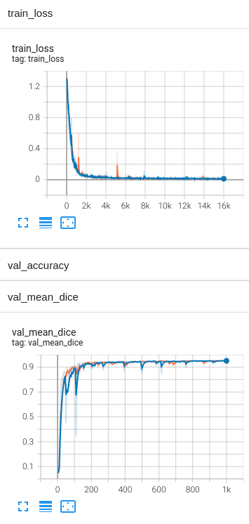

## 3D spleen CT segmentation
In the following, we show an example of running MONAI-bundle configurations with NVFlare.

### (Optional) 1. Set up a virtual environment
```
python3 -m pip install --user --upgrade pip
python3 -m pip install --user virtualenv
```
(If needed) make all shell scripts executable using
```
find . -name ".sh" -exec chmod +x {} \;
```
initialize virtual environment.
```
source ./virtualenv/set_env.sh
```
install required packages for training
```
pip install --upgrade pip
pip install -r virtualenv/requirements.txt
```

### 2. Download the Spleen Bundle
```
python3 -m monai.bundle download --name "spleen_ct_segmentation_v0.3.1" --bundle_dir ./job/app/config
``` 

### 3. Download the data
Download the spleen CT data from the [MSD challenge](http://medicaldecathlon.com/) and update data path.

> **Note:** The dataset will be saved under `./data`. 
```
python3 download_spleen_dataset.py
sed -i "s|/workspace/data/Task09_Spleen|${PWD}/data/Task09_Spleen|g" job/app/config/spleen_ct_segmentation/configs/train.json
```

### 4. Run experiment in simulator

#### 4.1 Single thread, single gpu
In resource restricted environments where you need to simulate several clients (-n 2 in this case) on the same GPU device, 
you can run the simulator using:

```
nvflare simulator job --workspace /tmp/nvflare/sim_spleen_ct_seg --threads 1 --n_clients 2
```

#### 4.2 Multiple threads, multiple gpus
If you have several gpus in your system, you can assign one for each client and use two threads. 
We can also specify the client names via the `--clients` argument 
and assign them to the appropriate GPU device using the `--gpu` argument.

```
nvflare simulator job --workspace /tmp/nvflare/sim_spleen_ct_seg --threads 2 --clients site-1,site-2 --gpu 0,1
```

#### 4.3 Multi-gpu training
If you have several gpus in your system and want to simulate multi-gpu training on one client, 
please follow step 2 & 3 above but replace `job` with `job_multi_gpu`. This will use NVFlare's `PTMultiProcessExecutor` 
to start multi-gpu training using [torchrun](https://pytorch.org/docs/stable/elastic/run.html) on one client. 

```
nvflare simulator job_multi_gpu --workspace /tmp/nvflare/sim_spleen_ct_seg --threads 1 --n_clients 1
```

#### 4.4 TensorBoard visualization
To monitor the training job, you can start tensorboard:
```
tensorboard --logdir /tmp/nvflare/sim_spleen_ct_seg
```
With the default setting and running on multiple gpus (section 4.2), the expected TensorBoard training curves look like this when training from scratch:



In order to load a pretrained model provided in the MONAI bundle, define the `source_ckpt_filename` argument of `MonaiBundlePersistor` in "config_fed_server.json", e.g.:
```
    {
      "id": "persistor",
      "path": "monai_nvflare.monai_bundle_persistor.MonaiBundlePersistor",
      "args": {
        "bundle_root": "config/spleen_ct_segmentation",
        "source_ckpt_filename": "models/model.pt"
      }
    }
```

> **_NOTE:_** For more information about the simulator, see [here](https://nvflare.readthedocs.io).

### 5. Run NVFlare in POC mode

#### 5.1 Prepare POC workspace
To run FL experiments in POC mode, create your local FL workspace the below command.  
```
nvflare poc -n 2 --prepare
```

#### 5.2 Start server and clients
Then, start the FL system using without admin console
```
nvflare poc --start -ex admin
```

#### 5.3 Run the experiment
Submit the job by running:
```
./submit_job.sh job
```
To monitor the training job, you can start tensorboard:
```
tensorboard --logdir /tmp/nvflare/poc
```

#### 5.4 Shut down the server/clients

To shut down the clients and server, run the following Admin commands:
```
nvflare poc --stop
```

> **_NOTE:_** For more information about the Admin client, see [here](https://nvflare.readthedocs.io/en/main/user_guide/operation.html).
