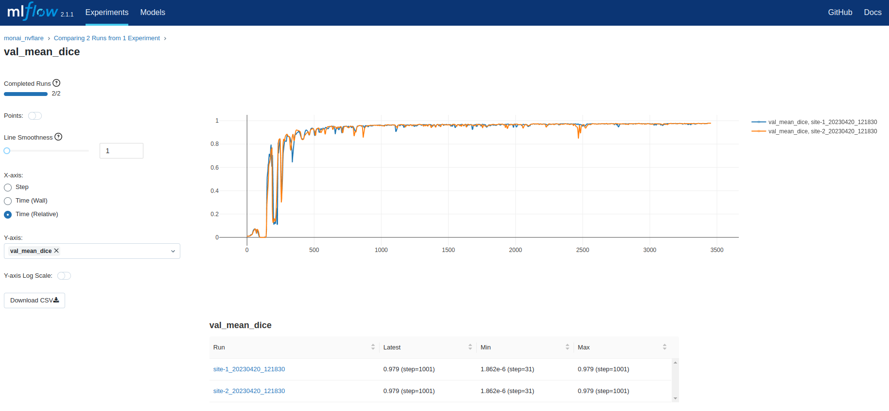

## 3D spleen CT segmentation - Local Provisioning
In the following, we show an example of running MONAI-bundle configurations with NVFlare.

This example includes instructions on running [FedAvg](https://arxiv.org/abs/1602.05629) with experiment tracking using [MLFlow](https://mlflow.org/)
and [homomorphic encryption](https://developer.nvidia.com/blog/federated-learning-with-homomorphic-encryption/)
for secure aggregation.
It uses the provisioning and the admin API to submit jobs, similar to how one would set up experiments similar to
real-world deployment.

In this example, we use an already prepared [provisioning](https://nvflare.readthedocs.io/en/main/programming_guide/provisioning_system.html) file (*project.yml*) to run experiments on a single machine.
For real-world deployment, additional considerations must be taken into account.
See [here](https://nvflare.readthedocs.io/en/latest/real_world_fl.html) for more information.

For an example to get started with FL simulator, see [here](../spleen_ct_segmentation_sim/README.md).

To execute the below commands, please open a terminal.
And go to the folder containing this tutorial

## Setup environment

To execute the below commands, please open a terminal
and go to the folder containing this tutorial.

We recommend following the instructions for setting up a [virtual environment](../../../../examples/README.md#set-up-a-virtual-environment),
and using it in [JupyterLab](../../../../examples/README.md#Set-up-JupyterLab-for-notebooks) for running the notebooks the MONAI integration examples.

### 1. Download the Spleen Bundle

Download the MONAI bundle as `./${JOB_NAME}/app/config/spleen_ct_segmentation`.

```
JOB_NAME=job
python3 -m monai.bundle download --name "spleen_ct_segmentation" --version "0.4.6" --bundle_dir ./jobs/${JOB_NAME}/app/config
``` 

In this example, `JOB_NAME` can be either `job` or `job_he`, depending on the configuration you would like to run (see below).
The final folder structure under `JOB_NAME` will be:
```
.
├── app
│   └── config
│       ├── config_fed_client.json
│       ├── config_fed_server.json
│       └── spleen_ct_segmentation
│           ├── LICENSE
│           ├── configs
│           │   ├── evaluate.json
│           │   ├── inference.json
│           │   ├── logging.conf
│           │   ├── metadata.json
│           │   ├── multi_gpu_evaluate.json
│           │   ├── multi_gpu_train.json
│           │   └── train.json
│           ├── docs
│           │   ├── README.md
│           │   └── data_license.txt
│           └── models
│               ├── model.pt
│               └── model.ts
└── meta.json
```

## 2. Download the data
Download the spleen CT data from the [MSD challenge](http://medicaldecathlon.com/) and update data path.

> **Note:** The dataset will be saved under `./data`.
```
JOB_NAME=job
python3 download_spleen_dataset.py
sed -i "s|/workspace/data/Task09_Spleen|${PWD}/data/Task09_Spleen|g" ${JOB_NAME}/app/config/spleen_ct_segmentation/configs/train.json
```


## 3. Create your FL workspace and start FL system

The next scripts will start the FL server and 2 clients automatically to run FL experiments on localhost.

### 3.1 Secure FL workspace

The project file for creating the secure workspace used in this example is shown at
[./workspaces/secure_project.yml](./workspaces/secure_project.yml).

If you want to run the homomorphic encryption job, please install [TenSEAL](https://github.com/OpenMined/TenSEAL):
```
pip install tenseal
```
(this example was tested with tenseal==0.3.12)

Otherwise, please remove the `HEBuilder` section from [workspaces/secure_project.yml](./workspaces/secure_project.yml).

To create the secure workspace, please use the following to build a package and copy it
to `secure_workspace` for later experimentation.
```
cd ./workspaces
nvflare provision -p ./secure_project.yml
cp -r ./workspace/secure_project/prod_00 ./secure_workspace
cd ..
```
For more information about secure provisioning see the [documentation](https://nvflare.readthedocs.io/en/latest/programming_guide/provisioning_system.html).

### 3.2 Start FL system

For starting the FL system with 2 clients in the secure workspace, run
```
./start_fl_secure.sh 2
```

## 4. (Optional) Experimenting with POC ("proof of concept") workspace
To run FL experiments in POC mode, create your local FL workspace the below command.
In the following experiments, we will be using 2 clients. Press y and enter when prompted.

### 4.1 (Optional) Crate POC workspace
```
nvflare poc prepare -n 2
```
By default, POC will create startup kits at `/tmp/nvflare/poc`.

> **_NOTE:_** **POC** stands for "proof of concept" and is used for quick experimentation
> with different amounts of clients.
> It doesn't need any advanced configurations while provisioning the startup kits for the server and clients.
> 
> The **secure** workspace on the other hand is needed to run experiments that require encryption keys such as the
> homomorphic encryption (HE) one shown below. These startup kits allow secure deployment of FL in real-world scenarios
> using SSL certificated communication channels.

### 4.2 (Optional)  Start FL system in POC mode

Then, start the FL system with all provisioned clients by running
```
nvflare poc start
```

## 5. Run experiments

Here, we assume jobs are submitted and run one at a time.
For details about resource management and consumption, please refer to the [documentation](https://nvflare.readthedocs.io/en/latest/programming_guide/resource_manager_and_consumer.html).

> **Note:** Full FL training could take several hours for this task.
> To speed up your experimentation, you can reduce the `num_rounds` value in `config_fed_server.json`, e.g. to 5 rounds.

### 5.1 Experiment tracking with MLFlow
Using MONAI's experiment [tracking feature](https://github.com/Project-MONAI/tutorials/tree/main/experiment_management),
we can use MLFlow to track the model performance on the local clients.

In a new terminal, start the mlflow server:
```
mlflow server
```

You can access the MLFlow dashboard in your browser using the default tracking uri `http://127.0.0.1:5000`.
Next, submit the job.

### 5.2 Federated averaging

To run FedAvg using with local provisioning, submit the job using:
```
./submit_job.sh job
```
(Optional) In POC mode, use
```
./submit_job.sh job --poc
```

> **_NOTE:_** You can always use the admin console to manually abort a running job.
  using `abort_job [JOB_ID]`.
> For a complete list of admin commands, see [here](https://nvflare.readthedocs.io/en/main/real_world_fl/operation.html).
>
> To log into the POC workspace admin console no username is required
> (use "admin" for commands requiring conformation with username).
>
> For the secure workspace admin console, use username "admin@nvidia.com"

After training, each client's best model will be used for cross-site validation.
The results can be downloaded and shown with the admin console using
```
  download_job [JOB_ID]
```
where `[JOB_ID]` is the ID assigned by the system when submitting the job.
You can use the `list_jobs` [admin command](https://nvflare.readthedocs.io/en/main/real_world_fl/operation.html#admin-command-prompt) to find the relevant `JOB_ID`.

The result will be downloaded to your admin workspace (the exact download path will be displayed when running the command).
You should see the cross-site validation results at
```
[DOWNLOAD_DIR]/[JOB_ID]/workspace/cross_site_val/cross_val_results.json
```

Once the training started, you can the experiment curves for the local clients in the current run on the MLFlow dashboard.



### 5.3 Secure aggregation using homomorphic encryption

Next we run FedAvg using homomorphic encryption (HE) for secure aggregation on the server.

> **_NOTE:_** For HE, we need to use the securely provisioned workspace.
> It will also take longer due to the additional encryption, decryption, encrypted aggregation,
> and increased encrypted messages sizes involved.

Follow the steps above for downloading the bundle and setting the data using `JOB_NAME=job_he`.

Then, submit the job to run FedAvg with HE:
```
./submit_job.sh job_he
```
