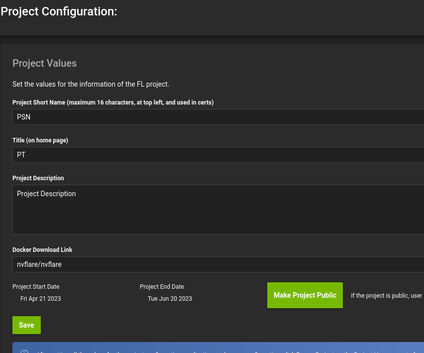
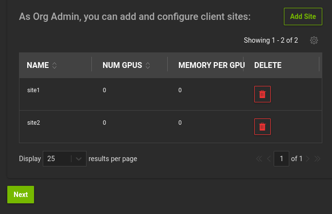

## Cloud Deployment

This example demonstrates running MONAI-bundle configuration with NVFlare in a multiple-cloud environment.
When reading this document, please remember that the [README](./README.md) document explains the training task in details.  Therefore,
this document will focus on cloud deployment. 

From now one, we assume the followings are installed or available.  They are used during cloud deployment time in those cloud launch scripts.

* Azure CLI (az)
* AWS CLI (aws)
* JSON Query (jq)
* SSH Pass (sshpass)
* Domain Information Groper (dig)
* Azure subscription account
* AWS IAM user with AmazonEC2FullAccess permission
* ~/.aws/credentials contains the AWS access key and secret of the above user
* NVFlare

## Running NVFlare Dashboard

First, in a terminal, run the following command

```
nvflare dashboard --cloud aws
``` 

It will prompt you for the project admin email address.  In this example, any email will do and we will enter `hello@world.com`

```
$ nvflare dashboard --cloud azure
Dashboard launch script for cloud is written at /home/iscyang/workspace/demo/azure_start_dsb.sh.  Now running the script.
This script requires az (Azure CLI), sshpass and jq.  Now checking if they are installed.
Checking if az exists. => found
Checking if sshpass exists. => found
Checking if jq exists. => found
One initial user will be created when starting dashboard.
Please enter the email address for this user.
hello@world.com
To sign in, use a web browser to open the page https://microsoft.com/devicelogin and enter the code ATXEY6ZWZ to authenticate.
Creating Resource Group nvflare_dashboard_rg_31469_4363 at Location westus2
Creating Virtual Machine, will take a few minutes
WARNING: Starting Build 2023 event, "az vm/vmss create" command will deploy Trusted Launch VM by default. To know more about Trusted Launch, please visit https://docs.microsoft.com/en-us/azure/virtual-machines/trusted-launch
Setting up network related configuration
Installing docker engine in nvflare_dashboard, may take a few minutes.
Installing nvflare in nvflare_dashboard, may take a few minutes.
Checking if certificate (web.crt) and private key (web.key) are available
No web.crt and web.key found
Starting dashboard
URL is http://20.29.233.101:443
Note: you may need to configure DNS server with your DNS hostname and the above IP address.
Project admin credential (username:password) is hello@world.com:13569 .
To stop the dashboard, run az group delete -n nvflare_dashboard_rg_31469_4363
```

The dashboard is now running at 20.29.233.101 with port 443.  You can find the Project Admin credential on the last two lines.
Login to the dashboard on your browser with the Project Admin credential.

The details about dashboard can be found at this [page](https://nvflare.readthedocs.io/en/2.3.0/user_guide/dashboard_ui.html).  After login,
set the Project Short Name, Title, Description, Docker Download link, Start date and End date.  Then Save and Make Project Public.



Click the SERVER CONFIGURATION on the left column.  Set the Server (DNS name) to nvflaregrpc230417.westus2.cloudapp.azure.com.  Note that
nvflaregrpc230417 should be replaced with your own choice and it has to be unique in that region.  For example, you can set the Server to
foobar31415926.westus2.cloudapp.azure.com so it is unlikely to collide with existing name.

Do not select Enable HA.  In cloud deployment, we expect users to utilize features from cloud service providers to support high availability.

Click Save.  Then go to PROJECT HOME and click Freeze Project.

You can now download the Server startup kit and Admin Console startup kit from DOWNLOADS.  Remember to write down the PIN during downloading.  You
will need it to unzip the encrypted zip file.

Please also create two clients, site1 and site2, with 0 GPUs and 0 GB/GPU, so we can deploy one to Azure and the other to AWS.  



If you select non-zero in those fields, you will need to launch GPU instances.  You may
need to check again [NVFlare Dashboard document](https://nvflare.readthedocs.io/en/2.3.0/user_guide/dashboard_ui.html) on how to signup new users,
how to approve them as project admin and to download client startup kits.


## Preparing Cloud Deployment

* After downloading the server startup kit, unzip it with the PIN.  Repeat the same steps for site1 and site2.

* Create the requirements.txt file with the following content in the startup folder of the server, site1 and site2.  The content is nearly identical to 
the requirements.txt in this tutorial, with smaller dependency set.

```
tqdm
nibabel
fire
pytorch-ignite>=0.4.10
monai>=1.1
tensorboard
scikit-image
pandas
matplotlib
monai-nvflare
```

## Launch NVFlare Server

In the terminal, cd to the server folder and launch the server in Azure with

```
$ ./startup/start.sh --cloud azure --config ../az.conf 
This script requires az (Azure CLI), sshpass and jq.  Now checking if they are installed.
Checking if az exists. => found
Checking if sshpass exists. => found
Checking if jq exists. => found
If the client requires additional dependencies, please copy the requirements.txt to /home/nvflaremonai/nvflaregrpc230417.westus2.cloudapp.azure.com/startup.
Press ENTER when it's done or no additional dependencies. 
To sign in, use a web browser to open the page https://microsoft.com/devicelogin and enter the code AK8QWWSZL to authenticate.
Creating Resource Group nvflare_rg at Location westus2
Creating Virtual Machine, will take a few minutes
WARNING: Starting Build 2023 event, "az vm/vmss create" command will deploy Trusted Launch VM by default. To know more about Trusted Launch, please visit https://docs.microsoft.com/en-us/azure/virtual-machines/trusted-launch
Setting up network related configuration
Copying files to nvflare_server
Destination folder is nvflare@20.112.74.83:/var/tmp/cloud
Warning: Permanently added '20.112.74.83' (ECDSA) to the list of known hosts.
Installing packages in nvflare_server, may take a few minutes.
System was provisioned
To delete the resource group (also delete the VM), run the following command
az group delete -n nvflare_rg
```

The az.conf file is a simple text file that includes settings to overwrite the default values.
```
$ cat ../az.conf 
VM_IMAGE=Canonical:0001-com-ubuntu-server-focal:20_04-lts-gen2:latest
VM_SIZE=Standard_B4ms
```

## Launch NVFlare Clients

In the terminal, cd to the site1 folder and launch site1 in Azure with

```
$ ./startup/start.sh --cloud azure --config ../az.conf 
```

Remember to copy the requirements.txt to the startup folder so that those dependencies are installed into the provisioned cloud instance.

For site2, it's quite similar.  cd to the site2 folder and launch site2 in AWS with

```
$ ./startup/start.sh --cloud aws --config ../aws.conf
```

The aws.conf, similar to az.conf, overwrites default settings.  Note that because the default AMI and AWS EC2 instance in the cloud deployment scripts are
not large enough for the Spleen CT Segmentation task, aws.conf chooses larger EC2 type and a customized AMI with larger root volume.

```
$ cat ../aws.conf 
# AMI_IMAGE=ami-031a1b2ccba66f578
AMI_IMAGE=ami-04b53fee49949dbfa
EC2_TYPE=t3a.2xlarge
REGION=us-west-2
```

Please refer to AWS document on how to create a customized AMI image with large root volume.  In this example, we set the root volume to 64GB.


## Download the Spleen Bundle

Download the MONAI bundle as `./${JOB_NAME}/app/config/spleen_ct_segmentation`.

```
JOB_NAME=job
python3 -m monai.bundle download --name "spleen_ct_segmentation" --version "0.3.7" --bundle_dir ./${JOB_NAME}/app/config
``` 

In this example, `JOB_NAME` can be only `job` because we did not include HE context in the startup kits.
The final folder structure under `JOB_NAME` will be:
```
.
├── app
│   └── config
│       ├── config_fed_client.json
│       ├── config_fed_server.json
│       └── spleen_ct_segmentation
│           ├── LICENSE
│           ├── configs
│           │   ├── evaluate.json
│           │   ├── inference.json
│           │   ├── logging.conf
│           │   ├── metadata.json
│           │   ├── multi_gpu_evaluate.json
│           │   ├── multi_gpu_train.json
│           │   └── train.json
│           ├── docs
│           │   ├── README.md
│           │   └── data_license.txt
│           └── models
│               ├── model.pt
│               └── model.ts
└── meta.json
```

## Download and upload the data
Download the spleen CT data from the [MSD challenge](http://medicaldecathlon.com/) and update data path.

> **Note:** The dataset will be saved under current working directory.

```
wget https://msd-for-monai.s3-us-west-2.amazonaws.com/Task09_Spleen.tar
tar xvf Task09_Spleen.tar
sed -i "s|/workspace/data/Task09_Spleen|/var/tmp/Task09_Spleen|g" ${JOB_NAME}/app/config/spleen_ct_segmentation/configs/train.json
```

You can upload the entire Task09_Spleen folder to the /var/tmp folder of site1 and site2.  Alternatively, to save upload time and training time, you can
upload smaller dataset of Task09_Spleen to those clients.  Here, we show the command to upload the entire dataset to both clients.

### Azure

```
scp -r Task09_Spleen nvflare@$IP_ADDRESS:/var/tmp/
```
The IP_ADDRESS can be found during the site1 launch time.  For example, this following log shows site1 is at 20.112.74.83.

```
Destination folder is nvflare@20.112.74.83
```

The credential to login to site1 is stored in the vm_credetial.txt of site1 folder.

### AWS

```
scp -r -i site2/NVFlareClientKeyPair.pem Task09_Spleen ubuntu@$IP_ADDRESS:/var/tmp/
```
The IP_ADDRESS can be found during the site1 launch time.  For example, this following log shows site2 is at 44.234.88.174.

```
Destination folder is nvflare@44.234.88.174
```

## Submit job from Admin Console

First, ensure the job folder is copied to hello@world.com/transfer so there is a folder with name `job` under transfer folder.
Then start the Admin Console and check if two clients, site1 and site2, are registered.

```
$ cd hello@world.com
$ ./startup/fl_admin.sh 
User Name: hello@world.com
Trying to obtain server address
Obtained server address: nvflaregrpc230417.westus2.cloudapp.azure.com:8003
Trying to login, please wait ...
Logged into server at nvflaregrpc230417.westus2.cloudapp.azure.com:8003 with SSID: ebc6125d-0a56-4688-9b08-355fe9e4d61a
Type ? to list commands; type "? cmdName" to show usage of a command.
> check_status server
Engine status: stopped
---------------------
| JOB_ID | APP NAME |
---------------------
---------------------
Registered clients: 2
----------------------------------------------------------------------------
| CLIENT | TOKEN                                | LAST CONNECT TIME        |
----------------------------------------------------------------------------
| site1  | c1e1579e-a48b-4373-ad39-e71c823d89d9 | Thu Apr 20 23:45:11 2023 |
| site2  | e9fe3d23-76a8-411e-b172-4970849790a2 | Thu Apr 20 23:45:11 2023 |
----------------------------------------------------------------------------
Done [171715 usecs] 2023-04-20 16:45:19.803981

```

Now you can submit the job to the system.
```
> submit_job job
Submitted job: 76262f7c-9e4f-48f7-bb98-f630261c8427
Done [78069949 usecs] 2023-04-20 17:34:49.5886102
> list_jobs
-------------------------------------------------------------------------------------------------------------------------------------------
| JOB ID                               | NAME          | STATUS                       | SUBMIT TIME                      | RUN DURATION   |
-------------------------------------------------------------------------------------------------------------------------------------------
| 76262f7c-9e4f-48f7-bb98-f630261c8427 | spleen-bundle | RUNNING                      | 2023-04-21T00:34:49.646968+00:00 | 0:05:48.988398 |
-------------------------------------------------------------------------------------------------------------------------------------------
Done [176787 usecs] 2023-04-20 17:40:42.721412
> 
```
