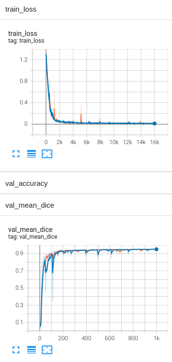
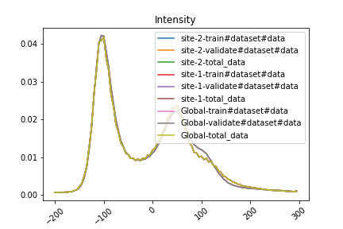
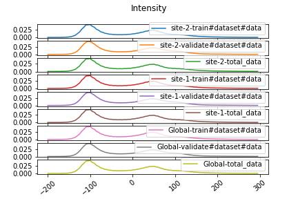

## 3D spleen CT segmentation - Simulation
In the following, we show an example of running MONAI-bundle configurations with NVFlare using the
[FL simulator](https://nvflare.readthedocs.io/en/main/user_guide/nvflare_cli/fl_simulator.html).

For an example with real-world deployment settings, see [here](../spleen_ct_segmentation_local/README.md).

## Setup environment

To execute the below commands, please open a terminal
and go to the folder containing this tutorial.

Follow the [setup](../../README.md#requirements) to create a virtual environment with the MONAI-NVFlare integration installed to use in JupyterLab.

Install the required packages in your virtual environment:

```
pip install -r ./requirements.txt
```

### 1. Download the Spleen Bundle

Download the MONAI bundle as `./${JOB_NAME}/app/config/spleen_ct_segmentation`.

```
JOB_NAME=job
python3 -m monai.bundle download --name "spleen_ct_segmentation" --version "0.5.4" --bundle_dir ./${JOB_NAME}/app/config
``` 

In this example, `JOB_NAME` can be either `job`, `job_multi_gpu` or `job_stats`, depending on the configuration you would like to run (see below).
The final folder structure under `JOB_NAME` will be:

```
.
├── app
│   └── config
│       ├── config_fed_client.json
│       ├── config_fed_server.json
│       └── spleen_ct_segmentation
│           ├── LICENSE
│           ├── configs
│           │   ├── evaluate.json
│           │   ├── inference.json
│           │   ├── logging.conf
│           │   ├── metadata.json
│           │   ├── multi_gpu_evaluate.json
│           │   ├── multi_gpu_train.json
│           │   └── train.json
│           ├── docs
│           │   ├── README.md
│           │   └── data_license.txt
│           └── models
│               ├── model.pt
│               └── model.ts
└── meta.json
```


### 2. Download the data
Download the spleen CT data from the [MSD challenge](http://medicaldecathlon.com/) and update data path.

> **Note:** The dataset will be saved under `./data`.
```
JOB_NAME=job
python3 download_spleen_dataset.py
sed -i "s|/workspace/data/Task09_Spleen|${PWD}/data/Task09_Spleen|g" ${JOB_NAME}/app/config/spleen_ct_segmentation/configs/train.json
```

### 3. Run experiment in simulator

> **Note:** Full FL training could take several hours for this task.
> To speed up your experimentation, you can reduce the `num_rounds` value in `config_fed_server.json`, e.g. to 5 rounds.

#### 3.1 Single thread, single gpu
In resource restricted environments where you need to simulate several clients (-n 2 in this case) on the same GPU device,
you can run the simulator using:

```
nvflare simulator job --workspace /tmp/nvflare/sim_spleen_ct_seg --threads 1 --n_clients 2
```

#### 3.2 Multiple threads, multiple gpus
If you have several gpus in your system, you can assign one for each client and use two threads.
We can also specify the client names via the `--clients` argument
and assign them to the appropriate GPU device using the `--gpu` argument.

```
nvflare simulator job --workspace /tmp/nvflare/sim_spleen_ct_seg --clients site-1,site-2 --gpu 0,1
```

#### 3.3 Multi-gpu training
If you have several gpus in your system and want to simulate multi-gpu training on one client,
please follow step 2 & 3 above but replace `JOB_NAME=job` with `JOB_NAME=job_multi_gpu`. This will use NVFlare's `PTMultiProcessExecutor`
to start multi-gpu training using [torchrun](https://pytorch.org/docs/stable/elastic/run.html) on one client.

```
nvflare simulator job_multi_gpu --workspace /tmp/nvflare/sim_spleen_ct_seg --threads 1 --n_clients 1
```

#### 3.4 TensorBoard visualization
To monitor the training job, you can start tensorboard:
```
tensorboard --logdir /tmp/nvflare/sim_spleen_ct_seg
```

With the default setting and running on multiple gpus (section 4.2), the expected TensorBoard training curves look like this when training from scratch:



In order to load a pretrained model provided in the MONAI bundle, define the `source_ckpt_filename` argument of `MonaiBundlePersistor` in "config_fed_server.json", e.g.:
```
    {
      "id": "persistor",
      "path": "monai_nvflare.monai_bundle_persistor.MonaiBundlePersistor",
      "args": {
        "bundle_root": "config/spleen_ct_segmentation",
        "source_ckpt_filename": "models/model.pt"
      }
    }
```

> **_NOTE:_** For more information about the simulator, see [here](https://nvflare.readthedocs.io).

#### 3.5 Federated statistics

To compute summary statistics on the datasets defined in the MONAI bundle, we can use NVFlare's `StatisticsController`.
Again, please step 2 & 3 above but replace `JOB_NAME=job` with `JOB_NAME=job_stats`.
To avoid caching the data for training (which will not be executed during the statistics workflow), set `cache_rate=0` in train.json.

```
nvflare simulator job_stats --workspace /tmp/nvflare/sim_spleen_ct_seg --n_clients 2 --gpu 0,1
```

The histogram results will be placed in the workspace directory under `simulate_job/statistics/image_statistics.json`.
Additional summary statistics, like average image shapes and spacings, computed by MONAI are placed under `simulate_job/app_server/`.
See [stats_demo/simulate_job/app_server](./stats_demo/simulate_job/app_server) for examples.

For an end-to-end demo, including visualization of the gathered statistics, open the [stats_demo.ipynb](./stats_demo/stats_demo.ipynb) notebook in `stats_demo`.

##### Statistics Visualization:
The demo [notebook](./stats_demo/stats_demo.ipynb) shows how to 
visualize the site and aggregated global image intensity histograms. 

Either as overlay:




Or side by side:


