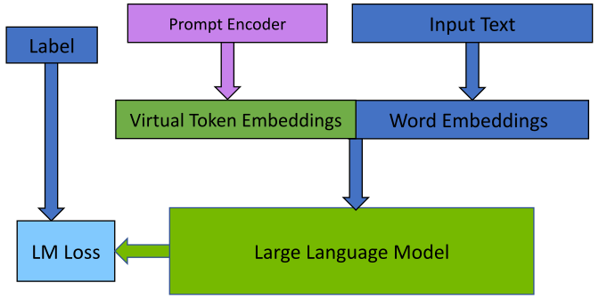
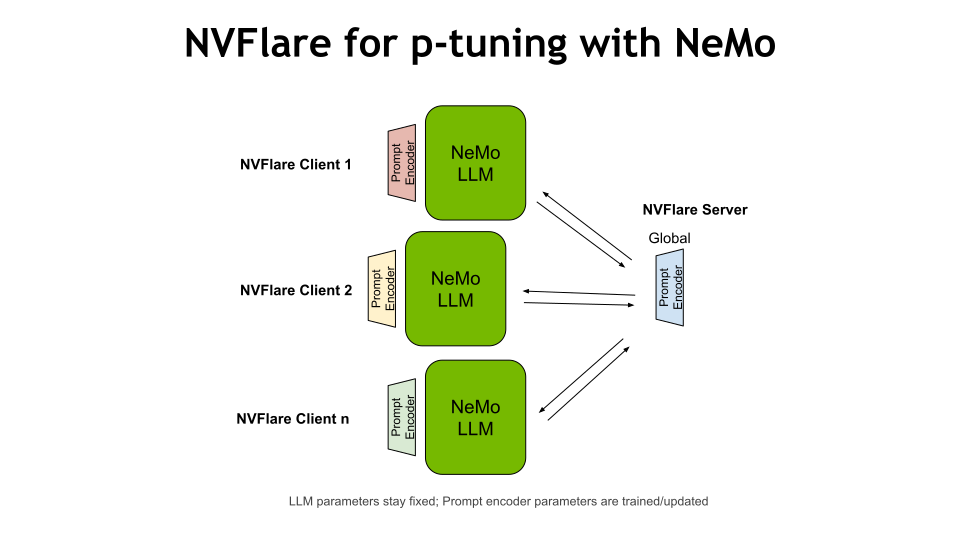

## Prompt Learning with NeMo

In this example, we utilize NeMo's [prompt learning](https://docs.nvidia.com/deeplearning/nemo/user-guide/docs/en/v1.17.0/nlp/nemo_megatron/prompt_learning.html)
feature to showcase how to adapt a large language model (LLM) to 
a downstream task such as financial sentiment predictions. 
As the prompt learning technique shown in the example is p-tuning, which adds a small prompt encoder network to the LLM
to produce virtual tokens that guide the model toward the desired output of the downstream task.



In our federated implementation, the LLM parameters stay fixed. Prompt encoder parameters are trained/updated and averaged on the server.



## Dependencies
The example was tested with the [NeMo 23.02 container](https://catalog.ngc.nvidia.com/orgs/nvidia/containers/nemo).
In the following, we assume this example folder of the container is mounted to `/workspace` and all downloading, etc. operations are based on this root path.

Start the docker container from **this directory** using
```
# cd NVFlare/integration/nemo/examples/prompt_learning
DOCKER_IMAGE="nvcr.io/nvidia/nemo:23.02"
docker run --runtime=nvidia -it --rm --shm-size=16g -p 8888:8888 -p 6006:6006 --ulimit memlock=-1 --ulimit stack=67108864 \
-v ${PWD}:/workspace -w /workspace ${DOCKER_IMAGE}
```

For easy experimentation with NeMo, install NVFlare and mount the code inside the [nemo_nvflare](./nemo_nvflare) folder.
```
pip install nvflare~=2.5.0rc
pip install protobuf==3.20
export PYTHONPATH=${PYTHONPATH}:/workspace
``` 

## Examples
### 1. Federated p-tuning using a 345 million parameter GPT model
We use [JupyterLab](https://jupyterlab.readthedocs.io) for this example.
To start JupyterLab, run
```
jupyter lab .
```
and open [prompt_learning.ipynb](./prompt_learning.ipynb).

#### Hardware requirement
This example requires a GPU with at least 16GB of memory to run three clients in parallel on the same GPU.

### 2. Federated p-tuning using a 20 billion parameter GPT model
This example of running a 20B GPT model requires more computational resources. 

To run the example, follow the instructions in [prompt_learning_20B.md](prompt_learning_20B.md).

#### Hardware requirement
To run three clients in parallel, we require at least six GPUs with 64 GB memory or more each 
(Ampere or later GPU architecture).
