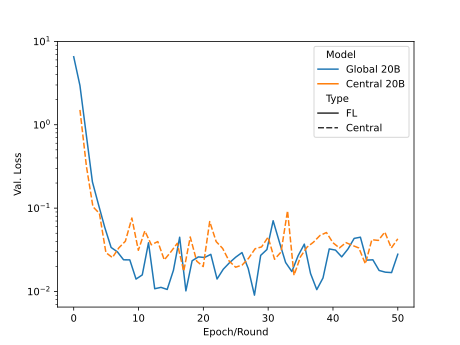
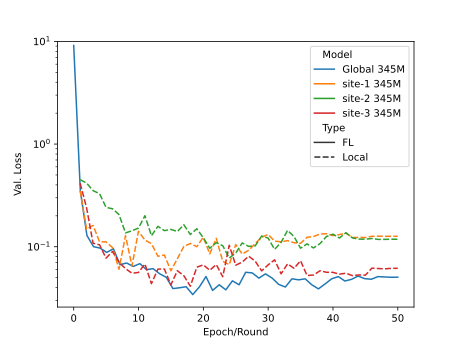

## Federated p-tuning using a 20 billion parameter GPT model

In this example, we utilize NeMo's [prompt learning](https://docs.nvidia.com/deeplearning/nemo/user-guide/docs/en/v1.17.0/nlp/nemo_megatron/prompt_learning.html)
feature to showcase how to adapt a large language model (LLM) to 
a downstream task such as financial sentiment predictions. 

The prompt learning technique shown in the example is p-tuning which adds a small prompt encoder network to the LLM
to produce virtual tokens that guide the model toward the desired output of the downstream task.

For more details on how to change hyperparameters for prompt learning in NeMo, see this [tutorial](https://github.com/NVIDIA/NeMo/blob/v1.17.0/tutorials/nlp/Multitask_Prompt_and_PTuning.ipynb) which is also the basis for this NVFlare tutorial.

## Dependencies
This example running a 20B GPT model requires more computational resources.
To run three clients in parallel, we require at least six GPUs with 64 GB memory or more each 
(Ampere or later GPU architecture).
The example was tested on 6xA100 GPUs with 80 GB each.

We assume you followed the instructions [here](./README.md) 
to install the NeMo framework and mount the required code. 

The example was tested using the [NeMo Docker container](https://catalog.ngc.nvidia.com/orgs/nvidia/containers/nemo), 
available with `docker pull nvcr.io/nvidia/nemo:23.02`.

For downloading the pre-trained model, we use [git lfs](https://git-lfs.com).
Install it in the container with
```
apt update
apt install git-lfs
```

## Download the pre-trained LLM
In this example, we use a [Megatron-GPT 20B](https://huggingface.co/nvidia/nemo-megatron-gpt-20B), a transformer-based language model based on the GPT architecture.
```
# download the model from HuggingFace using git lfs
git clone https://huggingface.co/nvidia/nemo-megatron-gpt-20B
```
> Note, this will take some time. After download, the checkpoint `nemo_gpt20B_bf16_tp4.nemo` should have a size of 38 GB. 
> You can check the download status with `du -sh nemo-megatron-gpt-20B/nemo_gpt20B_bf16_tp4.nemo`.

Next, in order to minimize the number of GPUs needed to simulate each client, 
we convert the downloaded checkpoint that was trained using tensor parallel of size 4, to tensor parallel of size 2.

We use the conversion script provided by NeMo which can be downloaded from GitHub.
```
script_name="megatron_change_num_partitions.py"
if test -f "$FILE"; then
    echo "${script_name} already downloaded."  
else
    wget -N "https://raw.githubusercontent.com/NVIDIA/NeMo/v1.17.0/examples/nlp/language_modeling/${script_name}"
fi
```

Now, convert the downloaded checkpoint to use tensor parallel of size 2.
```
source_ckpt="nemo-megatron-gpt-20B/nemo_gpt20B_bf16_tp4.nemo"
target_ckpt="nemo-megatron-gpt-20B/nemo_gpt20B_bf16_tp2.nemo"
python3 megatron_change_num_partitions.py --model_file ${source_ckpt} --target_file ${target_ckpt} --tensor_model_parallel_size 4 --target_tensor_model_parallel_size 2
```

## Data preprocessing
As our downstream task, we will use the [Financial PhraseBank dataset](https://huggingface.co/datasets/financial_phrasebank) for sentiment analysis.

The Financial PhraseBank dataset contains the sentiments for financial news headlines from a retail investor's perspective. 
Further details about the dataset can be found in Malo et al.'s ["Good Debt or Bad Debt: Detecting Semantic Orientations in Economic Texts"](https://arxiv.org/abs/1307.5336).


#### 1. Download the preprocessing scripts
We use the preprocessing scripts provided by NeMo which can be downloaded from GitHub.
```
script_name="prompt_learning_financial_phrase_bank_preprocessing.py"
if test -f "$FILE"; then
    echo "${script_name} already downloaded."  
else
    wget -N "https://raw.githubusercontent.com/NVIDIA/NeMo/v1.17.0/scripts/dataset_processing/nlp/financial_phrase_bank/${script_name}"
fi
```

#### 2. Download the Financial PhraseBank Dataset
<!-- markdown-link-check-disable -->
Download the `FinancialPhraseBank-v1.0.zip` dataset from [here](https://www.researchgate.net/profile/Pekka_Malo/publication/251231364_FinancialPhraseBank-v1.0/data/0c96051eee4fb1d56e000000/FinancialPhraseBank-v1.0.zip).
<!-- markdown-link-check-enable -->
Then extract it under `./data`.

#### 3. Preprocess the dataset
```
python3 prompt_learning_financial_phrase_bank_preprocessing.py
```

#### 4. Split the dataset to simulate clients
Next, we use three clients to simulate federated learning for p-tuning with NeMo.
```
python3 data/split_financial_phrase_data.py --data_path data/FinancialPhraseBank-v1.0/financial_phrase_bank_train.jsonl --num_clients 3 --out_dir data/FinancialPhraseBank-v1.0_split
```

## Federated learning simulations
Next, we are using NVFlare's [POC mode](https://nvflare.readthedocs.io/en/main/getting_started.html#setting-up-poc) to simulate 
each client training on their own dataset locally and all three clients training together using the 
[FedAvg](https://arxiv.org/abs/1602.05629) algorithm implemented in NVFlare.

With this setting, we require six GPUs with at least 64 GB memory each to run all three clients in parallel. 

First, we create the poc workspaces:
```
nvflare poc prepare -n 3
```
Next, we start the NVFlare system distributing the three clients to use two GPUs each by specifying six GPU indices to use:
```
nvflare poc start --gpu 0 1 2 3 4 5
```
For better usability, open a new terminal and start the [admin command prompt](https://nvflare.readthedocs.io/en/main/real_world_fl/operation.html#admin-command-prompt):
```
nvflare poc start --service admin@nvidia.com
```

#### 1. Local P-Tuning
First, we create the configuration files and modify them to include the current directory path to access the dataset and pre-trained LLM.
At this point, we also modify the local number of clients, local epochs and FL rounds to simulate local training using two devices per client.

To do this, we only run 1 round of FL, with each client running 50 p-tuning epochs on their local dataset.
In a standard terminal, run
```
python3 create_configs.py --job_folder "jobs/gpt_p-tuning_local_20B" --num_clients 3 --devices 2 --aggregation_epochs 50 --num_rounds 1
```
Next, submit the federated p-tuning job in the terminal running the admin command prompt.

```
submit_job /workspace/jobs/gpt_p-tuning_local_20B
```

#### 2. Federated P-Tuning
We use the [FedAvg](https://arxiv.org/abs/1602.05629) algorithm to p-tune the model in a federated scenario. 
First, create and modify the configuration files again. 
This time, we increase the number of FL rounds and decrease the number of local epochs per round to match the federated scenario.
Here, each client p-tunes for one local epoch before sending their local model updates to the server for aggregation. 
This is repeated for 50 FL rounds.

In a standard terminal, run
```
python3 create_configs.py --job_folder "jobs/gpt_p-tuning_fedavg_20B" --num_clients 3 --devices 2 --aggregation_epochs 1 --num_rounds 50
```
Next, simulate the federated p-tuning using FedAvg in the terminal running the admin command prompt.
```
submit_job /workspace/jobs/gpt_p-tuning_fedavg_20B
```
You can visualize the training process using TensorBoard
```
tensorboard --logdir /tmp/nvflare/poc
```

## Results
In this scenario, all clients utilize the same validation set, allowing for a direct comparison between the locally p-tuned and federated global models. 

The FedAvg-trained global model performs similar to the scenario where all data is centralized as shown in the next figure.


As anticipated, the global model exhibits lower validation loss than the models trained solely on their local datasets. 
This is because the global model has access to all client datasets and can, consequently, generalize better.


## Inference

We can use `model.generate()` to run inference after p-tuning the model. 
Below, we define some test examples to feed to the p-tuned model to see its predictions.
```
test_examples = [
    {"taskname": "sentiment", "sentence": "The products have a low salt and fat content ."},
    {"taskname": "sentiment", "sentence": "The agreement is valid for four years ."},
    {"taskname": "sentiment", "sentence": "Diluted EPS rose to EUR3 .68 from EUR0 .50 ."},
    {"taskname": "sentiment", "sentence": "The company is well positioned in Brazil and Uruguay ."},
    {"taskname": "sentiment", "sentence": "Profit before taxes decreased by 9 % to EUR 187.8 mn in the first nine months of 2008 , compared to EUR 207.1 mn a year earlier ."},
]
```
The expected output predictions look something like this

>      The products have a low salt and fat content . sentiment: neutral
>      ------------------------------
>      The agreement is valid for four years . sentiment: neutral
>      ------------------------------
>      Diluted EPS rose to EUR3 .68 from EUR0 .50 . sentiment: positive
>      ------------------------------
>      The company is well positioned in Brazil and Uruguay . sentiment: positive
>      ------------------------------
>      Profit before taxes decreased by 9 % to EUR 187.8 mn in the first nine months of 2008 , compared to EUR 207.1 mn a year earlier . sentiment: negative
>      ------------------------------
