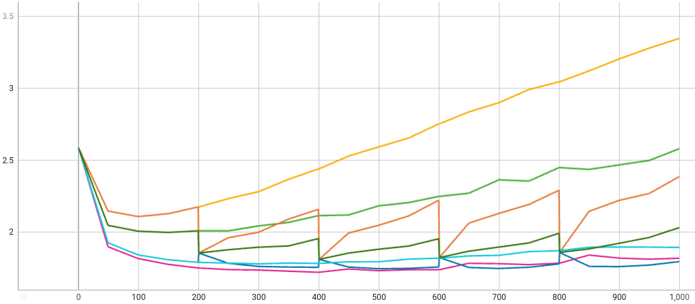

## Supervised Fine-tuning (SFT) with NeMo

In this example, we utilize NeMo's [supervised fine-tuning](https://github.com/NVIDIA/NeMo-Megatron-Launcher#515-instruction-following-via-supervised-finetuning--sft-)
feature to showcase how to fine-tune the whole model on supervised data for learning how to follow user specified instructions. 

Due to the large model size of the LLM, we use NVFlare's streaming feature to transfer the model in chunks.

## Dependencies
This example running a 1.3B GPT model requires considerable computational resources. For training 1.3B model, SFT needs ~30GB GPU memory using fp16 precision. Hence, to run three clients in parallel, we can compute the resource needs accordingly.
The example for 3-client 1.3B GPT model was performed on two A100 GPUs with 80 GB memory each.

We assume you followed the instructions [here](../../README.md#requirements) 
to install the NeMo, NVFlare, and the NeMo-NVFlare package. 

The example was tested using the [NeMo Docker container](https://catalog.ngc.nvidia.com/orgs/nvidia/containers/nemo), 
available with `docker pull nvcr.io/nvidia/nemo:23.02`.

For downloading the pre-trained model, we use [git lfs](https://git-lfs.com).

## Download the pre-trained LLM
In this example, we use [Megatron-GPT 1.3B](https://huggingface.co/nvidia/nemo-megatron-gpt-1.3B) and [Megatron-GPT 5B](https://huggingface.co/nvidia/nemo-megatron-gpt-5B), transformer-based language models based on the GPT architecture.
We download the model from HuggingFace using git lfs
```
mkdir Models
cd Models
git clone https://huggingface.co/nvidia/nemo-megatron-gpt-1.3B
git clone https://huggingface.co/nvidia/nemo-megatron-gpt-5B
cd ..
```

## Data preprocessing
For SFT task, we will use three datasets:
- [Alpaca](https://huggingface.co/datasets/tatsu-lab/alpaca) 
- [databricks-dolly-15k](https://huggingface.co/datasets/databricks/databricks-dolly-15k)
- [OpenAssistant Conversations](https://huggingface.co/datasets/OpenAssistant/oasst1)

These three datasets contain instruction-following data in different formats under different settings: oasst1 features a tree struture for full conversations, while the other two are instruction(w/ or w/o context)-response pairs.

In this example, we first preprocess them following the [NeMo SFT](https://github.com/NVIDIA/NeMo-Megatron-Launcher#5151-sft-data-formatting)'s instructions. The script converts the "Instruction", "Context" and "Response" fields (or their equivalents) into "Input" and "Output". The script also concatenates the "Instruction" and "Context" fields with a \n\n separator and randomizes the order in which they appear in the input to generate a new JSONL file.

#### 1. Download the datasets
We download the datasets from HuggingFace:
```
mkdir Data
cd Data
git clone https://huggingface.co/datasets/tatsu-lab/alpaca
git clone https://huggingface.co/datasets/databricks/databricks-dolly-15k
git clone https://huggingface.co/datasets/OpenAssistant/oasst1
cd ..
```

#### 2. Preprocess each dataset
We preprocess each dataset using the following script:
``` 
mkdir Data/Processed
mkdir Data/Processed/alpaca
python utils/preprocess_alpaca.py --training_file Data/alpaca/data/train-00000-of-00001-a09b74b3ef9c3b56.parquet --output_dir Data/Processed/alpaca
mkdir Data/Processed/dolly
python utils/preprocess_dolly.py --training_file Data/databricks-dolly-15k/databricks-dolly-15k.jsonl --output_dir Data/Processed/dolly
mkdir Data/Processed/oasst1
python utils/preprocess_oasst1.py --training_file Data/oasst1/data/train-00000-of-00001-b42a775f407cee45.parquet --validation_file Data/oasst1/data/validation-00000-of-00001-134b8fd0c89408b6.parquet --output_dir Data/Processed/oasst1
```

#### 3. Combine for centralized training
We also generate a combined version for centralized training baseline:
```
mkdir Data/Processed/combined
python utils/combine_jsonl.py --file_list Data/Processed/alpaca/training.jsonl Data/Processed/dolly/training.jsonl Data/Processed/oasst1/training.jsonl --output_path Data/Processed/combined/training.jsonl
python utils/combine_jsonl.py --file_list Data/Processed/alpaca/validation.jsonl Data/Processed/dolly/validation.jsonl Data/Processed/oasst1/validation.jsonl --output_path Data/Processed/combined/validation.jsonl
python utils/combine_jsonl.py --file_list Data/Processed/alpaca/testing.jsonl Data/Processed/dolly/testing.jsonl Data/Processed/oasst1/testing.jsonl --output_path Data/Processed/combined/testing.jsonl
```

## Federated learning simulations
Next, we are using NVFlare's [POC mode](https://nvflare.readthedocs.io/en/main/getting_started.html#setting-up-poc) to simulate 
each client training on their own dataset locally, centralized training with all three dataset combined, and all three clients training together using the 
[FedAvg](https://arxiv.org/abs/1602.05629) algorithm implemented in NVFlare.

#### 1. Local and Centralized SFT
For single-site and centralized training experiments, we create the poc workspaces:
```
nvflare poc --prepare -n 1
```
For 1.3B model experiment, we start the NVFlare system with one GPU:
```
nvflare poc --start --gpu 0
```
For better usability, open a new terminal and start the [admin command prompt](https://nvflare.readthedocs.io/en/main/real_world_fl/operation.html#admin-command-prompt):
```
nvflare poc --start --package admin
```

We create the configuration files and modify them to include the current directory path to access the dataset and pre-trained LLM.
At this point, we also modify the data path and local number of clients.

In a standard terminal, run
```
python utils/create_configs.py --job_folder "jobs/gpt_sft_1.3B_alpaca" --num_clients 1 --devices 1 --train_ds_files /workspace/Data/Processed/alpaca/training.jsonl --validation_ds_files /workspace/Data/Processed/combined/validation.jsonl
python utils/create_configs.py --job_folder "jobs/gpt_sft_1.3B_dolly" --num_clients 1 --devices 1 --train_ds_files /workspace/Data/Processed/dolly/training.jsonl --validation_ds_files /workspace/Data/Processed/combined/validation.jsonl
python utils/create_configs.py --job_folder "jobs/gpt_sft_1.3B_oasst1" --num_clients 1 --devices 1 --train_ds_files /workspace/Data/Processed/oasst1/training.jsonl --validation_ds_files /workspace/Data/Processed/combined/validation.jsonl
python utils/create_configs.py --job_folder "jobs/gpt_sft_1.3B_combined" --num_clients 1 --devices 1 --train_ds_files /workspace/Data/Processed/combined/training.jsonl --validation_ds_files /workspace/Data/Processed/combined/validation.jsonl
```
Note that we used the combined validation set for all experiments, allowing for a direct comparison across all training settings.

Next, submit the single-client SFT jobs using the admin prompt.
Replace `[PWD]` with the path to this directory.
```
submit_job [PWD]/jobs/gpt_sft_1.3B_alpaca
submit_job [PWD]/jobs/gpt_sft_1.3B_dolly
submit_job [PWD]/jobs/gpt_sft_1.3B_oasst1
submit_job [PWD]/jobs/gpt_sft_1.3B_combined
```

#### 2. Federated SFT
We use the [FedAvg](https://arxiv.org/abs/1602.05629) algorithm to perform SFT on the model in a federated scenario with 3 clients, each uses one of the three datasets. 

We create the poc workspaces:
```
nvflare poc --prepare -n 3
```
For 1.3B model experiment, we start the NVFlare system with two GPUs:
```
nvflare poc --start --gpu 0,1
```
For better usability, open a new terminal and start the [admin command prompt](https://nvflare.readthedocs.io/en/main/real_world_fl/operation.html#admin-command-prompt):
```
nvflare poc --start --package admin
```

First, create and modify the configuration files again. 
Here, each client performs SFT for one local epoch before sending their local model updates to the server for aggregation. 
```
python3 utils/create_configs.py --job_folder "jobs/gpt_sft_1.3B_fedavg" --num_clients 3 --devices 1 --train_ds_files /workspace/Data/Processed/alpaca/training.jsonl /workspace/Data/Processed/dolly/training.jsonl /workspace/Data/Processed/oasst1/training.jsonl --validation_ds_files /workspace/Data/Processed/combined/validation.jsonl  /workspace/Data/Processed/combined/validation.jsonl  /workspace/Data/Processed/combined/validation.jsonl
```
Next, simulate the federated p-tuning using FedAvg.
```
submit_job [PWD]/jobs/gpt_sft_1.3B_fedavg
```

## Results
During training, we can visualize the training process using TensorBoard
```
tensorboard --logdir /tmp/nvflare/nemo
```
In this scenario, all experiments utilize the same validation set, allowing for a direct comparison across all models. Note that we ran FL for 5 rounds, and asked NeMo to record the validation losses every few steps during local training.

The validation losses for all experiments are shown below.


## Inference
We use NeMo's [inference script](https://github.com/NVIDIA/NeMo/blob/main/examples/nlp/language_modeling/megatron_gpt_eval.py) for generation task with models after SFT. 
Below, we define some test examples to feed to the SFT model to see its predictions.

First, we ask the model to generate answer to an open question "Tell me an interesting fact about space travel." 
```
ALPACA: The first human to orbit the Earth was Neil Armstrong, who flew on the Apollo 11 mission in 1969.'
DOLLY: The International Space Station is the largest floating structure in the universe. It is made of steel and is about the size of a small house.
OASST: Sure! Here are a few interesting facts about space travel:\n\n1. Space travel is possible even with small amounts of fuel. The amount of
COMBINED: The first human to set foot on the Moon was Neil Armstrong.
```
Note that models mostly gives plausible answers, but ALPACA-finetuned model in fact gives misinformation, since it should be Yuri Gagarin who is the first human to orbit the Earth.
On the other hand, the model trained on the combined dataset is able to generate a more accurate answer.

Next, we ask the model to answer a question according to a given context, one instance from [SQuAD dataset](https://rajpurkar.github.io/SQuAD-explorer/).

Context being "Super Bowl 50 was an American football game to determine the champion of the National Football League (NFL) for the 2015 season. The American Football Conference (AFC) champion Denver Broncos defeated the National Football Conference (NFC) champion Carolina Panthers 24–10 to earn their third Super Bowl title. The game was played on February 7, 2016, at Levi\'s Stadium in the San Francisco Bay Area at Santa Clara, California. As this was the 50th Super Bowl, the league emphasized the "golden anniversary" with various gold-themed initiatives, as well as temporarily suspending the tradition of naming each Super Bowl game with Roman numerals (under which the game would have been known as "Super Bowl L"), so that the logo could prominently feature the Arabic numerals 50.", 

Input being "Which NFL team represented the AFC at Super Bowl 50?" 

By using a simple prompt `***CONTEXT*** + context + ***INPUT*** + question + ***OUTPUT***`, we have the following results:
```
ALPACA: The AFC champion Denver Broncos represented the AFC at Super Bowl 50.'
DOLLY: The NFL team that represented the AFC at Super Bowl 50 was the Denver Broncos.'
OASST: The Denver Broncos defeated the Carolina Panthers 24–10 to win the Super Bowl 50 championship.'
COMBINED: The Denver Broncos'
```
As we can see, the key word "Denver Broncos" is correctly captured by all models. However, ALPACA answer is a bit redundant, and OASST answer is not directly "to the question".

By using a more sophisticated prompt `***TASK*** Give ANSWER to the QUESTION according to the CONTEXT. ***CONTEXT*** + context + ***QUESTION*** + question + ***ANSWER***`, we have the following results:
```
ALPACA: The Denver Broncos.'
DOLLY: The AFC champion Denver Broncos represented the NFL at Super Bowl 50, as they defeated the NFC Carolina Panthers 24–10.'
OASST: The Denver Broncos represented the AFC at Super Bowl 50.'
COMBINED: The Denver Broncos represented the AFC at Super Bowl 50.'
```
This time all answers make sense, only DOLLY gives redundant information irrelevant to the question.

Based on the above results, we can see that the model trained on the combined dataset is able to generate more stable and accurate answers.