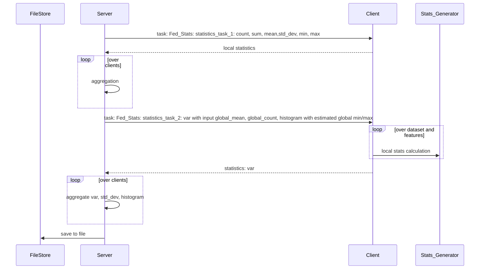

# How Statistics Executor works

```mermaid
 
sequenceDiagram
    participant FileStore
    participant Server
    participant Client
    participant Stats_Generator
    Server->>Client: task: Fed_Stats: statistics_task_1: count, sum, mean,std_dev, min, max 
    Client-->>Server: local statistics
    loop over clients
        Server->>Server: aggregation
    end
    Server->>Client:  task: Fed_Stats: statistics_task_2: var with input global_mean, global_count, histogram with estimated global min/max
    loop over dataset and features
       Client->>Stats_Generator: local stats calculation
    end
    Client-->>Server: statistics: var
    loop over clients
        Server->>Server: aggregate var, std_dev, histogram
    end
    Server->>FileStore: save to file
```
