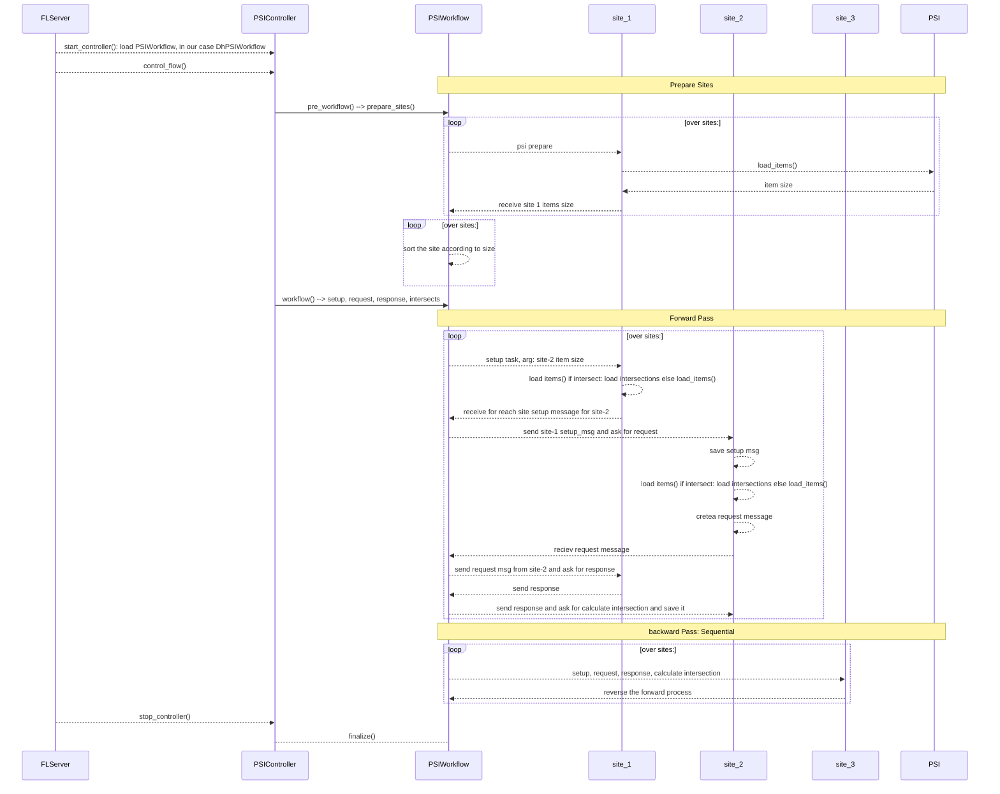
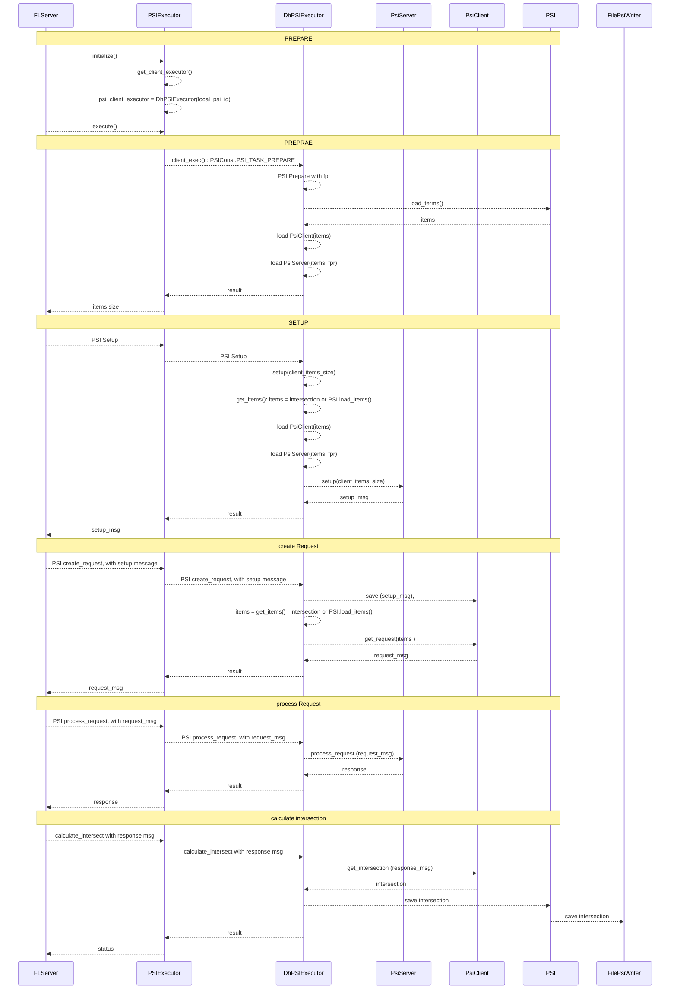

# Federated Private Set Intersection

The Private Set Intersection (PSI) protocol is based on [ECDH](https://en.wikipedia.org/wiki/Elliptic-curve_Diffie%E2%80%93Hellman),
Bloom Filters, and Golomb Compressed Sets PSI algorithm. The algorithm is developed by [openmined PSI](https://github.com/OpenMined/PSI)
for two-party. 

We took the two-party direct communication PSI protocol and extended to Federated Computing setting where all exchanges are 
funneled via a central FL server. We supported multi-party PSI via pair-wise approach.  
 
Here is the detailed Sequence diagrams. 

## Client Side interactions

* Note each site/client is both a PSI Client and PSI Server. 
* Initially, the items() is the original data items
* Once the client has get the intersection from the previous Clients' intersect operation, the items will be
* the intersection instead of original items.

