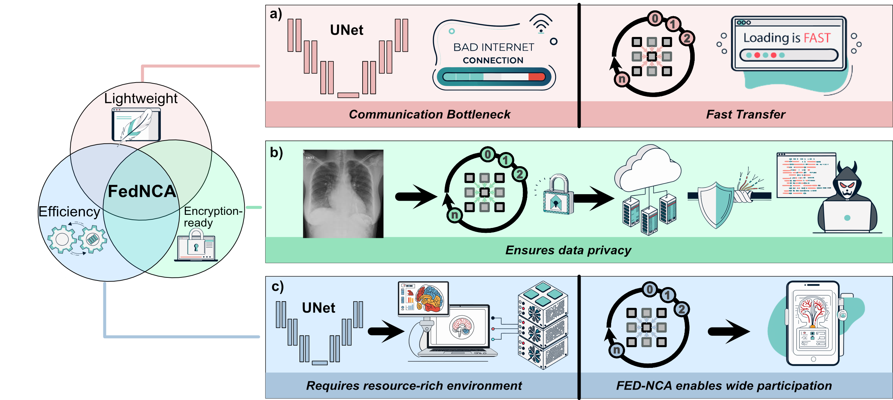
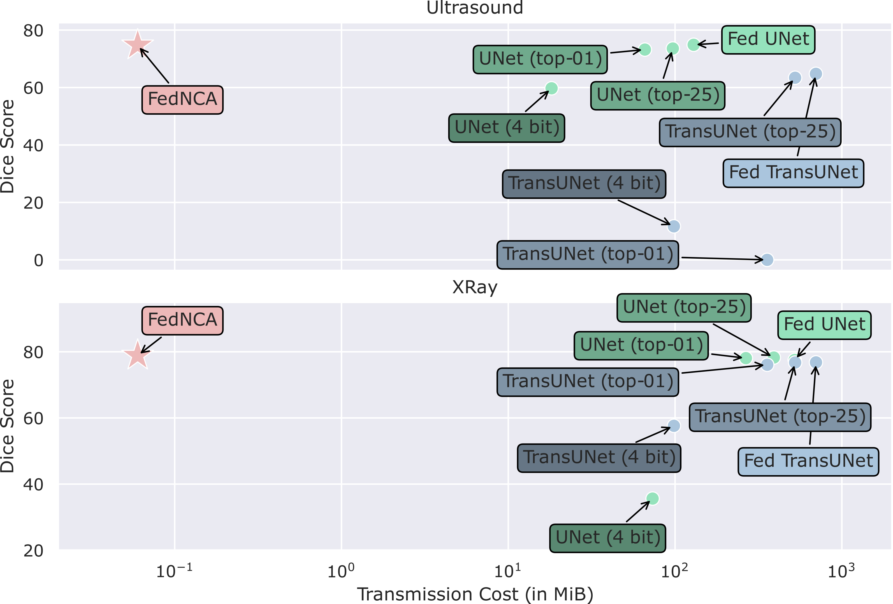

# FedNCA - Equitable Federated Learning with NCA
This readme references the official implementation of our paper [Equitable Federated Learning with NCA](https://arxiv.org/abs/2506.21735) accepted at MICCAI 2025.  
Nick Lemke<sup>\*</sup>, Mirko Konstantin<sup>\*</sup>, Henry John Krumb, John Kalkhof, Jonathan Stieber, Anirban Mukhopadhyay  
<sup>\*</sup> Equal Contribution

Using NVIDIA Flare, we propose a lightweight and secure federated learning system for medical image segmentation designed for low-resource settings like low- and middle-income countries. 
It enables model training on low-cost devices (e.g., smartphones) with low communication and computing demands, while supporting encryption for secure data transfer. 
This makes FL more accessible, efficient, and equitable in areas with limited infrastructure and unreliable internet.



## Background
Recent deep learning architectures have grown increasingly large in terms of parameter count, leading to higher computational and communication demands in federated learning settings.
Neural Cellular Automata (NCA) offer a lightweight alternative, achieving performance comparable to much larger models.
Their low parameter count provides several advantages for federated learning, as demonstrated in our publication.


## Code 
The code and details of how to set up and run are found in our GitHub repository: https://github.com/MECLabTUDA/FedNCA

## Expected Results
These are the main results of our paper. The y-axis shows the segmentation quality in terms of Dice score, and the x-axis depicts the transmission cost on a log scale.



## Citing FedNCA
If you use FedNCA in your research, please include the following BibTeX entry.
```
@inproceedings{lemke2025equitable,
  title={Equitable Federated Learning with NCA},
  author={Lemke, Nick and Konstantin, Mirko and Krumb, Henry John and Kalkhof, John and Stieber, Jonathan and Mukhopadhyay, Anirban},
  booktitle={International Conference on Medical Image Computing and Computer-Assisted Intervention},
  pages={168--177},
  year={2025},
  organization={Springer}
}
```
