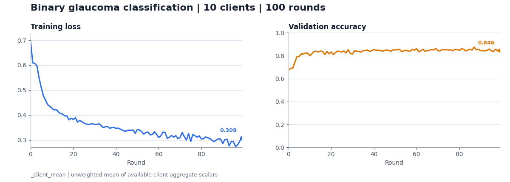

# AgenticFL: Agentic Data Readiness for Federated Learning

## Abstract

AgenticFL is a research workflow for turning a natural-language federated
learning task into client-local prepared data and an executable NVIDIA FLARE
training job. NVIDIA FLARE owns client/server transport, task lifecycles,
simulation, aggregation, and result collection. Bounded Codex workers propose
task inquiries, client-local adapters, data contracts, and training code; the
workflow validates those proposals before promoting them.

This contribution is the stable research artifact with one live coding-agent
backend (`codex`). A client-local VLM performs bounded raw-input guardrail
inspection and image/label alignment review; for spatial labels, the workflow
renders orientation candidates. For the built-in segmentation contract, it
automatically applies a consensus flip or 180-degree transform before training;
generated spatial contracts retain ownership of their geometry. The separate
acquisition-quality scoring and sample-filtering workflow is deliberately
excluded.

## Objective

AgenticFL studies whether coding agents can reduce repeated, task-specific data
engineering in cross-silo FL without moving client-local records to the server.
The contribution demonstrates an end-to-end proposal, verification, and
promotion workflow built on NVFlare rather than proposing a new aggregation
algorithm.

## Method Summary

The workflow has two explicit phases:

1. A custom NVFlare controller asks every client for safe aggregate metadata,
   uses Codex to define a shared data contract, and asks eligible clients to
   generate and execute local adapters. The client-local VLM checks a bounded
   raw input, reviews contract-owned visual artifacts, and selects any required
   orientation repair. Only path-redacted aggregate outcomes return through
   FLARE.
2. A server Codex worker generates task-specific training code. AgenticFL
   validates and packages it, runs a one-client mock-data `SimEnv` preflight,
   and then launches the prepared multi-client FedAvg job.

Agent outputs are proposals, not trusted state. A generated local adapter must
execute against client data and produce a provenance-valid manifest. Generated
training code must satisfy package and Client API contracts and pass a local
NVFlare simulation before it can be exported or run.

The following are explicit non-goals of this research artifact:

- acquisition-quality grading, dataset-wide quality scoring, or quality-based
  sample filtering;
- general image enhancement, reconstruction, inpainting, or content repair;
- OpenHands, hosted chat APIs, or deterministic runtime fallbacks;
- production isolation or clinical/model-quality claims.

## Repository Layout

```text
research/agentic-fl/
|-- README.md
|-- findings.md              # Review issues, acceptance criteria, and status
|-- ACKNOWLEDGEMENTS.md
|-- requirements.txt
|-- pyproject.toml
|-- meta/site-meta.example.json
|-- meta/reference-sources.example.json
|-- prepare_ref.sh            # Select local visual-review references from data
|-- scripts/prepare_references.py # Standalone reference preparation
|-- task_example/             # Prepared and git-ignored reference output
|-- docs/data-download.md     # Public links for the 39-site retinal cohort
|-- docs/architecture.md
|-- agenticfl/
|   |-- job_data.py           # Data preflight, FedJob construction, and execution
|   |-- job_train.py          # Generated trainer validation and FedAvg execution
|   |-- server.py             # NVFlare Controller and two-round data workflow
|   |-- client.py             # NVFlare client Executor and local validation
|   |-- agents/               # Codex bridge, agent logic, VLM/adapters, preflight
|   |-- data/                 # Profiling, extraction, QC, and typed contracts
|   |-- flare/                # FLARE messages and client/preflight runtimes
|   |-- prompts/              # Prompt loader and scoped JSON prompt bundles
|   `-- utils/                # Atomic I/O, audit logging, and training metrics
`-- tests/                    # Compact critical-path acceptance tests
```

See [docs/architecture.md](docs/architecture.md) for lifecycle and trust-boundary
details.

## Setup

Python 3.11 or newer, the Codex CLI, a local OpenAI-compatible vision endpoint,
and filesystem space for local simulator workspaces are required. GPU
requirements depend on the local VLM and generated training code. Codex must
already be installed and authenticated where the simulator processes run.

From the NVFlare repository root:

```bash
python3 -m venv .venv
. .venv/bin/activate
python -m pip install --upgrade pip
python -m pip install -e .
python -m pip install -e 'research/agentic-fl[training]'
codex --version
```

By default the local visual path uses
`Qwen/Qwen3-VL-8B-Instruct` at `http://127.0.0.1:8001/v1`. Override those
settings with `AGENTICFL_VISION_AGENT_MODEL`,
`AGENTICFL_VISION_AGENT_API_BASE_URL`, and
`AGENTICFL_VISION_AGENT_API_KEY_ENV`. The endpoint must resolve to localhost;
the workflow sends image-content review requests only to that loopback endpoint.
The client Codex worker and generated adapter can still access the local dataset
to construct and validate the adapter, as described in the trust boundaries.

Before starting an experiment, launch the local endpoint in a separate host
terminal using an environment that provides vLLM, and leave it running:

```bash
export AGENTICFL_LOCAL_VISION_API_KEY=local-vlm
OMP_NUM_THREADS=1 VLLM_HOST_IP=127.0.0.1 \
vllm serve Qwen/Qwen3-VL-8B-Instruct \
  --host 127.0.0.1 \
  --port 8001 \
  --api-key "${AGENTICFL_LOCAL_VISION_API_KEY}" \
  --limit-mm-per-prompt.image 3 \
  --limit-mm-per-prompt.video 0 \
  --max-model-len 4096 \
  --gpu-memory-utilization 0.85
```

Export the same API key in the terminal used to run AgenticFL, then verify the
endpoint before continuing:

```bash
export AGENTICFL_LOCAL_VISION_API_KEY=local-vlm
curl --fail --silent --show-error \
  --header "Authorization: Bearer ${AGENTICFL_LOCAL_VISION_API_KEY}" \
  http://127.0.0.1:8001/v1/models
```

If vLLM reports a `TCPStore` timeout for `127.0.0.1`, use the IPv6 loopback
interface for both its internal rendezvous and API instead:

```bash
export VLLM_HOST_IP=::1
export VLLM_LOOPBACK_IP=::1
export AGENTICFL_VISION_AGENT_API_BASE_URL='http://[::1]:8001/v1'
export NO_PROXY="${NO_PROXY:+${NO_PROXY},}localhost,127.0.0.1,::1"
export no_proxy="${no_proxy:+${no_proxy},}localhost,127.0.0.1,::1"
# Re-run the vllm command above with: --host ::1
```

The contribution targets NVFlare 2.9 APIs on `main`. Until that version is
published, use the editable repository install above rather than replacing the
`nvflare~=2.9.0rc` requirement with an older release.

## Data Preparation

The workflow assumes each site's data is already available on that client's
local filesystem. It does not download, redistribute, or prescribe acquisition
steps for the datasets. Create a site registry from
`meta/site-meta.example.json`; each `data_path` may be absolute or relative to
the project root passed to `job_data.py`.

See [docs/data-download.md](docs/data-download.md) for the download page and
Kaggle reference associated with every site in the 39-site retinal cohort.

```bash
cp research/agentic-fl/meta/site-meta.example.json \
  research/agentic-fl/meta/site-meta.json
# Adjust the 39 relative data/<SITE_ID> paths if your local layout differs.
```

Client IDs must be unique, contain only letters, digits, `.`, `_`, or `-`, and
start with a letter or digit. This keeps every site-owned artifact inside its
run directory.

The local parser shares aggregate structure only. Paths, filenames, sample
identifiers, raw images, annotations, and generated adapter files are redacted
from server-visible responses. Dataset licenses and access terms remain the
operator's responsibility. The contribution does not distribute training data
or reference images.

Before running AgenticFL, select one existing prepared record for each supported
reference task. Copy `meta/reference-sources.example.json`, replace its four
sample-manifest paths with local paths, and prepare the digest-bound references:

```bash
cp research/agentic-fl/meta/reference-sources.example.json \
  /tmp/agenticfl-reference-sources.json
# Edit /tmp/agenticfl-reference-sources.json to point at prepared local data.
bash research/agentic-fl/prepare_ref.sh \
  /tmp/agenticfl-reference-sources.json
export AGENTICFL_TASK_EXAMPLE_DIR="$(pwd)/research/agentic-fl/task_example"
```

The preparer selects real image/target pairs from the declared manifests and
writes the same canonical final-form contract used by visual review. Source
paths may be absolute or relative to the source-config file. See
[task_example/README.md](task_example/README.md) for the accepted prepared-data
record shapes.
`AGENTICFL_TASK_EXAMPLE_DIR` is optional for the documented editable install,
but setting it makes the external reference location explicit and also supports
normal wheel installations, where references are intentionally not packaged.

## Run Instructions

All commands below run from the NVFlare repository root. Prepare the references
from existing local records first if the digest-bound bundle is not present:

```bash
bash research/agentic-fl/prepare_ref.sh \
  /tmp/agenticfl-reference-sources.json
export AGENTICFL_TASK_EXAMPLE_DIR="$(pwd)/research/agentic-fl/task_example"
```

Run the data-readiness entry point with a site registry, task, and project root:

```bash
TASK='binary glaucoma classification from fundus images using explicit local diagnosis or screening labels only; harmonize every admitted client to the shared label space 0=no glaucoma or non-referable, 1=an explicitly named glaucoma-spectrum positive or screening-positive state, including confirmed, possible, suspected, probable, or referable glaucoma. Do not use cup/disc masks, CDR, large-cup findings, or opaque numeric diagnosis codes as classification labels unless a local metadata source, README, codebook, legend, schema, or descriptive class-folder name explicitly defines the glaucoma-spectrum diagnosis or screening state. A descriptive local label that explicitly names the requested target remains semantic evidence when qualified as possible, suspected, probable, or referable; do not require a separate codebook merely to restate that descriptive label, and interpret the complete label so explicit negative or exclusion wording remains negative. If a local metadata source has multiple task-positive glaucoma-spectrum values, collapse those values to label 1 only when their local meanings are explicit; if the local evidence cannot support this binary mapping, mark the site unfeasible.'
python -m agenticfl.job_data \
  research/agentic-fl/meta/site-meta.json \
  "${TASK}" \
  .
```

The value above is the exact task wording used by the showcased retinal
experiment. In particular, the target is glaucoma rather than arbitrary binary
image classification, and the local-evidence constraints are part of the task.

`job_data.py` directly runs the live-runtime preflight and then the two-round
NVFlare data workflow with fixed research defaults. Its JSON result reports the
generated session and run directory. Prepared outputs are isolated under
`data/dataset_fl_runs/<session-id>/`; existing data is never overwritten. The
fixed four-hour result timeout accommodates full materialization of large cohort
archives. The server decision used for training is written to:

```text
runs/<session-id>/server/decisions/extraction_round_summary.json
```

Pass that decision directly to the training entry point:

```bash
# Stop the local VLM after job_data.py exits to release its GPU memory.
python -m agenticfl.job_train \
  runs/<session-id>/server/decisions/extraction_round_summary.json \
  .
```

`job_train.py` reads the task and ready clients from the data decision, generates
and validates the trainer, resolves that data phase's run-isolated prepared-data
folder, and executes the showcased 100-round FedAvg experiment with fixed
defaults. Both entry points use the current public Recipe pattern: they connect
custom `FedJob` objects to NVFlare's public `SimEnv` and launch them with
`Recipe.execute`. The generated trainer uses NVFlare's Client API loop and
uploads model differences with `NUM_STEPS_CURRENT_ROUND` metadata for FedAvg
aggregation.

The public simulator is the default. On a host where NVFlare simulator traffic
cannot use IPv4 loopback, an explicit compatibility mode is available. Use it
when the simulator reports `Failed to create connection to the child process in
SimulatorClientRunner` after client registration:

```bash
export AGENTICFL_SIMULATOR_MODE=ipv6_unix
```

That mode is limited to the NVFlare 2.9 simulator internals used by this
research example; an incompatible installation fails immediately instead of
silently changing transport behavior.

On some hosts, SimEnv may print `could not stop AIO loop` during process cleanup
after `Finished FedAvg`. The run is reported as completed with warnings only when
all client results were aggregated, the global model was persisted, and non-empty
client metric artifacts exist. The preflight applies the same evidence-bound
classification; earlier AIO or trainer errors still fail the run.

## Expected Results

A successful data phase reports extracted, screened-out, and failed clients and
writes a redacted extraction summary. A successful training phase produces:

- a Codex-generated training package under the run directory;
- package-validation and mock-data simulation attestations;
- an exported NVFlare job under `jobs/`;
- simulator logs, aggregate metrics, and the persisted global model under the
  training workspace.

### Showcased retinal experiment

The following is the most recent recorded `data_retinal` experiment result for
the exact task, cohort, and workflow described here. It is included as research
evidence, not as a claim that every run reproduces identical generated code or
metrics.

The `data_retinal` experiment queried all 39 registered retinal clients for the
exact glaucoma task above. Round-one aggregate profiling admitted 18 clients to
client-local extraction. Eight of those were screened out locally because their
available evidence could not satisfy the label contract; no admitted client
failed extraction, leaving 10 final training clients.

| Stage | Clients | Outcome |
|---|---:|---|
| Cohort queried in round 1 | 39 | Privacy-safe aggregate profiling |
| Initially admitted to round 2 | 18 | Local adapter generation and validation |
| Screened out in round 2 | 8 | Insufficient task-aligned local label evidence |
| Failed in round 2 | 0 | No unresolved extraction failures |
| Finally admitted to training | 10 | 26,549 image-label records |

The 26,549 records comprise 21,748 training, 2,400 validation, and 2,401 test
records. A Codex-generated ResNet-18-style trainer with GroupNorm then completed
100 FedAvg rounds across all 10 clients, with 10/10 client updates aggregated in
every round and the global model persisted. At round 99, the unweighted
client-mean training loss was 0.3086, validation accuracy was 0.8456, balanced
accuracy was 0.8006, and AUC was 0.8774. The best client-mean validation
accuracy was 0.8750 at round 87. The simulator reported one post-success AIO
loop cleanup warning, but no client-training or aggregation failure.

The curves below are read from the TensorBoard `_client_mean` series: an
unweighted mean of available client aggregate scalars for visualization. FedAvg
model aggregation remains optimizer-step-weighted; with the fixed batch size
and one local epoch used here, that is approximately sample-proportional.



The agent generates a task-appropriate training strategy from the observed data
contract, so strategy selection adds run-to-run variability beyond ordinary
model-training randomness. For example, an earlier run selected DenseNet-121
with a small random rotation, while this run selected a ResNet-18-style model,
removed that rotation, added EXIF orientation repair, and changed the color
augmentation. The main FL settings remained fixed: 100 rounds, 10 clients,
batch size 2, one local epoch, 128x128 inputs, AdamW with learning rate 0.001,
class-weighted loss, DIFF updates, and optimizer-step-weighted FedAvg. Exact
predictive metrics therefore depend on the task, datasets, generated trainer,
and run budget. The research artifact establishes workflow completion and
failure containment; it does not claim a fixed benchmark score.

## Validation

The focused checks do not call Codex or a live VLM; renderer and reference
preparation tests use only temporary fixtures:

```bash
PYTHONPATH=research/agentic-fl \
  python -m unittest discover -s research/agentic-fl/tests -v
python -m compileall -q research/agentic-fl/agenticfl
```

Live end-to-end validation additionally requires authenticated Codex, at least
two prepared client datasets, and any framework/GPU dependencies selected by
the generated trainer.

## License

The code is licensed under Apache License 2.0. No pretrained model weights,
training datasets, or reference images are redistributed; `prepare_ref.sh`
selects the required references from locally available prepared records. See
[ACKNOWLEDGEMENTS.md](ACKNOWLEDGEMENTS.md) for provenance.

## Requirements

Runtime dependencies are listed in `requirements.txt`; package extras are in
`pyproject.toml`. The code requires NVFlare 2.9 because it follows the current
Recipe execution and Client API contracts on `main`.

## Citation

AgenticFL has not yet been published. Until a paper citation is available,
record the AgenticFL and NVIDIA FLARE revisions used for the experiment.

## Retinal Benchmark Cohort

The retinal experiments use the 39-site retinal/fundus cohort derived from the
[FedAgentBench dataset catalog](https://arxiv.org/abs/2509.23803). The cohort version used here is identified as
`data_retinal`. This research example assumes the cohort has already been
made available at the client-local paths in the site registry.
