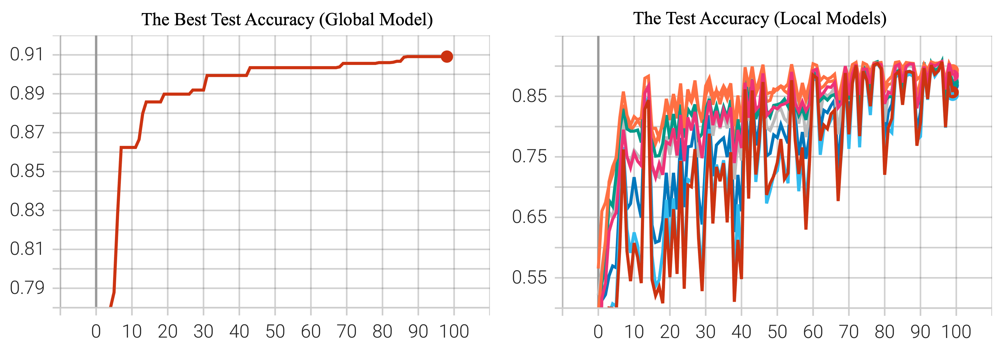

# Auto-FedRL

Components for running the algorithm proposed in
["Auto-FedRL: Federated Hyperparameter Optimization for Multi-institutional Medical Image Segmentation"](https://arxiv.org/abs/2203.06338) (ECCV 2022)
with [NVIDIA FLARE](https://nvflare.readthedocs.io/en/main/index.html).

###### Abstract:

> Federated learning (FL) is a distributed machine learning technique that enables collaborative model training while avoiding explicit data sharing. The inherent privacy-preserving property of FL algorithms makes them especially attractive to the medical field. However, in case of heterogeneous client data distributions, standard FL methods are unstable and require intensive hyperparameter tuning to achieve optimal performance. Conventional hyperparameter optimization algorithms are impractical in real-world FL applications as they involve numerous training trials, which are often not affordable with limited compute budgets. In this work, we propose an efficient reinforcement learning (RL)-based federated hyperparameter optimization algorithm, termed Auto-FedRL, in which an online RL agent can dynamically adjust hyperparameters of each client based on the current training progress.

You can find the original experimental implementation [here](https://github.com/guopengf/Auto-FedRL).

> **Note:** For more examples of FL algorithms with the CIFAR-10 dataset,
> see [here](../../examples/advanced/cifar10).

## License

The code in this directory is released under Apache v2 License.

## 1. Set PYTHONPATH
Set `PYTHONPATH` to include custom files of this example:

We use both the utils from the [CIFAR-10 examples](../../examples/advanced/cifar10) (e.g., pt.learners, and pt.utils)
and files under [./src](./src):
```
export PYTHONPATH=${PWD}/../../examples/advanced/cifar10:${PWD}/../../examples/advanced/cifar10/pt/utils:${PWD}/src
```

## 2. Download the CIFAR-10 dataset
To speed up the following experiments, first download the [CIFAR-10](https://www.cs.toronto.edu/~kriz/cifar.html) dataset:
```
python3 -m pt.utils.cifar10_data_utils
```

## 3. Run simulated FL experiments

We are using NVFlare's [FL simulator](https://nvflare.readthedocs.io/en/latest/user_guide/nvflare_cli/fl_simulator.html) to run the following experiments.

The output root of where to save the results is set in [./run_simulator.sh](./run_simulator.sh) as `RESULT_ROOT=/tmp/nvflare/sim_cifar10`.

### 3.1 Varying data heterogeneity of data splits

We use an implementation to generated heterogeneous data splits from CIFAR-10 based a Dirichlet sampling strategy
from FedMA (https://github.com/IBM/FedMA), where `alpha` controls the amount of heterogeneity,
see [Wang et al.](https://arxiv.org/abs/2002.06440).

We use `set_alpha.sh` to change the alpha value inside the job configurations.

### 3.2 Auto-FedRL

Next, let's try to run Auto-FedRL on a heterogeneous split (alpha=0.1):

[Auto-FedRL](https://arxiv.org/abs/2203.06338) is a method for federated hyperparameter optimization
```
./run_simulator.sh cifar10_autofedrl 0.1 8 8
```

## 4. Experiments on CIFAR-10

Here, we show the experiment using the continuous search on CIFAR-10 (alpha=0.5) with 8 clients. The experiment was conducted on 1 NVIDIA V100 GPU (16GB) and took about 8 hours.

The TensorBoard curves for test accuracy during training are shown below:


## 5. BibTeX

```
@inproceedings{guo2022auto,
  title={Auto-FedRL: Federated hyperparameter optimization for multi-institutional medical image segmentation},
  author={Guo, Pengfei and Yang, Dong and Hatamizadeh, Ali and Xu, An and Xu, Ziyue and Li, Wenqi and Zhao, Can and Xu, Daguang and Harmon, Stephanie and Turkbey, Evrim and Turkbey, Baris and Wood, Bradford and Patella, Francesca and Stellato, Elvira and Carrafiello, Gianpaolo and Patel, Vishal M. and Roth, Holger R.},
  booktitle={Computer Vision--ECCV 2022: 17th European Conference, Tel Aviv, Israel, October 23--27, 2022, Proceedings, Part XXI},
  pages={437--455},
  year={2022},
  organization={Springer}
}
```
