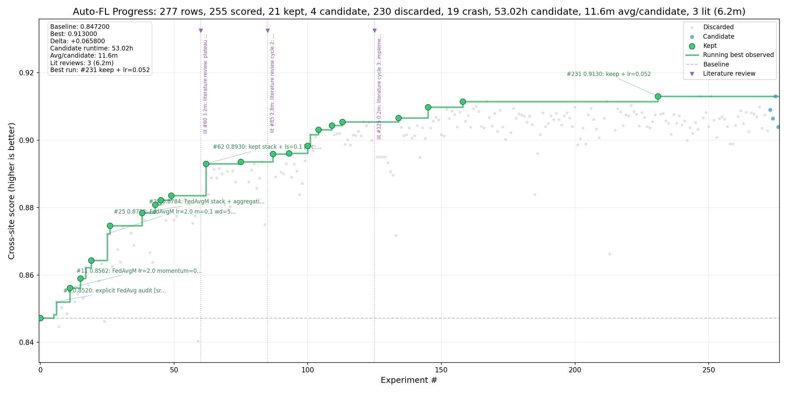

# Auto-FL-Research with NVFlare

This bundle is a practical starting point for an **autoresearch-style** Auto-FL loop on top of NVFlare using agents.

## Example progress

The plot below is an example result from using this harness with Claude Code, model: Opus 4.7 (1M context),
effort level: max.



It is designed to combine:
- NVFlare's **Client API + Recipe API** patterns for task-local `client.py`, `job.py`, `FedAvgRecipe`, `SimEnv`, TensorBoard tracking, and optional cross-site evaluation;
- task-specific training profiles that preserve **diff-based uploads** and comparable cross-site scoring; and
- the **`program.md` control-plane plus task profile** style popularized by [karpathy/autoresearch](https://github.com/karpathy/autoresearch), where the human primarily evolves the research instructions and the agent iterates on a bounded code surface.

## What is included

- `program.md` — the general agent control plane
- `tasks/cifar10/` — the default CIFAR-10/H100 task folder with `profile.md`, `requirements.txt`, `mutation_schema.yaml`, `client.py`, `job.py`, `model.py`, and `train_utils.py`
- `tasks/vlm_med/` — a medical VLM task folder for Qwen3-VL adapter FL campaigns
- `tasks/shared/` — shared task utilities such as `custom_aggregators.py`
- `AGENTS.md`, `CLAUDE.md` — thin repository guardrails that point back to `program.md` and the active task profile
- `data/` — shared CIFAR-10 data utilities used by the default task
- `scripts/init_run.sh` — creates an autoresearch branch and initializes `results.tsv`
- `scripts/run_iteration.sh` — runs one candidate mutation with task-folder-aware log redirection and score extraction
- `scripts/finalize_batch_status.py` — promotes reviewed candidates to `keep` or demotes them to `discard`
- `scripts/plateau_watchdog.py` — recommends when a stalled run must switch back to literature review
- `scripts/log_literature_review.py` — records stall-recovery literature review events in `results.tsv`
- `scripts/extract_score.py` — extracts a comparable score from cross-site validation JSON
- `scripts/validate_contract.py` — static contract checks
- `templates/` — result logging templates
- `skills/autofl-nvflare-report/` — post-run reporting skill for stopped experiment branches
- `ACKNOWLEDGEMENTS.md` — provenance and attribution notes

## How this uses the autoresearch approach properly

The [autoresearch](https://github.com/karpathy/autoresearch) repo keeps the setup intentionally small and treats `program.md` as the agent-facing control plane. The core repo only has a few files that matter, with one main editable target and a fixed evaluation harness. This starter follows that spirit, but adapts it to NVFlare:

- **Primary control plane:** `program.md` is the first file the agent should read; the active task profile, such as `tasks/cifar10/profile.md` or `tasks/vlm_med/profile.md`, is read immediately afterward.
- **Bounded edit surface:** mutations should follow the active task profile. For the default CIFAR-10 profile this mostly means `tasks/cifar10/client.py`, then `tasks/shared/custom_aggregators.py` for shared aggregation experiments, then `tasks/cifar10/job.py`; registered, parameter-capped variants may also touch `tasks/cifar10/model.py`.
- **Fixed communication budget:** compare candidates with the same round/data/evaluation setup while allowing task-profile-approved local-compute sweeps under the runtime cap.
- **Comparable metric extraction:** recommended runs enable cross-site evaluation and extract one task-defined score from `cross_val_results.json`.
- **Run keep / discard loop:** the agent follows the active task profile's local hardware and candidate-width rules, then ranks completed candidates against the ledger and keeps, narrows, or discards.
- **Autonomous continuation:** after setup and baseline, the agent keeps running same-budget candidates until manually interrupted.
- **Literature-grounded recovery:** when progress stalls, `scripts/plateau_watchdog.py` gives the agent a hard backstop for switching from local sweeps back to the Camyla-inspired literature loop in `program.md`.
- **Tracked experiment ledger:** `results.tsv` is committed on experiment branches so the branch carries run provenance, including non-scored literature-review events when progress stalls.

> Note: This is not a literal clone of [karpathy/autoresearch](https://github.com/karpathy/autoresearch); it is an NVFlare-specific adaptation of the same operating model.

## QWBE-style literature proposals

QWBE is currently implemented as an **instruction and artifact workflow**, not as imported [Camyla](https://yifangao112.github.io/camyla-page) code or a separate tree-search scheduler. After each reviewed candidate batch, `program.md` directs the agent to run `scripts/plateau_watchdog.py`. If it prints `recommendation=literature`, the agent must stop local jitter sweeps, use the Camyla-inspired literature loop, and fill `templates/literature_loop.md`. If it prints `recommendation=continue`, the agent should keep iterating locally rather than log another literature row for a routine missed batch.

The current flow is:

1. Run `scripts/plateau_watchdog.py results.tsv` after finalizing each batch. Its default hard trigger is 32 scored non-crash candidates without a material improvement or literature reset. Treat this as the normal trigger for literature mode.
2. Start a literature-review timer with `scripts/log_literature_review.py --start`, then generate source-backed proposal cards from recent `results.tsv` symptoms and relevant papers.
3. Filter out duplicates, known null/worse ideas, and proposals that violate the current contract.
4. Score each remaining proposal from 1-5 on expected gain, contract safety, simplicity, evidence, novelty, and runtime cost.
5. Compute:

   ```text
   2*expected_gain + 2*contract_safety + simplicity + evidence + novelty - runtime_cost
   ```

6. Rank the next compatible proposals with the scoring rubric and select a small batch of top candidates, up to the current `PARALLEL_CANDIDATES` width.
7. Append a `literature` event row with `scripts/log_literature_review.py --finish` so the ledger and plot show how long the review cycle took.
8. Launch the selected candidates with the normal `scripts/run_iteration.sh` mechanism, using unique `RUN_LOG` and `--name` values for each concurrent run under the active task profile's hardware rules.
9. Wait for the batch to finish or time out, rank the completed runs, then finalize reviewed ledger rows so completed `candidate` rows become `keep` or `discard`.

This keeps the Camyla/QWBE idea inside the existing harness contract: no new dependencies, no evaluation changes, and no server-client protocol changes except explicitly labeled modes such as `--aggregator scaffold`. Architecture or adapter changes are allowed only as registered variants under the active task profile's parameter budget.

## Recommended agent runtime

For long autonomous runs, prefer launching the coding agent inside a devcontainer rather than directly on the host. The recommended starting point is Trail of Bits' [`claude-code-devcontainer`](https://github.com/trailofbits/claude-code-devcontainer), which is designed to run Claude Code with broad command permissions inside a filesystem-isolated container.

Suggested flow:

```bash
# On the host, one-time setup from the Trail of Bits devcontainer README.
npm install -g @devcontainers/cli
git clone https://github.com/trailofbits/claude-code-devcontainer ~/.claude-devcontainer
~/.claude-devcontainer/install.sh self-install

# From the NVFlare repository root, install the template without starting it.
devc template .
```

Before starting the container shell, make sure `.devcontainer/devcontainer.json` exposes the H100 to Docker by including `--gpus=all` in `runArgs`. Do not replace the generated `runArgs` block; append the GPU value and keep existing entries such as `--cap-add=NET_ADMIN` and `--cap-add=NET_RAW`:

```json
{
  "runArgs": [
    "--cap-add=NET_ADMIN",
    "--cap-add=NET_RAW",
    "--gpus=all"
  ]
}
```

Then start the container and open a shell:

```bash
devc up
devc shell
```

This workflow assumes `/workspace` is a writable NVFlare git clone, not a source archive. The agent only needs local git access inside the container: it should create an `autoresearch/` branch and commit `results.tsv` plus kept code changes locally. Pushing the experiment branch is optional and can be done later from outside the devcontainer.

Inside the container, `cd` to `/workspace/research/auto-fl-research`, install this harness' Python requirements once with Python 3.12, export the prepared interpreter, and run preflight before handing control to the agent. Do not use the container's default `python3` if it points to Python 3.13. For Debian/Ubuntu-based devcontainers, install Python 3.12 first if it is missing.

Run the following from `/workspace/research/auto-fl-research`. This directory is the entry point for the harness, and it contains the `Makefile`, `program.md`, `tasks/`, and run scripts:

```bash
cd /workspace/research/auto-fl-research

if ! command -v python3.12 >/dev/null 2>&1; then
  sudo apt-get update
  sudo apt-get install -y python3.12 python3.12-venv python3.12-dev
fi

python3.12 --version
python3.12 -m venv .venv
. .venv/bin/activate
python -c 'import sys; assert sys.version_info[:2] == (3, 12), sys.version'

python -m pip install --upgrade pip
python -m pip uninstall -y nvflare-nightly
python -m pip install -r tasks/cifar10/requirements.txt
export PYTHON=.venv/bin/python
"$PYTHON" -c 'import sys; assert sys.version_info[:2] == (3, 12), sys.version'
"$PYTHON" -c 'import nvflare; print(nvflare.__version__, nvflare.__file__)'
make validate
make smoke
```

The default CIFAR-10 harness expects the released PyPI `nvflare` package from `tasks/cifar10/requirements.txt`, not an editable install of the repository checkout. If `pip freeze` shows `nvflare-nightly @ file://...`, remove it with `python -m pip uninstall -y nvflare-nightly` and rerun `python -m pip install -r tasks/cifar10/requirements.txt`.

If `apt-get` cannot find the Python 3.12 packages, update the devcontainer image or add an appropriate Python 3.12 package source before continuing; do not fall back to Python 3.13.

Shared runner scripts default to `TASK_DIR=tasks/cifar10`. For another task,
set `TASK_DIR=tasks/<task>` before running `make validate` or
`scripts/run_iteration.sh`; advanced cases can override `JOB_SCRIPT` and
`CLIENT_CONTRACT_PATH` directly. For `make smoke`, non-CIFAR tasks must also
provide task-specific `SMOKE_ARGS`; otherwise the smoke wrapper fails instead
of silently skipping runtime coverage.

On the H100 node, verify that the container can see the GPU before starting an overnight campaign:

```bash
nvidia-smi
```

For Claude Code, start the agent from the devcontainer shell with:

```bash
claude --permission-mode auto
```

For Codex CLI, install it inside the same devcontainer if needed, start Codex from `/workspace/research/auto-fl-research`, then use `/permissions` to set permissions inside the Codex session to `Auto-review`

Keep the devcontainer boundary meaningful: mount only the repository and deliberate scratch/drop paths, avoid mounting broad host directories or secrets, and remember that the container may still have outbound network access and git identity depending on how it is configured. For overnight runs, use `tmux` or the devcontainer's persistent shell workflow so the agent can keep running after you disconnect.

## Recommended agent entrypoint

For Codex or Claude Code, the first instruction can be copied directly after running the preflight steps:

```text
Make the bundled local `autofl-nvflare` skill available first if your runtime has not already loaded it. Use `skills/autofl-nvflare/SKILL.md` and its `references/` files as the skill source; do not recreate the skill from memory.

Then use the autofl-nvflare skill.

Start in this directory and read `program.md` first, then read `tasks/cifar10/profile.md` for the default task profile. Treat `program.md` as the general research control plane and `tasks/cifar10/profile.md` as the CIFAR-10/H100 source for environment, mutation, budget, and scoring details.

Start a fresh autoresearch campaign for the local single GPU node before running validation, smoke tests, the baseline, or any candidate experiment. Derive a descriptive run tag at runtime using `<node>-<campaign-topic>-$(date +%Y%m%d)`, then run `bash scripts/init_run.sh <run-tag>` to create and switch to `autoresearch/<run-tag>` and initialize `results.tsv`. Verify with `git branch --show-current` that you are on that new `autoresearch/` branch. Do not run experiments on `main`, `upstream/main`, or the starter branch, and do not use date-only names or copy stale example dates.

Use the local Python 3.12 environment created by preflight. Set:
export PYTHON=.venv/bin/python
Treat that PYTHON value as authoritative. First verify it with `test -x "$PYTHON"` and `"$PYTHON" -c "import sys; assert sys.version_info[:2] == (3, 12), sys.version; print(sys.executable)"`, then use that exact interpreter for validation, smoke tests, candidate runs, plotting, summaries, and reports.
Do not create a virtual environment, install dependencies, or search for alternate Python interpreters unless I explicitly ask you to. If `.venv/bin/python` is missing, invalid, or not Python 3.12, stop and tell me to rerun the README preflight in this directory with `python3.12`.

Use the default candidate budget, local hardware policy, calibration sequence, and mutation surface from the active task profile. Keep task-specific budget values in the profile instead of copying them into this prompt.

Once setup and baseline are complete, do not ask whether to keep going or whether this is a good stopping point. Continue the experiment loop until manually interrupted.

After every reviewed batch, run `"${PYTHON}" scripts/plateau_watchdog.py results.tsv` before choosing the next sweep. If it prints `recommendation=literature`, stop local hyperparameter jittering, run the literature loop in `program.md`, log a `literature` row, and launch the selected source-backed candidates next. If it prints `recommendation=continue`, do not start another literature review for a routine missed batch; keep sweeping a clear allowed local axis unless repeated crashes share one root cause or no non-duplicate safe axis remains.

Commit `results.tsv` locally after the baseline and after each reviewed batch. Commit surviving code changes locally on the active `autoresearch/` branch as soon as they are kept; do not let kept mutations accumulate only in the working tree. Do not require pushing from inside the devcontainer.
```

## Task budgets and calibration

The active task profile owns model or adapter budgets, default CLI args,
algorithm calibration sequences, local hardware width, and task-specific
mutation surfaces. Use this README for setup and task-selection flow; use
`tasks/cifar10/profile.md` or `tasks/vlm_med/profile.md` for comparable budget
and calibration details.

## Progress Plot

The progress plot reads the `status` column directly. If all successful rows
remain `candidate`, the plot will correctly show no kept runs. Rows with
`status=literature` are shown as vertical markers, with their `runtime_seconds`
counted separately from candidate runtime, so long score plateaus can be
compared against actual paper-review cycles.

To generate an autoresearch-style progress image from the ledger:

```bash
"${PYTHON:-python3}" scripts/plot_progress.py results.tsv --output progress.png
```

## How to adapt Auto-FL to new datasets and tasks

The default task profile in this directory is the compact CIFAR-10/H100
Auto-FL profile. To adapt the concept to a new dataset, task, model family, or
running environment, create a task folder that contains the task contract and
the code needed to run that contract. Keep `program.md`, `scripts/`,
`templates/`, reporting utilities, plotting, and logging helpers shared at this
directory level.

Humans select a non-default profile by naming the profile path or task name in
the initial prompt so the agent reads `program.md` first and the requested task
profile second. Example prompts:

- "Use `tasks/vlm_med/profile.md` as the active task profile."
- "Use the medical VLM profile instead of `tasks/cifar10/profile.md`."
- "Create a new task folder named `tasks/my_task/` with `profile.md` and
  `requirements.txt`, then use `tasks/my_task/profile.md` for this campaign."

The practical starting point is a working non-FL training scheme for the task.
Once the dataset loading, model construction, local training step, and
evaluation metric are implemented, adapt that scheme into the NVFlare
Client API + Recipe API shape. NVIDIA FLARE's
[`examples/advanced/qwen3-vl`](https://github.com/NVIDIA/NVFlare/tree/main/examples/advanced/qwen3-vl)
is the kind of pattern to follow for a VLM task: keep the task-specific
training/evaluation logic in the client-side code, define the job wiring in
task-local `job.py`, expose the exchanged model or adapter state in task-local
`model.py`, and then let the task profile define the fixed comparison budget.

At minimum, a new task should define:

- `tasks/<task>/profile.md` for the task contract, fixed comparison budget,
  metric, environment assumptions, and preferred edit surface.
- `tasks/<task>/requirements.txt` for dependencies specific to the task
  profile.
- `tasks/<task>/mutation_schema.yaml` entries for bounded mutation axes that
  the agent may choose during a campaign.
- Task-specific `client.py`, `job.py`, `model.py`, `train_utils.py`, and data
  bridge files when the dataset, training loop, model state, or score
  extraction differs from another task. Reuse `tasks/shared/custom_aggregators.py`
  for aggregation logic unless the new task needs a genuinely task-specific
  protocol.

The shared runner defaults are `TASK_DIR=tasks/cifar10`,
`JOB_SCRIPT=$TASK_DIR/job.py`, and `CLIENT_CONTRACT_PATH=$TASK_DIR/client.py`.
New tasks should work through those defaults where possible instead of copying
the shared `scripts/` directory. The `make full` helper is a CIFAR-10 full-eval
wrapper; use `scripts/run_iteration.sh` or a task-specific wrapper for other
profiles.

The important invariant is comparability: every candidate in a campaign should
use the same sites, rounds, data limits, seed policy, model-exchange state,
metric, timeout, and final evaluation clients unless the profile explicitly
changes the experiment contract.

## Post-run campaign report

After manually stopping an autoresearch experiment, leave the agent on the experiment branch that contains `results.tsv` and prompt it to make the bundled reporting skill available and run it. The skill should not launch more experiments; it only refreshes the plot, writes the report, and commits those reporting artifacts.

Copy-paste prompt:

```text
Make the bundled local `autofl-nvflare-report` skill available first if your runtime has not already loaded it. Use `skills/autofl-nvflare-report/SKILL.md` and its `scripts/` files as the skill source; do not recreate the skill from memory.

Then use the autofl-nvflare-report skill.

The autoresearch run has been manually stopped. Do not launch new experiments.
Use the current branch and its results.tsv as the source of truth.
Use the prepared PYTHON interpreter if I provided one; do not create a virtual environment or install dependencies.
Refresh progress.png.
Generate reports/<branch>-autoresearch-report.md.
Commit both reports/<branch>-autoresearch-report.md and progress.png to this experiment branch.
If I pasted agent model, effort, or cost output below, include it in the report.
If no model/effort/cost output is pasted, state that agent telemetry was unavailable.

Agent model output, optional:
<paste Claude Code /model output here, or leave empty>

Agent effort output, optional:
<paste Claude Code /effort output here, or leave empty>

Agent cost output, optional:
<paste Claude Code /cost output here, or leave empty>
```

For Claude Code, run `/model`, `/effort`, and `/cost` manually before sending the reporting prompt if you want model, reasoning effort, and token/tooling cost captured. These slash commands are interactive, so the reporting agent cannot invoke them from a tool call.

The skill refreshes `progress.png`, embeds it in `reports/<branch>-autoresearch-report.md`, and commits both the report markdown and `progress.png`. The report covers baseline and best score, absolute and relative lift, final stack, runtime cost, pasted agent model/effort/cost context when available, crash notes, literature-derived ideas with source refs, null/worse ideas, and recommended reproduction or next-step experiments.

## Acknowledgements

See `ACKNOWLEDGEMENTS.md` for provenance. In short:
- the **control-plane idea** and `program.md` workflow are adapted from [karpathy/autoresearch](https://github.com/karpathy/autoresearch);
- the **literature-loop / QWBE-style proposal workflow** is inspired by the public [Camyla project](https://yifangao112.github.io/camyla-page) and adapted only at the instruction/artifact level;
- the **FL execution substrate** is adapted from existing NVFlare examples and utilities, mainly [CIFAR-10 in PyTorch](../../examples/advanced/cifar10/pt/cifar10-sim).
