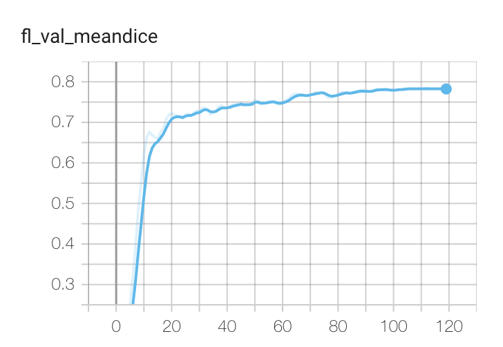
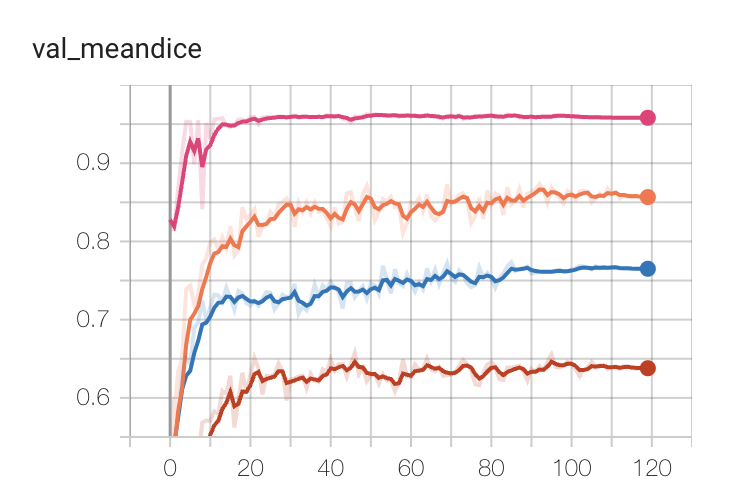

# ConDistFL: Conditional Distillation for Federated Learning from Partially Annotated Data

This folder will contain code to run the experiments reported in 

### ConDistFL: Conditional Distillation for Federated Learning from Partially Annotated Data ([arXiv:2308.04070](https://arxiv.org/abs/2308.04070))
Accepted to the 4th Workshop on Distributed, Collaborative, & Federated Learning ([DeCaF](https://decaf-workshop.github.io/decaf-2023/)), Vancouver, October 12th, 2023.

###### Abstract:
> Developing a generalized segmentation model capable of simultaneously delineating multiple organs and diseases is highly desirable. Federated learning (FL) is a key technology enabling the collaborative development of a model without exchanging training data. However, the limited access to fully annotated training data poses a major challenge to training generalizable models. We propose "ConDistFL", a framework to solve this problem by combining FL with knowledge distillation. Local models can extract the knowledge of unlabeled organs and tumors from partially annotated data from the global model with an adequately designed conditional probability representation. We validate our framework on four distinct partially annotated abdominal CT datasets from the MSD and KiTS19 challenges. The experimental results show that the proposed framework significantly outperforms FedAvg and FedOpt baselines. Moreover, the performance on an external test dataset demonstrates superior generalizability compared to models trained on each dataset separately. Our ablation study suggests that ConDistFL can perform well without frequent aggregation, reducing the communication cost of FL.

## License
The code in this directory is released under Apache v2 License.

## System Requirements

The sample code is developed and tested on DGX-Station V100 with
 - NVIDIA V100 32GB * 4
 - 256GB system memory

Minimam requirements:
 - 4 CUDA Capable GPUs with > 32GB memory
 - 96GB system memory
 - 100GB disk space

## Data Preparation
Download the liver, pancreas and spleen datasets from the [MSD Challenge](http://medicaldecathlon.com/dataaws/) and the kidney dataset from [KiTS19 Challenge](https://kits19.grand-challenge.org). Once the data is downloaded, use `prepare_data.py` to convert the datasets.

```
python prepare_data.py --task kidney   --src KiTS19          --dst data/KiTS19
python prepare_data.py --task liver    --src Task03_Liver    --dst data/Liver
python prepare_data.py --task pancreas --src Task07_Pancreas --dst data/Pancreas
python prepare_data.py --task spleen   --src Task09_Spleen   --dst data/Spleen
```

## Setup

### Software Enviroment

Install all dependencies using
```
pip install -r requirements.txt
```

### Configure paths for datasets

For each job in `jobs` folder, the four clients `kidney`, `liver`, `pancreas`, and `spleen` all requires different datasets. 
The setting of the path is available in `config/config_data.json`. 
The following example is the `config_data.json` for the `kidney` client.
```
{
  "data_root": "/work/pancreas/nvidia-tlt/scripts/condist_fl/data/KiTS19",
  "data_list": "/work/pancreas/nvidia-tlt/scripts/condist_fl/data/KiTS19/datalist.json",

  "num_samples": 2,

  "dataset": {
    "use_cache_dataset": true,
    "cache_rate": 1.0,
    "num_worker": 4
  },

  "data_loader": {
    "batch_size": 2,
    "num_workers": 4
  }
}
```
The user must change the `data_root` and `data_list` to the real path on their system.

## Run

### Training

To run ConDistFL with default settings, use `start_fl.sh`. The training logs and results will be saved in `workspace`.
The user can use TensorBoard to monitor the training.
```
tensorboard --logdir workspace/simulate_job
```

### Validation

The training process runs cross site validation (on the test set) automatically when the training ends. 
If the user intend to run cross site validation manually, use `run_validate.py` as following.
```
python run_validate.py -w workspace -o cross_site_validate.json
```

### Inference

The inference script requires torchscript format model to work. User can use `convert_to_torchscript.py` to convert existing checkpoints.
```
# For server checkpoint
python convert_to_torchscript.py \
  --config workspace/simulate_job/app_server/config/config_fed_server.json \
  --weights workspace/simulate_job/app_server/best_FL_global_model.pt \
  --app server \
  --output best_FL_global_model.pt

# For client checkpoint
python convert_to_torchscript.py \
  --config workspace/simulate_job/app_pancreas/config/config_task.json \
  --weights workspace/simulate_job/app_pancreas/models/best_model.pt \
  --app pancreas \
  --output best_pancreas_model.pt
```

Once the torchscript model is available, use `run_infer.py` to run inference. 
The following example is how to run inference using the best global model on the liver test set.
```
python run_infer.py \
  --data_root data/Liver \
  --data_list data/Liver/datalist.json \
  --data_list_key testing \
  --model best_global_model.pt \
  --output infer
```
The inference results will be saved in the output directory in NIfTI format.

## Example Results

Validation curves of the global model and local models with default setting (120 rounds, 1000 steps per round) are shown below. 
The x-axis is the round number and y-axis is the average validation Dice score. 
The validation Dice score of the global model is computed on all client's validation set. 
The validation Dice score of local models only reflect the performance on its local dataset.

|  |
|:-------------------------------------------------------------------------------------:|
| Fig 1. The average validation Dice scores of the global model.                        |
|                  |
| Fig 2. Validation curves for different clients (top to bottom: spleen, kidney, liver, pancreas)  |

## Pretrained Models

Pretrained models in torchscript format is available [here](https://drive.google.com/drive/folders/1amKJ6Lhy3dxiuL86bYpN3TucvyxQUJoa?usp=sharing).

The test performance in average Dice scores of the pretrained model:

| Site     | Kidney | Kidney Tumor | Liver  | Liver Tumor | Pancreas | Pancreas Tumor | Spleen | Average |
|:---------|:------:|:------------:|:------:|:-----------:|:--------:|:--------------:|:------:|:-------:|
| Server   | 0.9525 |       0.8143 | 0.9556 |      0.6822 |   0.7821 |         0.4604 | 0.9622 |  0.8013 |
| Kidney   | 0.9530 |       0.8246 | 0.9574 |      0.6650 |   0.7812 |         0.4283 | 0.9622 |  0.7960 |
| Liver    | 0.9504 |       0.7740 | 0.9545 |      0.6532 |   0.7810 |         0.4172 | 0.9617 |  0.7846 |
| Pancreas | 0.9333 |       0.2180 | 0.9526 |      0.6366 |   0.7742 |         0.4801 | 0.9592 |  0.7077 |
| Spleen   | 0.9446 |       0.7129 | 0.9549 |      0.6501 |   0.7817 |         0.3960 | 0.9613 |  0.7716 |

The `Server` model is the best global model during the training. The other models are the best local models from each client.

## Citation

> Wang, Pochuan, et al. "ConDistFL: Conditional Distillation for Federated Learning from Partially Annotated Data." arXiv preprint arXiv:2308.04070 (2023).

BibTeX
```
@article{wang2023condistfl,
  title={ConDistFL: Conditional Distillation for Federated Learning from Partially Annotated Data},
  author={Wang, Pochuan and Shen, Chen and Wang, Weichung and Oda, Masahiro and Fuh, Chiou-Shann and Mori, Kensaku and Roth, Holger R},
  journal={arXiv preprint arXiv:2308.04070},
  year={2023}
}
```

## Acknowledgement

This code is contributed by Pochuan Wang, from MeDA Lab, National Taiwan University.

