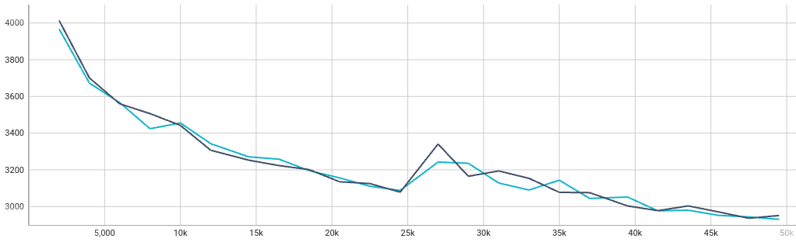

# FedBN: Federated Learning on Non-IID Features via Local Batch Normalization

Welcome to the repository for FedBN, a federated learning algorithm designed to address the feature shift problem when aggregating models across different data distributions.

###### Abstract:

> In this work, we propose an effective method that uses local batch normalization to alleviate the feature shift before averaging models. The resulting scheme, called FedBN, outperforms both classical FedAvg and FedProx on our extensive experiments. These empirical results are supported by a convergence analysis that shows in a simplified setting that FedBN has a faster convergence rate than FedAvg.

## License
This project is open-sourced under the Apache v2 License. The codebase builds upon the initial work shared at [FedBN](https://github.com/med-air/FedBN).

## Setup Instructions

To set up the environment for training, execute the following commands:
```
pip install --upgrade pip
pip install -r ./requirements.txt
```

## Running the code 

### Initial Configuration

Ensure all shell scripts are executable:
```
find . -name ".sh" -exec chmod +x {} \;
``` 

Set the Python path to recognize the FedBN modules:
```
export PYTHONPATH=${PYTHONPATH}:${PWD}/..
```

Data Preparation

Download the necessary datasets by running:
```
./prepare_data.sh
```

# Run FedBN on different data splits
We first set the job template path
```commandline
nvflare config -jt ../../job_templates
```
We will use the in-process client API, we choose the sag_pt job template and run the following command to create the job:
```
./create_job.sh
```

Execution

Run the FedBN simulation with the following command:
```
./run_job.sh
```

## Visualizing Results
The training record will be stored under the job workspace `/tmp/nvflare/fed_bn/workspace/server/simulate_job/tb_events/`.
With tensorboard, we can visualize the loss for the two sites, example run as below:



## Citation
If you find the code and dataset useful, please cite our paper.
```latex
@inproceedings{
li2021fedbn,
title={Fed{\{}BN{\}}: Federated Learning on Non-{\{}IID{\}} Features via Local Batch Normalization},
author={Xiaoxiao Li and Meirui Jiang and Xiaofei Zhang and Michael Kamp and Qi Dou},
booktitle={International Conference on Learning Representations},
year={2021},
url={https://openreview.net/pdf?id=6YEQUn0QICG}
}
```

