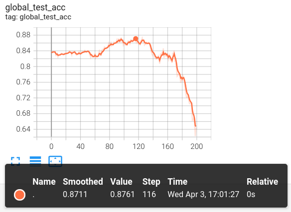

# FedBPT: Efficient Federated Black-box Prompt Tuning for Large Language Models

This example shows how to run [FedBPT](https://arxiv.org/abs/2310.01467) on an example task and the [FL simulator](https://nvflare.readthedocs.io/en/latest/user_guide/nvflare_cli/fl_simulator.html).

###### Abstract:
> Pre-trained language models (PLM) have revolutionized the NLP landscape, achieving stellar performances across diverse tasks. These models, while benefiting from vast training data, often require fine-tuning on specific data to cater to distinct downstream tasks. However, this data adaptation process has inherent security and privacy concerns, primarily when leveraging user-generated, device-residing data. Federated learning (FL) provides a solution, allowing collaborative model fine-tuning without centralized data collection. However, applying FL to finetune PLMs is hampered by challenges, including restricted model parameter access, high computational requirements, and communication overheads. This paper introduces Federated Black-box Prompt Tuning (FedBPT), a framework designed to address these challenges. FedBPT does not require the clients to access the model parameters. By focusing on training optimal prompts and utilizing gradient-free optimization methods, FedBPT reduces the number of exchanged variables, boosts communication efficiency, and minimizes computational and storage costs. Experiments highlight the framework's ability to drastically cut communication and memory costs while maintaining competitive performance. Ultimately, FedBPT presents a promising solution for efficient, privacy-preserving fine-tuning of PLM in the age of large language models.

## License
The code in this directory is released under Apache v2 License.
The code is extended from [Black-Box-Tuning (BBT)](https://github.com/txsun1997/Black-Box-Tuning) which is released under MIT License.
The models code is copied from the [transformers](https://github.com/huggingface/transformers) library.

## 1. Setup
We recommend creating a [conda environment](https://www.anaconda.com) following [BBT](https://github.com/txsun1997/Black-Box-Tuning#prepare-your-environment) 
with the addition of installing NVFlare for running federated learning and some other updates:
```commandline
conda create --name fedbpt python=3.12
conda activate fedbpt
pip install -r requirements.txt
```

## 2. Run a federated learning experiment
First, we set the location of NVFlare job templates directory.
```commandline
nvflare config -jt ./job_templates
```
Next, we generate a job configuration from the template to run FL on `N_CLIENTS` clients. 
We utilize the [SST-2 dataset](https://huggingface.co/datasets/stanfordnlp/sst2) and the RoBerTa-large model for training.
```commandline
N_CLIENTS=10
SEED=1234
nvflare job create -force -j "./jobs/fedbpt" -w "fedbpt" -sd "./src" \
-f app/config/config_fed_client.conf app_script="fedbpt_train.py" app_config="--task_name sst2 \
--n_prompt_tokens 50 \
--intrinsic_dim 500 \
--k_shot 200 \
--device cuda:0 \
--seed ${SEED} \
--loss_type ce \
--cat_or_add add \
--local_iter 8 \
--num_users ${N_CLIENTS} \
--iid 1 \
--local_popsize 5 \
--perturb 1 \
--model_name roberta-large \
--eval_clients site-1 \
--llama_causal 1" \
-f app/config/config_fed_server.conf min_clients=${N_CLIENTS} num_rounds=200 seed=${SEED}
```
By default, we only evaluate the global model on client `site-1` as in our setting, the global test set is shared by clients.

Start the FL simulator with `N_CLIENTS` clients in parallel.
The following setting requires a GPU with at least 24 GB memory and enough system memory to run the clients in parallel (we recommend at least 40 GB).
For a system with less resources, you can set -t to be a lower number and simulate the clients running sequentially.
```commandline
OUT_DIR="/tmp/nvflare/fedbpt"
nvflare simulator ./jobs/fedbpt -n ${N_CLIENTS} -t ${N_CLIENTS} -w ${OUT_DIR}
```
If you have more GPUs available on your system, you can use the `--gpu` argument of the simulator to run clients on different GPUs in parallel.

## 3. Example results
The training results showing the global testing accuracy over 200 rounds is shown below. 
The global learnt prompt using FedBPT achieves an accuracy of 0.8761 on the SST-2 test set. 


## Citation

> Sun, Jingwei, et al. "FedBPT: Efficient Federated Black-box Prompt Tuning for Large Language Models." arXiv preprint arXiv:2310.01467 (2023).

BibTeX
```
@article{sun2023fedbpt,
  title={FedBPT: Efficient Federated Black-box Prompt Tuning for Large Language Models},
  author={Sun, Jingwei and Xu, Ziyue and Yin, Hongxu and Yang, Dong and Xu, Daguang and Chen, Yiran and Roth, Holger R},
  journal={arXiv preprint arXiv:2310.01467},
  year={2023}
}
```
