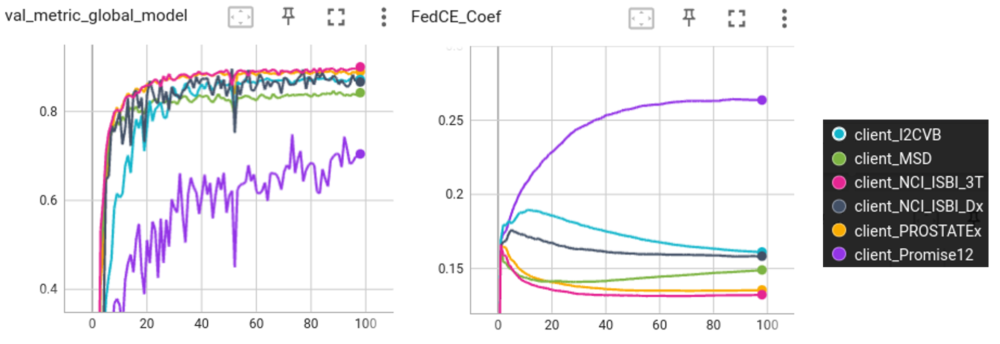

# FedCE: Fair Federated Learning via Client Contribution Estimation

This directory will contain the code for the fair federated learning algorithm via client **C**ontribution **E**stimation (Fed**CE**) described in

### Fair Federated Medical Image Segmentation via Client Contribution Estimation ([arXiv:2303.16520](https://arxiv.org/abs/2303.16520))
Accepted to [CVPR2023](https://cvpr2023.thecvf.com/).

###### Abstract:

> How to ensure fairness is an important topic in federated learning (FL). Recent studies have investigated how to reward clients based on their contribution (collaboration fairness), and how to achieve uniformity of performance across clients (performance fairness). Despite achieving progress on either one, we argue that it is critical to consider them together, in order to engage and motivate more diverse clients joining FL to derive a high-quality global model. In this work, we propose a novel method to optimize both types of fairness simultaneously. Specifically, we propose to estimate client contribution in gradient and data space. In gradient space, we monitor the gradient direction differences of each client with respect to others. And in data space, we measure the prediction error on client data using an auxiliary model. Based on this contribution estimation, we propose a FL method, federated training via contribution estimation (FedCE), i.e., using estimation as global model aggregation weights. We have theoretically analyzed our method and empirically evaluated it on two real-world medical datasets. The effectiveness of our approach has been validated with significant performance improvements, better collaboration fairness, better performance fairness, and comprehensive analytical studies

## License
- The code in this directory is released under Apache v2 License.

## Multi-source Prostate Segmentation
This example uses 2D (axial slices) segmentation of the prostate in T2-weighted MRIs based on multiple datasets.

Please refer to [Prostate Example](https://github.com/NVIDIA/NVFlare/tree/main/examples/advanced/prostate) for details of data preparation and task specs. In the following, we assume the data has been prepared in the same way to `${PWD}/data_preparation`. The dataset is saved to `${PWD}/data_preparation/dataset_2D`, and datalists are saved to `${PWD}/data_preparation/datalist_2D`.

## Setup

Install required packages for training
```
pip install --upgrade pip
pip install -r ./requirements.txt
```

## Run automated experiments
We use the NVFlare simulator to run FL training automatically, the 6 clients are named `client_I2CVB,client_MSD,client_NCI_ISBI_3T,client_NCI_ISBI_Dx,client_Promise12,client_PROSTATEx`.

### Prepare local configs
First, we add the image directory root to `config_train.json` files for generating the absolute path to dataset and datalist. 
In the current folder structure, it will be `${PWD}/..`. 
It can be any arbitrary path where the data locates.  
```
for job in fedce_prostate
do
  sed -i "s|DATASET_ROOT|${PWD}/data_preparation|g" jobs/${job}/app/config/config_train.json
done
```
### Use NVFlare simulator to run the experiments
We use NVFlare simulator to run the FL training experiments, following the pattern:
```
nvflare simulator jobs/[job] -w ${workspace_path}/[job] -c [clients] -gpu [gpu] -t [thread]
```
`[job]` is the experiment job that will be submitted for the FL training. 
In this example, this is `fedce_prostate`.  
The combination of `-c` and `-gpu`/`-t` controls the resource allocation. 

## Results on six clients for FedCE
In this example, we run six clients on 2 GPUs. The minimum GPU memory requirement is 10 GB per GPU. We put the workspace in `/tmp` folder
```
nvflare simulator jobs/fedce_prostate -w /tmp/nvflare/fedce_prostate -c client_I2CVB,client_MSD,client_NCI_ISBI_3T,client_NCI_ISBI_Dx,client_Promise12,client_PROSTATEx -gpu 0,1,0,1,0,1
```

### Metrics and FedCE contribution estimation curves
In this example, each client computes their validation scores using their own
validation set. We also record the contribution scores for each client.
The TensorBoard curves of validation Dice and contribution scores for the 100 epochs (100 rounds, 1 local epoch per round) during training are shown below:


As shown, one of the clients (Promise12) has significant domain shift from others, and hence intuitively it provides more novel information as compared with others. During training, its FedCE weight increases while others gradually decrease. Such that the overall federated learning captures the potential domain variations better. With this mechanism, FedCE provides an indication of reward/profit distribution by measuring the contribution of clients. Please refer to the [FedCE paper](https://arxiv.org/abs/2303.16520) for more details.

## Citation

> Jiang, Meirui, et al. "Fair Federated Medical Image Segmentation via Client Contribution Estimation." Proceedings of the IEEE/CVF Conference on Computer Vision and Pattern Recognition. 2023.

BibTeX
```
@inproceedings{jiang2023fedce,
  title={Fair Federated Medical Image Segmentation via Client Contribution Estimation},
  author={Jiang, Meirui and Roth, Holger R and Li, Wenqi and Yang, Dong and Zhao, Can and Nath, Vishwesh and Xu, Daguang and Dou, Qi and Xu, Ziyue},
  booktitle={Proceedings of the IEEE/CVF Conference on Computer Vision and Pattern Recognition},
  pages={--},
  year={2023}
}
```
